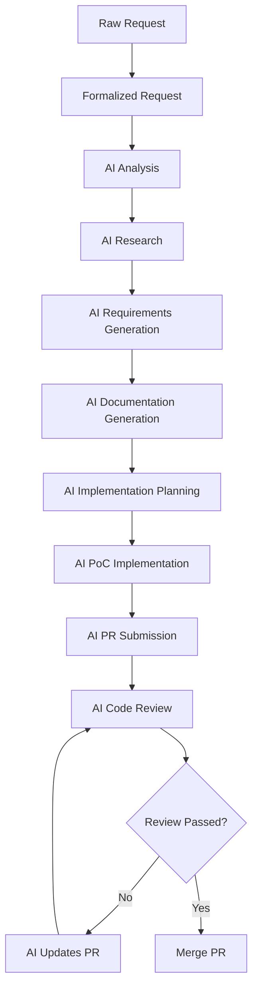

# AI-Driven SDLC

## Overview

## AI Enhancement Points

### 1. Request Processing
- **Raw Request Analysis**
  - Natural language processing
  - Intent classification
  - Priority assessment
  - Similar request identification

- **Request Formalization**
  - Template-based structuring
  - Requirements extraction
  - Acceptance criteria generation
  - Task breakdown

### 2. Analysis & Planning
- **AI Requirements Analysis**
  - Business value assessment
  - Technical feasibility check
  - Resource estimation
  - Risk analysis

- **AI Research**
  - Similar solutions research
  - Best practices identification
  - Technology selection
  - Architecture recommendations

### 3. Documentation Generation
- **AI-Generated Documents**
  - PRD (Product Requirements)
  - FRD (Feature Requirements)
  - Technical Specifications
  - API Documentation
  - Test Plans

### 4. Implementation
- **AI-Assisted Development**
  - Code generation
  - Code optimization
  - Test generation
  - Documentation updates

- **AI Code Review**
  - Style checking
  - Best practices verification
  - Security analysis
  - Performance optimization

### 5. Testing & QA
- **AI-Driven Testing**
  - Test case generation
  - Test data creation
  - Edge case identification
  - Regression test selection

### 6. Deployment & Monitoring
- **AI Deployment Assistance**
  - Deployment strategy
  - Resource optimization
  - Rollback triggers
  - Performance monitoring

## AI Tools Integration

### Development Assistance
- **Code Generation**
  - Codeium/Windsurf
  - Cursor
  - GitHub Copilot
  - Amazon CodeWhisperer
  - Tabnine

- **Code Review**
  - CodeRabbit
  - DeepSource AI
  - Amazon CodeGuru
  - PullRequest

### Testing
- **Test Generation**
  - TestIM
  - Mabl
  - Functionize
  - Applitools

### Documentation
- **Documentation Generation**
  - Mintlify
  - Docusaurus AI
  - GitBook AI
  - Notion AI

### Analysis & Monitoring
- **Performance Analysis**
  - AI-powered APM
  - Predictive analytics
  - Anomaly detection
  - Resource optimization

- **Security Analysis**
  - AI-driven vulnerability detection
  - Threat prediction
  - Security pattern recognition
  - Compliance verification

## AI Best Practices

### 1. Code Generation
- Use AI for boilerplate code
- Review AI-generated code thoroughly
- Maintain consistent code style
- Document AI usage patterns

### 2. Code Review
- Combine AI and human review
- Focus on logic and architecture
- Verify security implications
- Check performance impact

### 3. Testing
- Balance AI and manual testing
- Verify test coverage
- Validate test scenarios
- Monitor test reliability

### 4. Documentation
- Review AI-generated docs
- Maintain consistency
- Keep documentation updated
- Version control docs

### 5. Security
- Verify AI security suggestions
- Monitor AI access patterns
- Protect sensitive data
- Regular security audits

## AI Integration Guidelines

### 1. Tool Selection
- Evaluate AI capabilities
- Check integration requirements
- Consider cost implications
- Assess maintenance needs

### 2. Implementation
- Start with small integrations
- Gradually expand AI usage
- Monitor effectiveness
- Gather team feedback

### 3. Quality Control
- Define quality metrics
- Set up verification processes
- Monitor AI performance
- Regular effectiveness review

### 4. Team Training
- AI tools training
- Best practices education
- Regular skill updates
- Knowledge sharing
