# Architecture Diagrams

## System Architecture

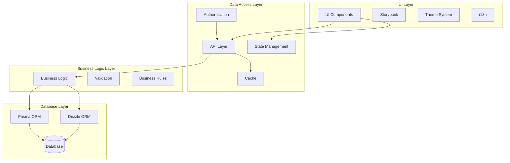

## Component Architecture

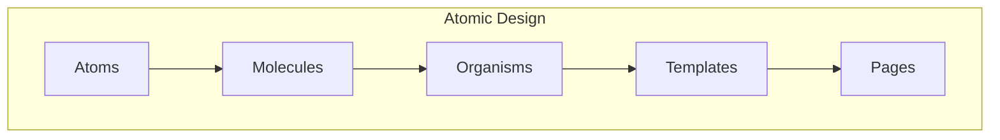

## Data Flow

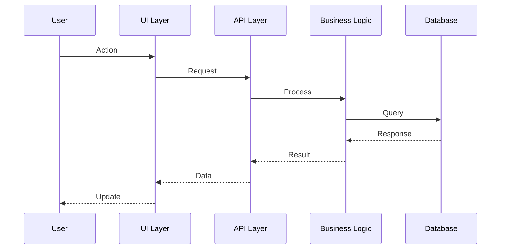

## State Management

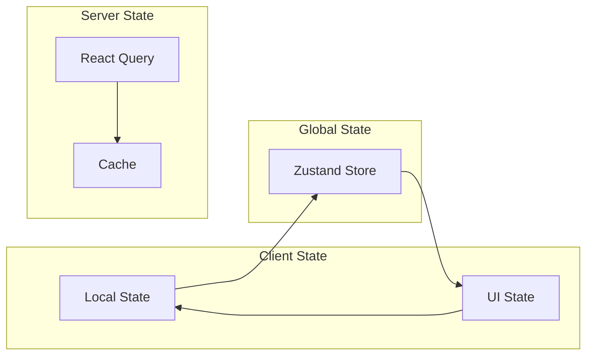

## Authentication Flow

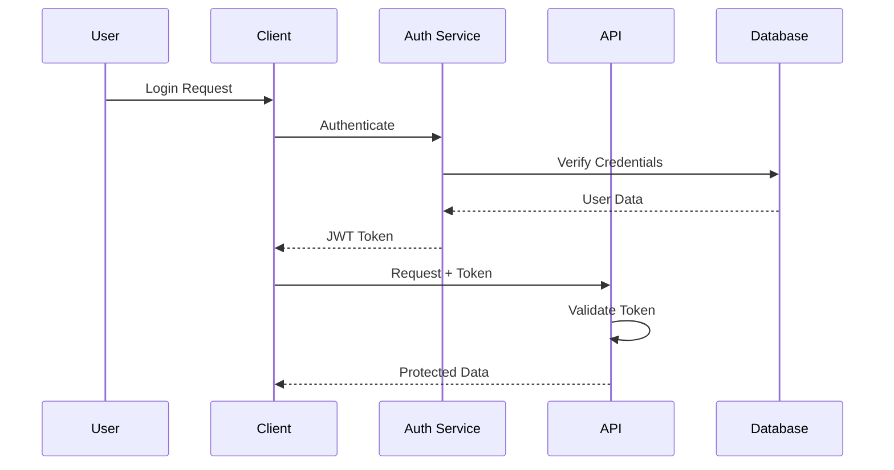

## Testing Strategy

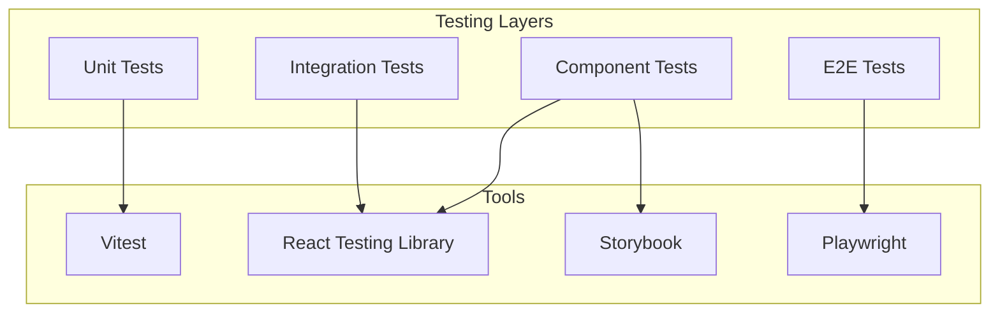

## Monitoring Setup

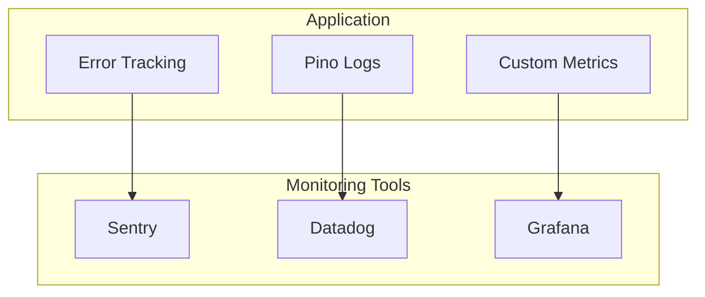

## CI/CD Pipeline

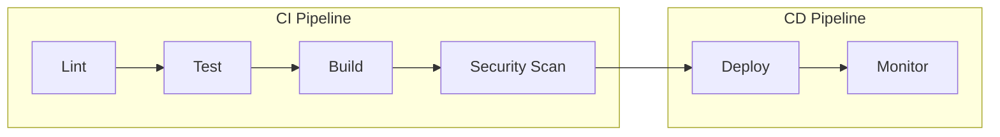

## Security Measures

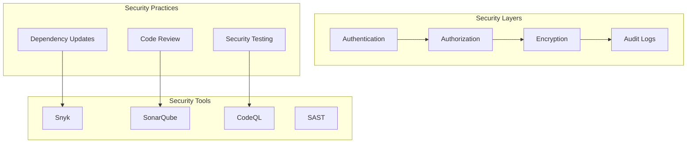

## Deployment Architecture

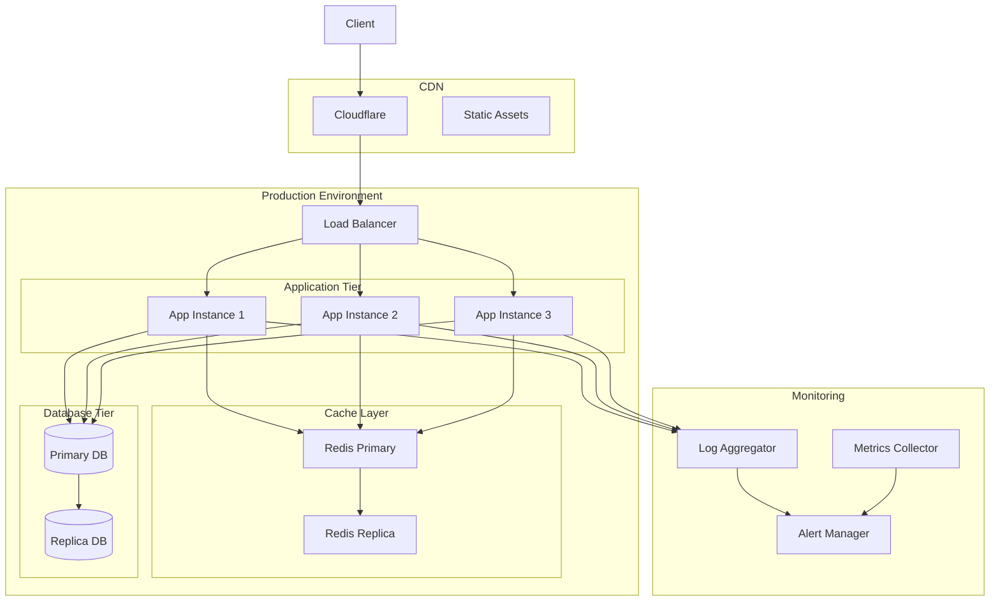

## CQRS Pattern

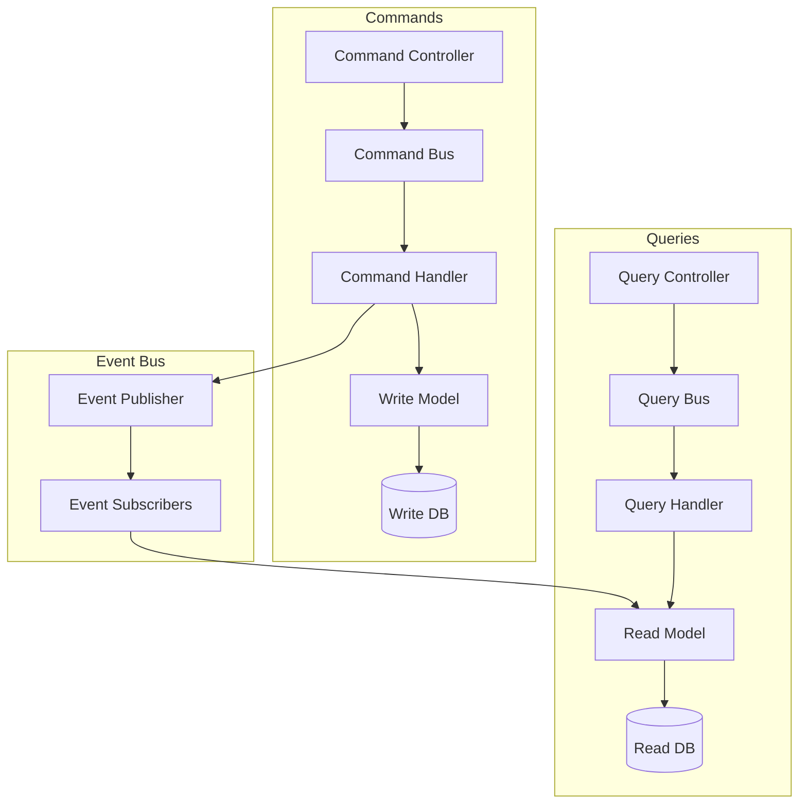

## Error Handling Flow

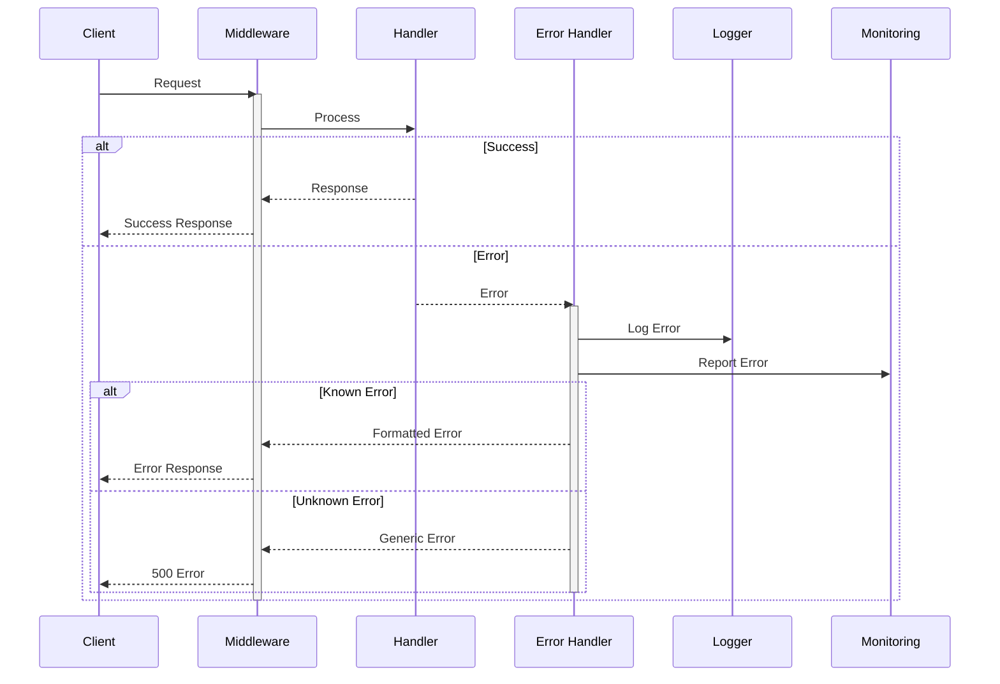

## Performance Monitoring Architecture

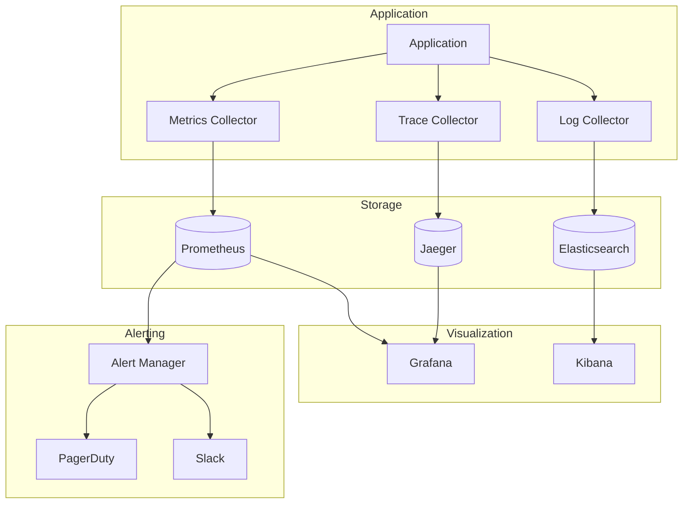

## Code Generation Flow

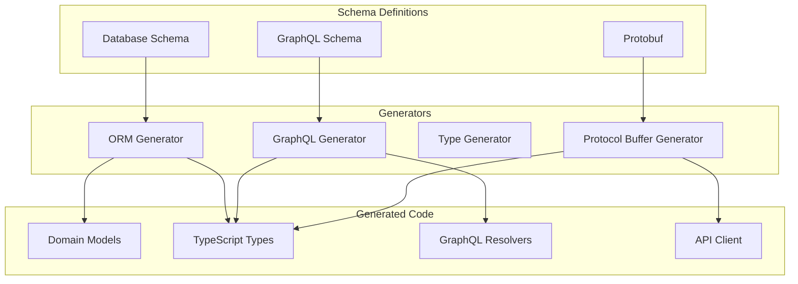

## CI/CD Pipeline Flow

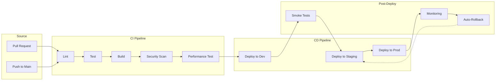

## State Management Pattern

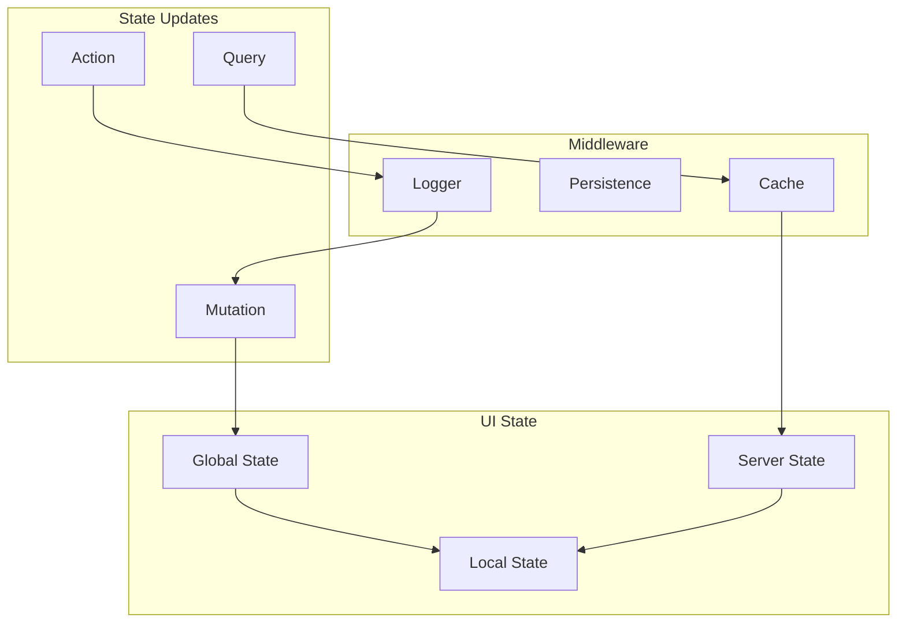

## Event Sourcing Architecture

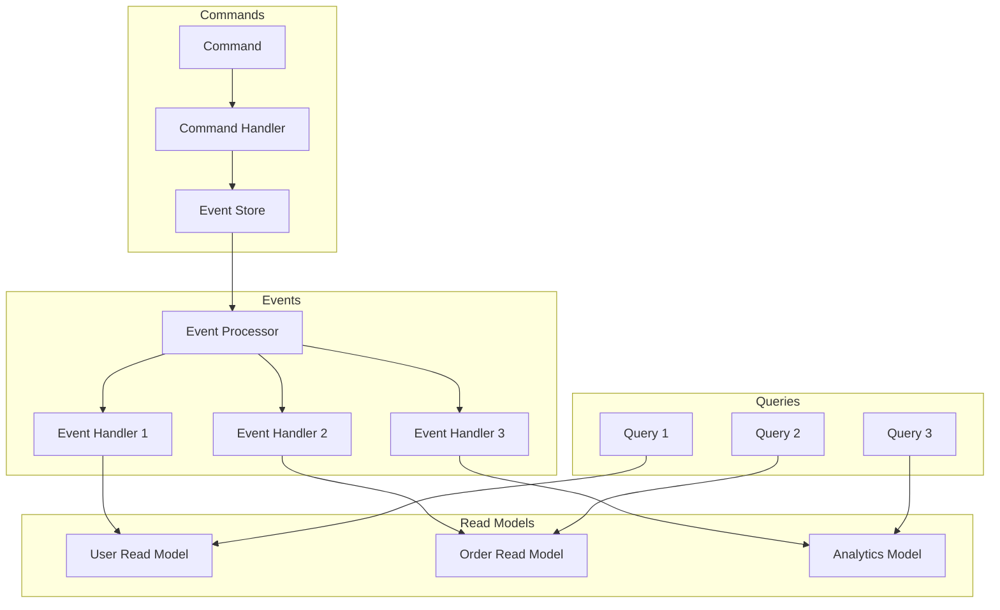

## Microservices Communication

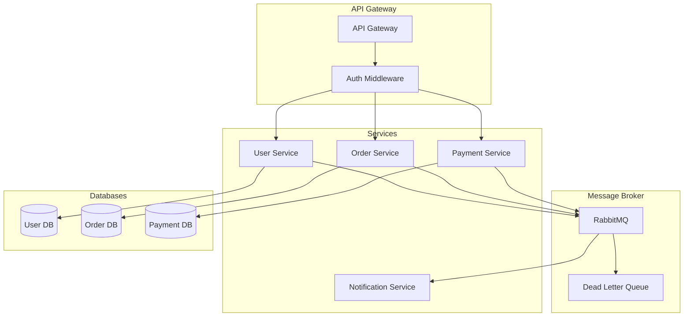

## Testing Strategy

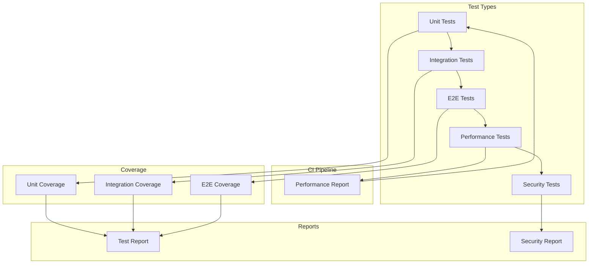

## Feature Flag System

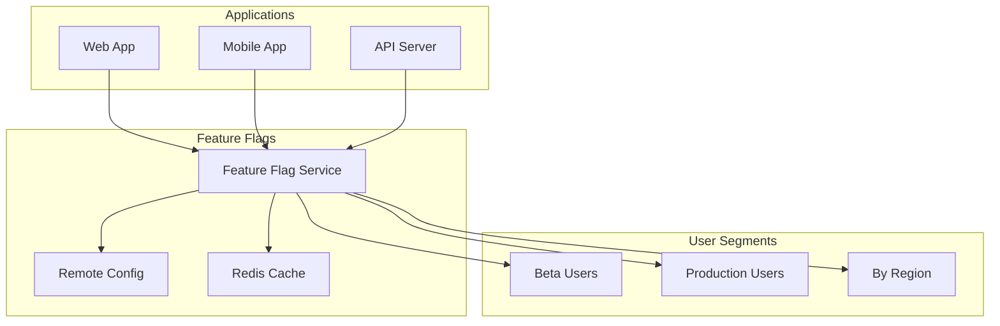

## Monitoring and Alerting

```mermaid
graph TB
    subgraph "Data Collection"
        Logs[Application Logs]
        Metrics[System Metrics]
        Traces[Distributed Traces]
        Events[Business Events]
    end
    
    subgraph "Processing"
        LogP[Log Processor]
        MetricP[Metric Processor]
        TraceP[Trace Processor]
        EventP[Event Processor]
    end
    
    subgraph "Storage"
        ES[(Elasticsearch)]
        Prom[(Prometheus)]
        Jaeger[(Jaeger)]
        TS[(TimeSeries DB)]
    end
    
    subgraph "Visualization"
        Kibana[Kibana]
        Grafana[Grafana]
        JaegerUI[Jaeger UI]
    end
    
    subgraph "Alerting"
        Rules[Alert Rules]
        Manager[Alert Manager]
        Notify[Notifications]
    end
    
    Logs --> LogP
    Metrics --> MetricP
    Traces --> TraceP
    Events --> EventP
    
    LogP --> ES
    MetricP --> Prom
    TraceP --> Jaeger
    EventP --> TS
    
    ES --> Kibana
    Prom --> Grafana
    Jaeger --> JaegerUI
    TS --> Grafana
    
    Grafana --> Rules
    Kibana --> Rules
    Rules --> Manager
    Manager --> Notify
```

## Authentication Flow

```mermaid
sequenceDiagram
    participant U as User
    participant C as Client
    participant AS as Auth Service
    participant RS as Resource Service
    participant IS as Identity Provider
    
    U->>C: Login Request
    C->>AS: Authenticate
    AS->>IS: Verify Credentials
    IS-->>AS: Identity Token
    AS-->>C: Access Token + Refresh Token
    C->>RS: Request + Access Token
    RS->>AS: Validate Token
    AS-->>RS: Token Valid
    RS-->>C: Protected Resource
    C-->>U: Response
    
    Note over C,AS: Token Refresh Flow
    C->>AS: Refresh Token
    AS-->>C: New Access Token
```

## Database Sharding

```mermaid
graph TB
    subgraph "Application"
        App[Application]
        Router[Shard Router]
    end
    
    subgraph "Shards"
        S1[(Shard 1)]
        S2[(Shard 2)]
        S3[(Shard 3)]
    end
    
    subgraph "Metadata"
        MS[(Metadata Store)]
        Config[Shard Config]
    end
    
    App --> Router
    Router --> MS
    MS --> Config
    
    Router --> S1
    Router --> S2
    Router --> S3
```

## Cache Strategy

```mermaid
graph TB
    subgraph "Cache Layers"
        L1[Browser Cache]
        L2[CDN Cache]
        L3[API Cache]
        L4[Data Cache]
    end
    
    subgraph "Cache Types"
        Write[Write-Through]
        Read[Read-Through]
        Back[Write-Back]
        Aside[Cache-Aside]
    end
    
    subgraph "Invalidation"
        TTL[Time-Based]
        Event[Event-Based]
        Manual[Manual]
    end
    
    L1 --> Write
    L2 --> Read
    L3 --> Back
    L4 --> Aside
    
    Write --> TTL
    Read --> Event
    Back --> Manual
    Aside --> Event
```

## Service Discovery

```mermaid
graph TB
    subgraph "Registry"
        SD[Service Registry]
        Health[Health Checker]
    end
    
    subgraph "Services"
        S1[Service 1]
        S2[Service 2]
        S3[Service 3]
    end
    
    subgraph "Load Balancers"
        LB1[LB 1]
        LB2[LB 2]
    end
    
    S1 --> SD
    S2 --> SD
    S3 --> SD
    
    Health --> S1
    Health --> S2
    Health --> S3
    
    SD --> LB1
    SD --> LB2
```
