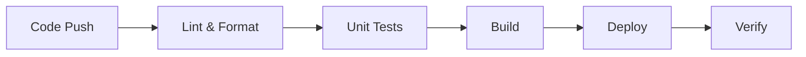

# Automation Guidelines

This document outlines our automation practices and workflows.

## CI/CD Pipeline

### Build Pipeline



### Implementation

```yaml
# Example GitHub Actions workflow
name: CI/CD Pipeline

on:
  push:
    branches: [main]
  pull_request:
    branches: [main]

jobs:
  build:
    runs-on: ubuntu-latest
    steps:
      - uses: actions/checkout@v3
      - uses: oven-sh/setup-bun@v1

      - name: Install dependencies
        run: bun install

      - name: Lint and format
        run: |
          bun run lint
          bun run format:check

      - name: Run tests
        run: bun test

      - name: Build
        run: bun run build
```

## Automated Tasks

### Code Quality

- Linting
- Formatting
- Type checking
- Test coverage
- Bundle analysis

### Documentation

- API documentation
- Changelog generation
- Dependency updates
- Cross-reference validation

### Deployment

- Environment setup
- Database migrations
- Asset optimization
- Cache management

## Testing Automation

### Unit Tests

```typescript
// Example automated test
describe('UserService', () => {
  it('should create user', async () => {
    const user = await UserService.create({
      name: 'Test User',
      email: 'test@example.com',
    });

    expect(user).toBeDefined();
    expect(user.name).toBe('Test User');
  });
});
```

### E2E Tests

```typescript
// Example E2E test
test('user signup flow', async ({ page }) => {
  await page.goto('/signup');
  await page.fill('[name="email"]', 'test@example.com');
  await page.fill('[name="password"]', 'password123');
  await page.click('button[type="submit"]');

  await expect(page).toHaveURL('/dashboard');
});
```

## Development Automation

### Code Generation

```typescript
// Example code generator
const generateComponent = (name: string) => {
  const template = `
import React from 'react';

export interface ${name}Props {
  children?: React.ReactNode;
}

export const ${name} = ({ children }: ${name}Props) => {
  return (
    <div className="${name.toLowerCase()}">{children}</div>
  );
};
`;

  writeFileSync(`./src/components/${name}.tsx`, template);
};
```

### Git Hooks

```json
{
  "husky": {
    "hooks": {
      "pre-commit": "lint-staged",
      "pre-push": "bun test"
    }
  },
  "lint-staged": {
    "*.{ts,tsx}": ["eslint --fix", "prettier --write"]
  }
}
```

## Monitoring Automation

### Health Checks

```typescript
// Example health check
const healthCheck = async () => {
  const checks = {
    database: await checkDatabase(),
    cache: await checkCache(),
    api: await checkExternalAPIs(),
  };

  return {
    status: Object.values(checks).every(Boolean) ? 'healthy' : 'unhealthy',
    checks,
  };
};
```

### Performance Monitoring

```typescript
// Example performance monitor
const performanceMonitor = {
  start: (label: string) => {
    performance.mark(`${label}-start`);
  },

  end: (label: string) => {
    performance.mark(`${label}-end`);
    performance.measure(label, `${label}-start`, `${label}-end`);
  },
};
```

## Project Automation

This document outlines the automation processes and tools used in our project.

### Build System

We use Nx as our build system and monorepo management tool. It provides:

- Efficient build caching
- Smart rebuilds of affected projects
- Dependency graph management

#### Key Commands

- `nx affected:build` - Builds all affected projects
- `nx affected:test` - Runs tests for affected projects
- `nx graph` - Visualizes the project dependency graph

### CI/CD Pipeline

Our continuous integration and deployment pipeline handles:

1. Automated testing
2. Build verification
3. Deployment to staging/production environments

#### Tools

- **Package Analyzer**: Custom tool for analyzing package dependencies
- **Docs Fetcher**: Automated documentation generation tool

### Development Workflow

1. Code changes trigger automated tests
2. Successful builds are automatically deployed
3. Documentation is automatically generated and updated

### Future Improvements

- [ ] Implement automated version management
- [ ] Add performance monitoring automation
- [ ] Enhance test coverage reporting

## Best Practices

### 1. Pipeline Design

- Keep it simple
- Fast feedback
- Parallel execution
- Clear failures

### 2. Testing Strategy

- Automated testing
- Test coverage
- Performance testing
- Security testing

### 3. Deployment

- Zero downtime
- Rollback plan
- Environment parity
- Monitoring

### 4. Maintenance

- Regular updates
- Security patches
- Performance optimization
- Documentation updates

## Tools and Technologies

### CI/CD Tools

- GitHub Actions
- Jenkins
- CircleCI
- ArgoCD

### Testing Tools

- Vitest
- Playwright
- Cypress
- k6

### Monitoring Tools

- Prometheus
- Grafana
- Datadog
- New Relic

## Related Documentation

- [Development Guide](development.md)
- [Quality and Security](../quality_and_security.md)
- [Testing Guidelines](testing.md)
- [Performance Guidelines](./diagrams/system/performance.md)
