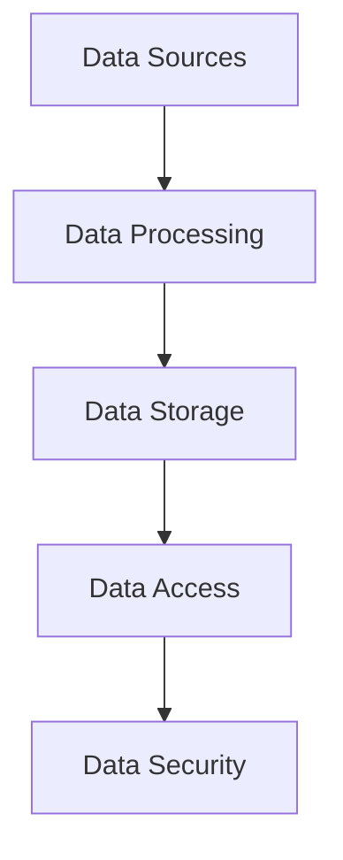
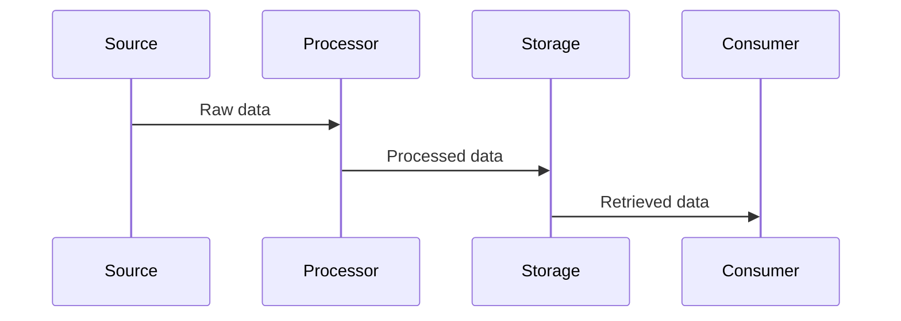

# Data Flow Overview

## Overview

This document provides a comprehensive overview of data flow patterns and architectures across our system.

## Components

### Data Flow Stack


### Key Components
1. Data Sources
   - External APIs
   - User inputs
   - System events
   - Sensor data

2. Data Processing
   - Stream processing
   - Batch processing
   - Real-time analytics
   - Data transformation

3. Data Storage
   - Databases
   - Caches
   - File systems
   - Data lakes

4. Data Access
   - APIs
   - Query interfaces
   - Data services
   - Access controls

## Interactions

### Data Flow Patterns


## Implementation Details

### Data Flow Configuration
```typescript
interface DataFlowConfig {
  sources: SourceConfig;
  processing: ProcessingConfig;
  storage: StorageConfig;
  access: AccessConfig;
}

interface SourceConfig {
  types: SourceType[];
  formats: DataFormat[];
  protocols: Protocol[];
  validation: ValidationRule[];
}
```

### Processing Rules
```typescript
interface ProcessingRule {
  type: ProcessingType;
  transformation: Transform[];
  validation: Validation[];
  routing: Route[];
}
```

### Data Flow Standards
- Data formats
- Processing patterns
- Storage strategies
- Access methods
- Security measures

## Related Documentation
- [Data Protection](../diagrams/data-flow/data-protection.md)
- [Caching](../diagrams/data-flow/caching.md)
- [Session Management](../diagrams/data-flow/session-management.md)
- [State Management](../diagrams/data-flow/state-management.md)
