# Accessibility (A11y) Architecture

This diagram illustrates our comprehensive accessibility implementation strategy across the application.

## Related Documentation

- [Component Library](./component-library.md)
- [Form Architecture](./form-architecture.md)
- [Atomic Design](./atomic-design.md)

## Implementation

Our accessibility implementation leverages several particle components from our [Atomic Design Structure](./atomic-design.md#particles):

- Focus Manager particles for keyboard navigation
- ARIA Context Providers for accessibility states
- Portal Containers for modals and overlays
- Event Handlers for keyboard interactions

## Accessibility Architecture Diagram

```mermaid
graph TB
    subgraph "Core A11y"
        subgraph "ARIA"
            Roles[ARIA Roles]
            States[ARIA States]
            Properties[ARIA Props]
        end

        subgraph "Semantics"
            HTML5[Semantic HTML]
            Landmarks[Landmarks]
            Structure[Doc Structure]
        end

        subgraph "Standards"
            WCAG[WCAG Guidelines]
            Section508[Section 508]
            WAI[WAI-ARIA]
        end
    end

    subgraph "Implementation"
        subgraph "Components"
            Base[Base Components]
            Complex[Complex Widgets]
            Custom[Custom Controls]
        end

        subgraph "Testing"
            Unit[Unit Tests]
            Integration[Integration]
            E2E[End-to-End]
        end

        subgraph "Automation"
            Linting[a11y Linting]
            Testing[a11y Testing]
            CI[CI Integration]
        end
    end

    subgraph "Design System"
        subgraph "Visual"
            Color[Color Contrast]
            Typography[Typography]
            Spacing[Spacing]
        end

        subgraph "Interaction"
            Focus[Focus Management]
            Keyboard[Keyboard Nav]
            Touch[Touch Targets]
        end

        subgraph "Feedback"
            Error[Error States]
            Status[Status Updates]
            Loading[Loading States]
        end
    end

    subgraph "Features"
        subgraph "Navigation"
            Skip[Skip Links]
            Breadcrumbs[Breadcrumbs]
            SiteMap[Site Map]
        end

        subgraph "Content"
            Alt[Alt Text]
            Captions[Captions]
            Transcripts[Transcripts]
        end

        subgraph "Inputs"
            Labels[Input Labels]
            Validation[Form Validation]
            Help[Help Text]
        end
    end

    %% Core Flow
    Roles --> Base
    States --> Complex
    Properties --> Custom

    HTML5 --> Unit
    Landmarks --> Integration
    Structure --> E2E

    WCAG --> Linting
    Section508 --> Testing
    WAI --> CI

    %% Design Flow
    Color --> Focus
    Typography --> Keyboard
    Spacing --> Touch

    Focus --> Error
    Keyboard --> Status
    Touch --> Loading

    %% Features Flow
    Skip --> Alt
    Breadcrumbs --> Captions
    SiteMap --> Transcripts

    Alt --> Labels
    Captions --> Validation
    Transcripts --> Help
```

## Component Description

### Core Accessibility

1. **ARIA Implementation**

   - Proper role usage
   - State management
   - Property assignment

2. **Semantic Structure**

   - HTML5 elements
   - Landmark regions
   - Document outline

3. **Standards Compliance**
   - WCAG 2.1 Level AA
   - Section 508
   - WAI-ARIA 1.2

### Design System Integration

1. **Visual Design**

   - Color contrast ratios
   - Typography scaling
   - Spacing system

2. **Interaction Design**
   - Focus management
   - Keyboard navigation
   - Touch targets

## Implementation Guidelines

1. **Component Development**

   - Base component patterns
   - Complex widget patterns
   - Custom control patterns
   - ARIA integration

2. **Testing Strategy**

   - Unit test coverage
   - Integration testing
   - E2E accessibility
   - Automated checks

3. **Feature Implementation**

   - Navigation patterns
   - Content accessibility
   - Form accessibility
   - Error handling

4. **Best Practices**

   - Semantic markup
   - ARIA patterns
   - Keyboard support
   - Screen readers

5. **Monitoring**

   - Automated testing
   - Manual audits
   - User feedback
   - Compliance checks

6. **Documentation**
   - Implementation guides
   - Testing procedures
   - Compliance requirements
   - Best practices
