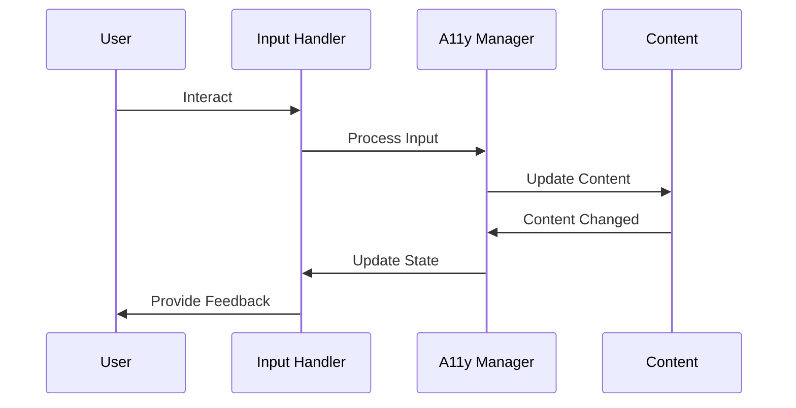

# Accessibility (A11y) Architecture

## Overview

This document outlines our comprehensive accessibility implementation strategy across the application. Our architecture ensures WCAG 2.1 Level AA compliance while providing an inclusive user experience through semantic markup, ARIA patterns, and robust keyboard support.

## Components

Our accessibility architecture consists of three main component groups:

### Core A11y Components
- ARIA Implementation
- Semantic Structure
- Standards Compliance

### Design System Components
- Visual Design Elements
- Interaction Patterns
- Feedback Mechanisms

### Feature Components
- Navigation Systems
- Content Accessibility
- Input Accessibility

## Interactions

The accessibility system operates through the following interaction patterns:

1. **User Input Flow**
   - Keyboard navigation handling
   - Screen reader interpretation
   - Touch interaction processing
   - Mouse input fallback

2. **Feedback Flow**
   - Status announcements
   - Error notifications
   - Loading state updates
   - Focus management

3. **Content Flow**
   - Semantic structure parsing
   - ARIA state updates
   - Dynamic content handling
   - Media alternatives



## Implementation Details

### Technical Stack
- Base: Semantic HTML5
- Enhancement: WAI-ARIA 1.2
- Testing: Jest + Testing Library
- Automation: Axe-core

### Implementation Guidelines

#### Component Development
```typescript
// Accessible button component
const AccessibleButton = ({
  onClick,
  children,
  disabled,
  ariaLabel,
}: ButtonProps) => {
  return (
    <button
      onClick={onClick}
      disabled={disabled}
      aria-label={ariaLabel}
      aria-disabled={disabled}
    >
      {children}
    </button>
  );
};

// Focus management hook
const useFocusManagement = (ref: RefObject<HTMLElement>) => {
  useEffect(() => {
    const element = ref.current;
    if (!element) return;

    const handleFocus = () => {
      element.classList.add('focused');
    };

    const handleBlur = () => {
      element.classList.remove('focused');
    };

    element.addEventListener('focus', handleFocus);
    element.addEventListener('blur', handleBlur);

    return () => {
      element.removeEventListener('focus', handleFocus);
      element.removeEventListener('blur', handleBlur);
    };
  }, [ref]);
};
```

### Testing Strategy
```typescript
// Accessibility test example
describe('AccessibleButton', () => {
  it('should have correct ARIA attributes', () => {
    const { getByRole } = render(
      <AccessibleButton
        onClick={() => {}}
        disabled={true}
        ariaLabel="Submit form"
      >
        Submit
      </AccessibleButton>
    );

    const button = getByRole('button');
    expect(button).toHaveAttribute('aria-label', 'Submit form');
    expect(button).toHaveAttribute('aria-disabled', 'true');
  });
});
```

### Best Practices

1. **Component Development**
   - Use semantic HTML elements
   - Implement ARIA patterns
   - Support keyboard navigation
   - Provide screen reader support

2. **Testing Strategy**
   - Unit test accessibility
   - Integration testing
   - E2E accessibility
   - Automated checks

3. **Feature Implementation**
   - Navigation patterns
   - Content accessibility
   - Form accessibility
   - Error handling

4. **Monitoring**
   - Automated testing
   - Manual audits
   - User feedback
   - Compliance checks

## Accessibility Architecture Diagram

```mermaid
graph TB
    subgraph "Core A11y"
        subgraph "ARIA"
            Roles[ARIA Roles]
            States[ARIA States]
            Properties[ARIA Props]
        end

        subgraph "Semantics"
            HTML5[Semantic HTML]
            Landmarks[Landmarks]
            Structure[Doc Structure]
        end

        subgraph "Standards"
            WCAG[WCAG Guidelines]
            Section508[Section 508]
            WAI[WAI-ARIA]
        end
    end

    subgraph "Implementation"
        subgraph "Components"
            Base[Base Components]
            Complex[Complex Widgets]
            Custom[Custom Controls]
        end

        subgraph "Testing"
            Unit[Unit Tests]
            Integration[Integration]
            E2E[End-to-End]
        end

        subgraph "Automation"
            Linting[a11y Linting]
            Testing[a11y Testing]
            CI[CI Integration]
        end
    end

    subgraph "Design System"
        subgraph "Visual"
            Color[Color Contrast]
            Typography[Typography]
            Spacing[Spacing]
        end

        subgraph "Interaction"
            Focus[Focus Management]
            Keyboard[Keyboard Nav]
            Touch[Touch Targets]
        end

        subgraph "Feedback"
            Error[Error States]
            Status[Status Updates]
            Loading[Loading States]
        end
    end

    subgraph "Features"
        subgraph "Navigation"
            Skip[Skip Links]
            Breadcrumbs[Breadcrumbs]
            SiteMap[Site Map]
        end

        subgraph "Content"
            Alt[Alt Text]
            Captions[Captions]
            Transcripts[Transcripts]
        end

        subgraph "Inputs"
            Labels[Input Labels]
            Validation[Form Validation]
            Help[Help Text]
        end
    end

    %% Core Flow
    Roles --> Base
    States --> Complex
    Properties --> Custom

    HTML5 --> Unit
    Landmarks --> Integration
    Structure --> E2E

    WCAG --> Linting
    Section508 --> Testing
    WAI --> CI

    %% Design Flow
    Color --> Focus
    Typography --> Keyboard
    Spacing --> Touch

    Focus --> Error
    Keyboard --> Status
    Touch --> Loading

    %% Features Flow
    Skip --> Alt
    Breadcrumbs --> Captions
    SiteMap --> Transcripts

    Alt --> Labels
    Captions --> Validation
    Transcripts --> Help
```



## Component Description

### Core Accessibility

1. **ARIA Implementation**

   - Proper role usage
   - State management
   - Property assignment

2. **Semantic Structure**

   - HTML5 elements
   - Landmark regions
   - Document outline

3. **Standards Compliance**
   - WCAG 2.1 Level AA
   - Section 508
   - WAI-ARIA 1.2

### Design System Integration

1. **Visual Design**

   - Color contrast ratios
   - Typography scaling
   - Spacing system

2. **Interaction Design**
   - Focus management
   - Keyboard navigation
   - Touch targets

## Implementation Guidelines

1. **Component Development**

   - Base component patterns
   - Complex widget patterns
   - Custom control patterns
   - ARIA integration

2. **Testing Strategy**

   - Unit test coverage
   - Integration testing
   - E2E accessibility
   - Automated checks

3. **Feature Implementation**

   - Navigation patterns
   - Content accessibility
   - Form accessibility
   - Error handling

4. **Best Practices**

   - Semantic markup
   - ARIA patterns
   - Keyboard support
   - Screen readers

5. **Monitoring**

   - Automated testing
   - Manual audits
   - User feedback
   - Compliance checks

6. **Documentation**
   - Implementation guides
   - Testing procedures
   - Compliance requirements
   - Best practices

## Related Documentation

- [Component Library](./component-library.md)
- [Form Architecture](./form-architecture.md)
- [Atomic Design](./atomic-design.md)
