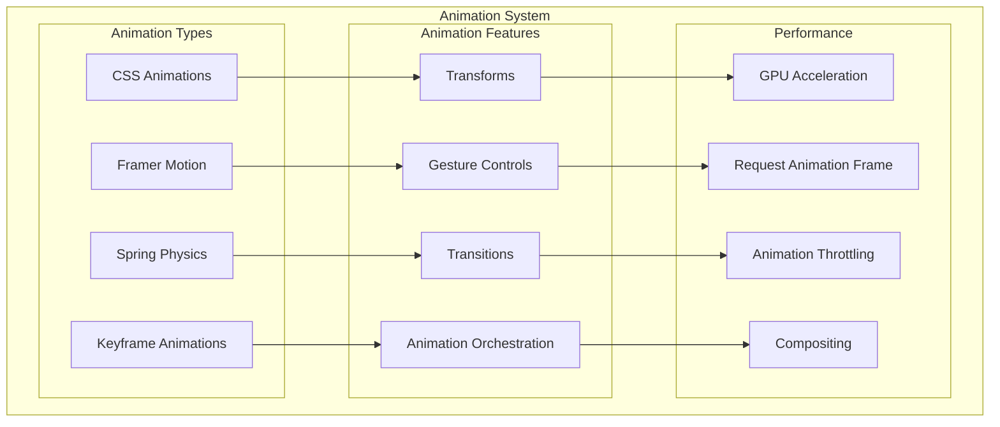

# Animation Architecture

This diagram illustrates our animation implementation strategy using Framer Motion and CSS animations.

## Implementation

Our animation system heavily utilizes Animation Wrapper particles from our [Atomic Design Structure](./atomic-design.md#particles):

- Animation Wrapper particles for motion effects
- Performance Optimizers for animation performance
- Event Handler particles for animation triggers
- Portal Containers for overlay animations

## Animation Architecture Diagram



## Animation Patterns

### 1. Motion Wrappers

```typescript
// Animation wrapper particle
const MotionWrapper = ({ children, animation }: MotionWrapperProps) => {
  return (
    <motion.div initial={animation.initial} animate={animation.animate} exit={animation.exit} transition={animation.transition}>
      {children}
    </motion.div>
  );
};
```

### 2. Gesture Handlers

```typescript
// Gesture handler particle
const GestureHandler = ({ children, onGesture }: GestureHandlerProps) => {
  return (
    <motion.div whileHover={{ scale: 1.1 }} whileTap={{ scale: 0.9 }} drag={true} onDragEnd={onGesture}>
      {children}
    </motion.div>
  );
};
```

### 3. Performance Optimizers

```typescript
// Animation performance optimizer particle
const AnimationOptimizer = ({ children, shouldAnimate }: OptimizerProps) => {
  const controls = useAnimation();

  useEffect(() => {
    if (shouldAnimate) {
      requestAnimationFrame(() => {
        controls.start({ opacity: 1 });
      });
    }
  }, [shouldAnimate, controls]);

  return <motion.div animate={controls}>{children}</motion.div>;
};
```

## Best Practices

1. **Performance**

   - Use GPU acceleration
   - Implement proper throttling
   - Optimize composite layers
   - Monitor frame rates

2. **User Experience**

   - Maintain 60fps
   - Implement smooth transitions
   - Handle interruptions
   - Provide fallbacks

3. **Accessibility**
   - Respect reduced motion
   - Provide animation controls
   - Implement proper timing
   - Handle motion sickness

## Related Diagrams

- [Performance Architecture](../system/performance.md)
- [Accessibility Architecture](./accessibility-architecture.md)
- [Component Interactions](./interactions.md)
