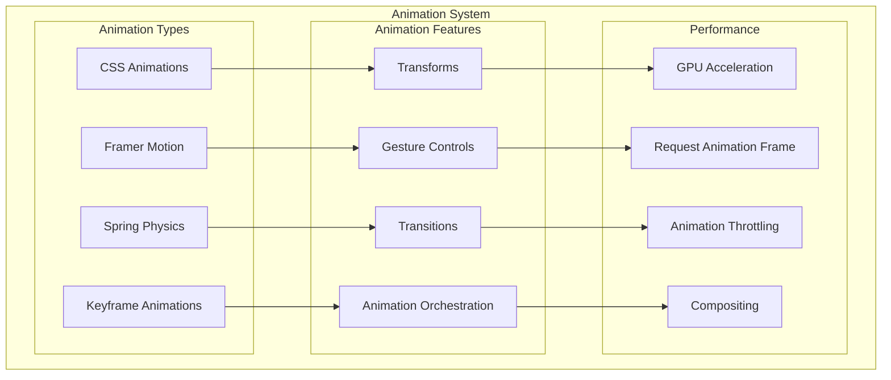

# Animation Architecture

## Overview

This document outlines our animation architecture, which leverages Framer Motion and CSS animations to create smooth, performant, and accessible motion experiences. Our system is designed to handle complex animations while maintaining performance and providing a consistent API for developers.

## Components

Our animation system consists of several key components:

### 1. Animation Core
- CSS Animations: For simple, performant transitions
- Framer Motion: For complex, interactive animations
- Spring Physics: For natural motion
- Keyframe Animations: For complex sequences

### 2. Feature Components
- Gesture Controls: For interactive animations
- Transitions: For state changes
- Transforms: For element manipulation
- Animation Orchestration: For complex sequences

### 3. Performance Layer
- GPU Acceleration: For hardware-accelerated animations
- RequestAnimationFrame: For smooth animations
- Animation Throttling: For performance optimization
- Compositing: For layer management



## Interactions

Our animation system follows these interaction patterns:

### 1. Animation Trigger Flow
- User interaction triggers animation
- Animation system calculates properties
- Performance optimizations applied
- Animation executes with proper timing

### 2. Gesture Handling Flow
- User initiates gesture
- System tracks gesture progress
- Animation updates in real-time
- Gesture completion triggers finish state

### 3. Performance Optimization Flow
- Animation request received
- System checks performance budget
- Optimizations applied as needed
- Animation executes within performance constraints

## Implementation Details

### 1. Motion Components

```typescript
// Base Motion Component
interface MotionProps {
  initial?: VariantLabels | TargetAndTransition;
  animate?: VariantLabels | TargetAndTransition;
  exit?: VariantLabels | TargetAndTransition;
  transition?: Transition;
  children: React.ReactNode;
}

const MotionWrapper: React.FC<MotionProps> = ({
  initial,
  animate,
  exit,
  transition,
  children
}) => {
  return (
    <motion.div
      initial={initial}
      animate={animate}
      exit={exit}
      transition={transition}
    >
      {children}
    </motion.div>
  );
};

// Gesture Component
interface GestureProps {
  onDragEnd?: (event: MouseEvent | TouchEvent | PointerEvent) => void;
  children: React.ReactNode;
}

const GestureHandler: React.FC<GestureProps> = ({
  onDragEnd,
  children
}) => {
  return (
    <motion.div
      whileHover={{ scale: 1.1 }}
      whileTap={{ scale: 0.9 }}
      drag={true}
      onDragEnd={onDragEnd}
    >
      {children}
    </motion.div>
  );
};
```

### 2. Animation Hooks

```typescript
// Performance-optimized animation hook
const useOptimizedAnimation = (
  shouldAnimate: boolean,
  animation: TargetAndTransition
) => {
  const controls = useAnimation();

  useEffect(() => {
    if (shouldAnimate) {
      requestAnimationFrame(() => {
        controls.start(animation);
      });
    }
  }, [shouldAnimate, controls, animation]);

  return controls;
};

// Gesture animation hook
const useGestureAnimation = (
  onComplete?: () => void
) => {
  return {
    drag: true,
    dragElastic: 0.2,
    dragConstraints: { left: 0, right: 0, top: 0, bottom: 0 },
    onDragEnd: (_, info) => {
      if (info.offset.x > 100) {
        onComplete?.();
      }
    }
  };
};
```

### 3. Animation Variants

```typescript
// Common animation variants
const fadeInVariants = {
  hidden: { opacity: 0 },
  visible: { 
    opacity: 1,
    transition: {
      duration: 0.3,
      ease: "easeOut"
    }
  }
};

const slideInVariants = {
  hidden: { x: "-100%" },
  visible: {
    x: 0,
    transition: {
      type: "spring",
      stiffness: 300,
      damping: 30
    }
  }
};
```

## Best Practices

1. **Performance Optimization**
   - Use CSS transforms and opacity for smooth animations
   - Implement proper will-change hints
   - Utilize RequestAnimationFrame for JavaScript animations
   - Monitor and optimize animation frame rate

2. **Animation Design**
   - Follow natural motion principles
   - Maintain consistent timing patterns
   - Implement proper easing functions
   - Consider reduced motion preferences

3. **Code Organization**
   - Centralize animation definitions
   - Reuse animation variants
   - Implement proper typing
   - Document animation parameters

4. **Accessibility**
   - Respect user motion preferences
   - Provide alternative non-animated states
   - Ensure animations don't interfere with usability
   - Implement proper ARIA attributes

## Related Diagrams

- [Performance Architecture](../system/performance.md)
- [Accessibility Architecture](./accessibility-architecture.md)
- [Component Interactions](./interactions.md)
