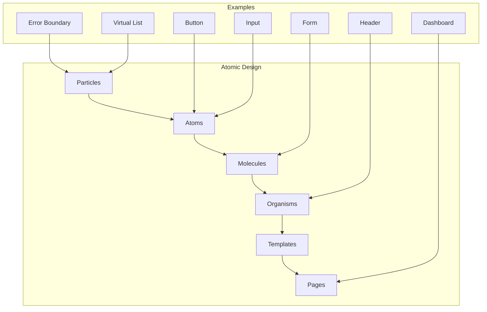

# Atomic Design Structure

## Overview

This document outlines our implementation of Atomic Design principles, extended with Particles for non-visual components. Our architecture follows Brad Frost's Atomic Design methodology with an additional layer for handling cross-cutting concerns. This approach enables us to build a scalable, maintainable, and consistent component library.

## Components

Our component architecture consists of six main layers:

### 1. Particles Layer (Extension)
Non-visual components that provide functionality:
- Error Boundaries (error handling wrapper)
- Virtual Lists (virtualization wrapper)
- Context Providers
- HOCs (Higher Order Components)
- Event Handlers
- Animation Wrappers
- Performance Optimizers
- State Synchronizers
- Portal Containers
- Focus Managers

### 2. Atoms Layer
Basic building blocks:
- Buttons
- Inputs
- Labels
- Icons

### 3. Molecules Layer
Simple groups of UI elements:
- Form Fields
- Search Bars
- Menu Items
- Card Components

### 4. Organisms Layer
Complex UI components:
- Navigation Bars
- Forms
- Cards Lists
- Data Tables

### 5. Templates Layer
Page-level layouts:
- Layout Grids
- Page Structures
- Section Arrangements

### 6. Pages Layer
Specific instances:
- Dashboard
- Profile Page
- Settings Page



## Interactions

Our atomic design system follows these interaction patterns:

### 1. Component Composition Flow
- Particles wrap other components
- Atoms combine into Molecules
- Molecules form Organisms
- Organisms arrange into Templates
- Templates implement Pages

### 2. State Flow
- Particles manage cross-cutting concerns
- Components receive props from parents
- State flows down the component tree
- Events bubble up to handlers

### 3. Styling Flow
- Design tokens define base values
- Atoms implement base styles
- Higher levels compose and override
- Themes apply consistently

## Implementation Details

### 1. Particle Components

```typescript
// Error Boundary Particle
interface ErrorBoundaryProps {
  fallback: React.ReactNode;
  onError?: (error: Error, errorInfo: React.ErrorInfo) => void;
  children: React.ReactNode;
}

class ErrorBoundary extends React.Component<ErrorBoundaryProps, { hasError: boolean }> {
  state = { hasError: false };

  static getDerivedStateFromError() {
    return { hasError: true };
  }

  componentDidCatch(error: Error, errorInfo: React.ErrorInfo) {
    this.props.onError?.(error, errorInfo);
  }

  render() {
    if (this.state.hasError) {
      return this.props.fallback;
    }

    return this.props.children;
  }
}

// Virtual List Particle
interface VirtualListProps<T> {
  items: T[];
  height: number;
  itemHeight: number;
  renderItem: (item: T, index: number) => React.ReactNode;
}

function VirtualList<T>({
  items,
  height,
  itemHeight,
  renderItem
}: VirtualListProps<T>) {
  const [scrollTop, setScrollTop] = useState(0);
  
  const startIndex = Math.floor(scrollTop / itemHeight);
  const endIndex = Math.min(
    startIndex + Math.ceil(height / itemHeight),
    items.length
  );

  return (
    <div
      style={{ height, overflow: 'auto' }}
      onScroll={(e) => setScrollTop(e.currentTarget.scrollTop)}
    >
      <div style={{ height: items.length * itemHeight }}>
        <div style={{ transform: `translateY(${startIndex * itemHeight}px)` }}>
          {items.slice(startIndex, endIndex).map((item, index) => (
            renderItem(item, startIndex + index)
          ))}
        </div>
      </div>
    </div>
  );
}
```

### 2. Atomic Components

```typescript
// Atom Component
interface ButtonProps {
  variant: 'primary' | 'secondary';
  size: 'sm' | 'md' | 'lg';
  children: React.ReactNode;
  onClick?: () => void;
}

const Button: React.FC<ButtonProps> = ({
  variant,
  size,
  children,
  onClick
}) => (
  <button 
    className={`btn btn-${variant} btn-${size}`}
    onClick={onClick}
  >
    {children}
  </button>
);

// Molecule Component
interface FormFieldProps {
  label: string;
  error?: string;
  children: React.ReactNode;
}

const FormField: React.FC<FormFieldProps> = ({
  label,
  error,
  children
}) => (
  <div className="form-field">
    <label>{label}</label>
    {children}
    {error && <span className="error">{error}</span>}
  </div>
);
```

## Best Practices

1. **Component Organization**
   - Follow single responsibility principle
   - Keep components focused and small
   - Use proper naming conventions
   - Document component interfaces

2. **State Management**
   - Keep state as close as needed
   - Use appropriate state solutions
   - Implement proper prop drilling
   - Handle side effects properly

3. **Performance**
   - Implement proper memoization
   - Use React.memo where needed
   - Optimize re-renders
   - Profile component performance

4. **Accessibility**
   - Follow ARIA best practices
   - Implement keyboard navigation
   - Provide proper labels
   - Test with screen readers

## Related Diagrams

- [Component Interactions](interactions.md) - How particles interact with other components
- [State Patterns](state-patterns.md) - State management patterns using particles
- [Error Flow](../system/error-flow.md) - Error handling using particles

## Particle Usage in System Architecture

Particles are used throughout our system architecture. Here are the key implementations:

### Error Handling

- [Error Flow](../system/error-flow.md) - Error boundary implementation in error handling flow
- [Error Handling Architecture](../system/error-handling.md) - UI error boundaries in system error handling

### State Management

- [Feature Flags](../system/feature-flags.md) - Feature flag context providers
- [i18n Architecture](../system/i18n-architecture.md) - Internationalization context providers

### Integration

- [Third-party Integration](../system/third-party.md) - Service wrappers for external services
- [API Architecture](../system/api-architecture.md) - API client wrappers

### Performance

- [Performance Architecture](../system/performance.md) - Virtual list and performance optimization wrappers
- [State Management](../data-flow/state-management.md) - State synchronization particles

## Component Hierarchy


## Description

Our UI components follow an extended Atomic Design methodology:

0. **Particles**: Non-visual components that provide functionality

   - Error Boundaries (error handling wrapper)
   - Virtual Lists (virtualization wrapper)
   - Context Providers
   - HOCs (Higher Order Components)
   - Event Handlers
   - Animation Wrappers
   - Performance Optimizers
   - State Synchronizers
   - Portal Containers
   - Focus Managers

1. **Atoms**: Basic building blocks

   - Buttons
   - Inputs
   - Labels
   - Icons

2. **Molecules**: Simple groups of UI elements functioning together

   - Form Fields
   - Search Bars
   - Menu Items
   - Card Components

3. **Organisms**: Complex UI components composed of molecules and/or atoms

   - Navigation Bars
   - Forms
   - Cards Lists
   - Data Tables

4. **Templates**: Page-level objects that place components into a layout

   - Layout Grids
   - Page Structures
   - Section Arrangements

5. **Pages**: Specific instances of templates with real content
   - Dashboard
   - Profile Page
   - Settings Page

## Component Standards

- Built using React and TypeScript
- Styled using Tailwind CSS and shadcn/ui
- Documented in Storybook
- Unit tested with Vitest
- Integration tested with Playwright
