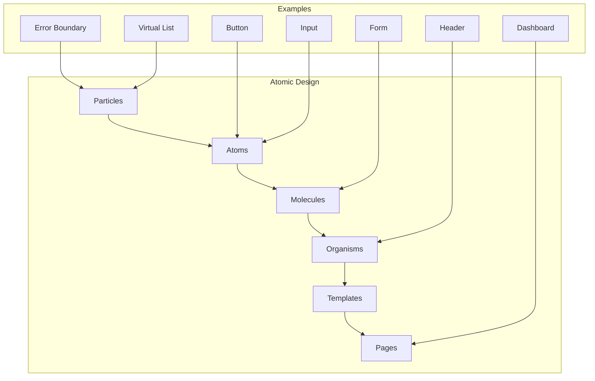

# Atomic Design Structure

This diagram illustrates our implementation of Atomic Design principles, extended with Particles for non-visual components.

## Component Hierarchy



## Description

Our UI components follow an extended Atomic Design methodology:

0. **Particles**: Non-visual components that provide functionality

   - Error Boundaries (error handling wrapper)
   - Virtual Lists (virtualization wrapper)
   - Context Providers
   - HOCs (Higher Order Components)
   - Event Handlers
   - Animation Wrappers
   - Performance Optimizers
   - State Synchronizers
   - Portal Containers
   - Focus Managers

1. **Atoms**: Basic building blocks

   - Buttons
   - Inputs
   - Labels
   - Icons

2. **Molecules**: Simple groups of UI elements functioning together

   - Form Fields
   - Search Bars
   - Menu Items
   - Card Components

3. **Organisms**: Complex UI components composed of molecules and/or atoms

   - Navigation Bars
   - Forms
   - Cards Lists
   - Data Tables

4. **Templates**: Page-level objects that place components into a layout

   - Layout Grids
   - Page Structures
   - Section Arrangements

5. **Pages**: Specific instances of templates with real content
   - Dashboard
   - Profile Page
   - Settings Page

## Implementation Details

### Particles Implementation

```typescript
// Error Boundary
class ErrorBoundary extends React.Component<ErrorBoundaryProps> {
  componentDidCatch(error: Error, errorInfo: React.ErrorInfo) {
    this.props.onError?.(error, errorInfo);
  }

  render() {
    return this.props.children;
  }
}

// Virtual List
const VirtualList = <T extends unknown>({ items, renderItem, height, itemHeight }: VirtualListProps<T>) => {
  const [startIndex, setStartIndex] = useState(0);
  const visibleItems = useVirtualization(items, startIndex, height, itemHeight);

  return <div style={{ height, overflow: 'auto' }}>{visibleItems.map(renderItem)}</div>;
};

// Context Provider
const FeatureWrapper = ({ children }: PropsWithChildren) => {
  const context = useFeatureContext();

  return <FeatureContext.Provider value={context}>{children}</FeatureContext.Provider>;
};
```

### Component Standards

- Built using React and TypeScript
- Styled using Tailwind CSS and shadcn/ui
- Documented in Storybook
- Unit tested with Vitest
- Integration tested with Playwright

## Particle Usage in System Architecture

Particles are used throughout our system architecture. Here are the key implementations:

### Error Handling

- [Error Flow](../system/error-flow.md) - Error boundary implementation in error handling flow
- [Error Handling Architecture](../system/error-handling.md) - UI error boundaries in system error handling

### State Management

- [Feature Flags](../system/feature-flags.md) - Feature flag context providers
- [i18n Architecture](../system/i18n-architecture.md) - Internationalization context providers

### Integration

- [Third-party Integration](../system/third-party.md) - Service wrappers for external services
- [API Architecture](../system/api-architecture.md) - API client wrappers

### Performance

- [Performance Architecture](../system/performance.md) - Virtual list and performance optimization wrappers
- [State Management](../data-flow/state-management.md) - State synchronization particles

## Best Practices

### Particle Components

1. **Error Handling**

   - Implement error boundaries at appropriate levels
   - Provide fallback UI for errors
   - Log errors for monitoring

2. **Performance**

   - Use virtualization for long lists
   - Implement lazy loading
   - Optimize re-renders

3. **State Management**

   - Keep state close to where it's used
   - Use context providers efficiently
   - Implement proper state isolation

4. **Accessibility**
   - Manage focus appropriately
   - Handle keyboard navigation
   - Provide ARIA attributes

## Related Diagrams

- [Component Interactions](interactions.md) - How particles interact with other components
- [State Patterns](state-patterns.md) - State management patterns using particles
- [Error Flow](../system/error-flow.md) - Error handling using particles
