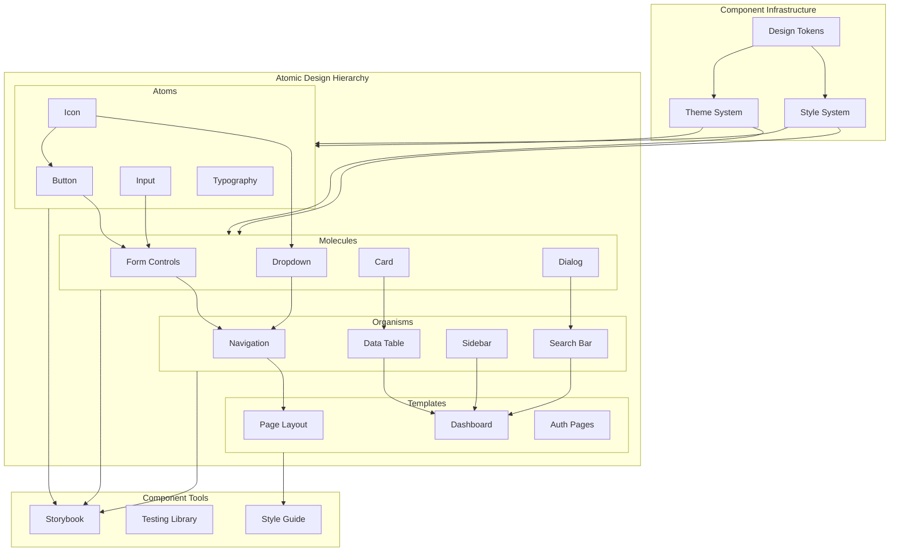

# Component Library Architecture

## Overview

This document outlines our component library architecture, which is built using shadcn/ui and follows Atomic Design principles. The architecture is designed to create a scalable, maintainable, and consistent component ecosystem that supports rapid development while maintaining high quality and reusability.

## Components

Our component library consists of several key layers and systems:

### Atomic Design Hierarchy

1. **Atoms**
   - Basic UI elements
   - Pure presentational
   - Highly reusable
   - Style foundation

2. **Molecules**
   - Composed of atoms
   - Simple combinations
   - Specific functionality
   - Reusable patterns

3. **Organisms**
   - Complex components
   - Business-specific
   - Composed of molecules
   - Feature-complete units

4. **Templates**
   - Page layouts
   - Component composition
   - Content structure
   - Layout patterns



## Interactions

Our component library follows these interaction patterns:

1. **Component Composition Flow**
   - Atoms combine to form Molecules
   - Molecules combine to form Organisms
   - Organisms arrange into Templates
   - Templates implement specific Pages

2. **Theme System Integration**
   - Design tokens define base values
   - Theme system applies consistent styling
   - Components inherit theme properties
   - Runtime theme switching supported

3. **Development Workflow**
   - Components developed in isolation
   - Storybook for development/testing
   - Automated testing via Testing Library
   - Documentation via Style Guide

## Implementation Details

### 1. Component Structure

```typescript
// Basic component structure
interface ButtonProps {
  variant: 'primary' | 'secondary';
  size: 'sm' | 'md' | 'lg';
  children: React.ReactNode;
}

const Button = ({ variant, size, children }: ButtonProps) => {
  return (
    <button className={cn(styles[variant], styles[size])}>
      {children}
    </button>
  );
};
```

### 2. Theme Implementation

```typescript
// Theme configuration
const theme = {
  colors: {
    primary: {
      main: 'var(--color-primary)',
      light: 'var(--color-primary-light)',
      dark: 'var(--color-primary-dark)',
    },
    // ... other color definitions
  },
  spacing: {
    sm: 'var(--spacing-sm)',
    md: 'var(--spacing-md)',
    lg: 'var(--spacing-lg)',
  },
};
```

### 3. Testing Strategy

```typescript
// Component test example
describe('Button', () => {
  it('renders with correct variant', () => {
    render(<Button variant="primary">Click me</Button>);
    expect(screen.getByRole('button')).toHaveClass('primary');
  });
});
```

### Best Practices

1. **Component Development**
   - Follow single responsibility principle
   - Implement proper prop typing
   - Include accessibility features
   - Write comprehensive tests

2. **Documentation**
   - Document all props and variants
   - Include usage examples
   - Provide accessibility guidelines
   - Keep documentation up-to-date

3. **Performance**
   - Implement proper memoization
   - Optimize bundle size
   - Use lazy loading where appropriate
   - Monitor performance metrics

## Implementation Guidelines

1. **Component Development**

   - Follow Atomic Design principles
   - Maintain component independence
   - Ensure accessibility
   - Document properly

2. **Style Management**

   - Use CSS-in-JS
   - Follow BEM methodology
   - Maintain theme consistency
   - Handle responsiveness

3. **Testing Strategy**

   - Unit tests for atoms
   - Integration tests for molecules
   - Visual tests for organisms
   - E2E tests for templates

4. **Documentation**

   - Component API docs
   - Usage examples
   - Design guidelines
   - Accessibility notes

5. **Best Practices**
   - Component composition
   - Prop drilling management
   - Performance optimization
   - Responsive design
