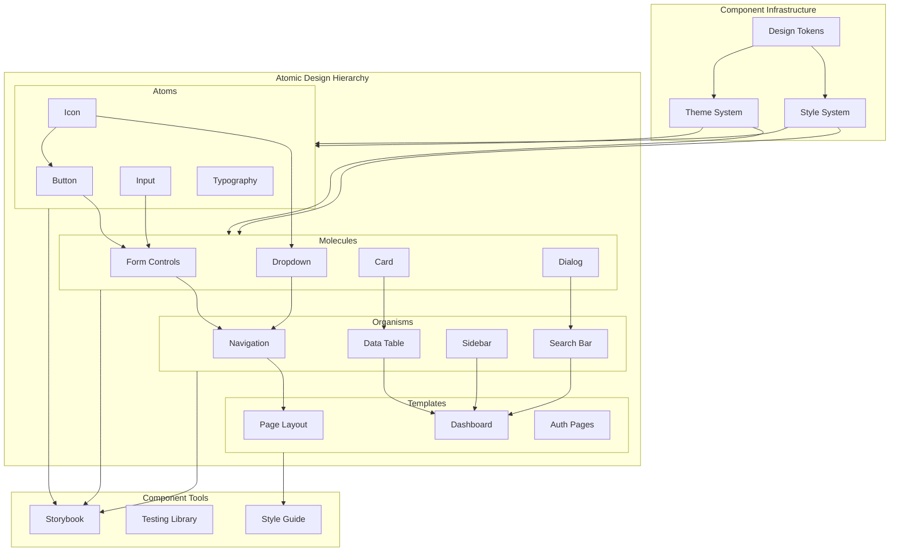

# Component Library Architecture

This diagram illustrates our component library architecture using shadcn/ui and Atomic Design principles, showing how components are organized and composed.

## Component Architecture Diagram

## Component Description

### Atomic Design Levels

1. **Atoms**

   - Basic UI elements
   - Pure presentational
   - Highly reusable
   - Style foundation

2. **Molecules**

   - Composed of atoms
   - Simple combinations
   - Specific functionality
   - Reusable patterns

3. **Organisms**

   - Complex components
   - Business logic
   - Feature-specific
   - Layout patterns

4. **Templates**
   - Page structures
   - Layout systems
   - Component composition
   - User flows

### Infrastructure

- **Theme System**: Design system implementation
- **Style System**: CSS/styling architecture
- **Design Tokens**: Visual variables

### Tools

- **Storybook**: Component development
- **Testing Library**: Component testing
- **Style Guide**: Documentation

## Implementation Guidelines

1. **Component Development**

   - Follow Atomic Design principles
   - Maintain component independence
   - Ensure accessibility
   - Document properly

2. **Style Management**

   - Use CSS-in-JS
   - Follow BEM methodology
   - Maintain theme consistency
   - Handle responsiveness

3. **Testing Strategy**

   - Unit tests for atoms
   - Integration tests for molecules
   - Visual tests for organisms
   - E2E tests for templates

4. **Documentation**

   - Component API docs
   - Usage examples
   - Design guidelines
   - Accessibility notes

5. **Best Practices**
   - Component composition
   - Prop drilling management
   - Performance optimization
   - Responsive design
