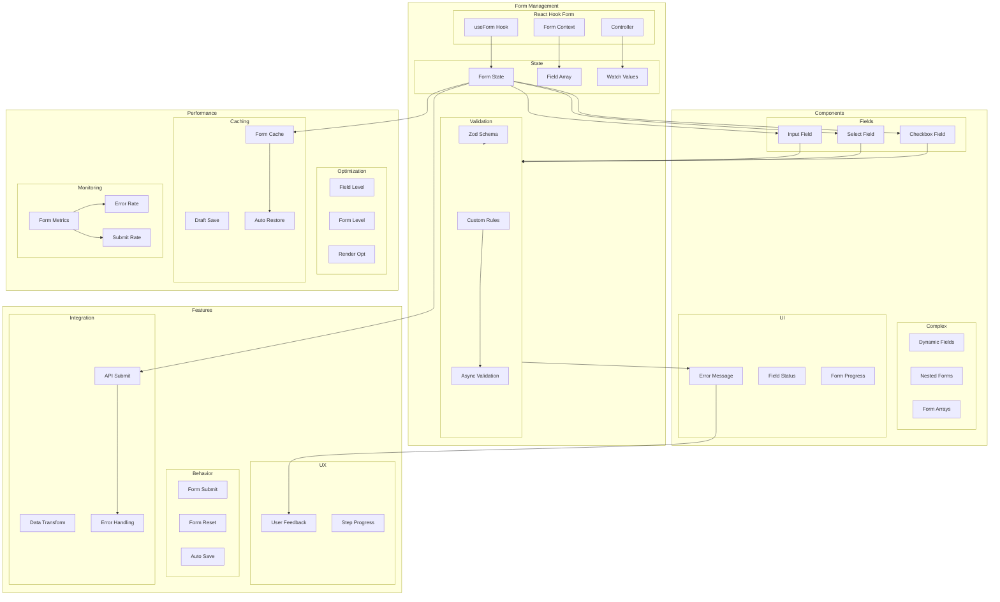

# Form Handling Architecture

## Overview

This document outlines our comprehensive form management architecture, built using React Hook Form and Zod. Our architecture is designed to handle complex form scenarios while maintaining performance, type safety, and excellent user experience. The system integrates validation, state management, and UI components in a cohesive way.

## Components

Our form architecture consists of several key components and systems:

### 1. Form Management Layer
- React Hook Form core (useForm, FormContext, Controller)
- Validation system (Zod Schema, Custom Rules)
- State management (Form State, Field Arrays)

### 2. UI Components Layer
- Basic field components (Input, Select, Checkbox)
- Complex form components (Dynamic Fields, Nested Forms)
- Feedback components (Error Messages, Status Indicators)

### 3. Feature Layer
- Form behaviors (Submit, Reset, Auto-save)
- User experience features (Live Validation, Feedback)
- Integration features (API Submit, Error Handling)

### 4. Performance Layer
- Optimization systems (Field Level, Form Level)
- Caching mechanisms (Form Cache, Draft Save)
- Monitoring tools (Form Metrics, Error Rate)



## Interactions

Our form system follows these interaction patterns:

### 1. Form Initialization Flow
- Form hook initialization with schema
- Field registration and default values
- Form context provider setup
- Controller component binding

### 2. User Input Flow
- Field value changes
- Real-time validation
- Error message display
- Field state updates

### 3. Submission Flow
- Form validation
- Data transformation
- API submission
- Error handling
- Success/failure feedback

## Implementation Details

### 1. Form Setup

```typescript
// Form Schema Definition
const formSchema = z.object({
  username: z.string().min(3).max(20),
  email: z.string().email(),
  password: z.string().min(8).regex(/[A-Z]/, 'Need one uppercase letter'),
  confirmPassword: z.string()
}).refine(data => data.password === data.confirmPassword, {
  message: "Passwords don't match",
  path: ["confirmPassword"],
});

// Form Hook Setup
const {
  register,
  handleSubmit,
  formState: { errors },
  control
} = useForm<FormData>({
  resolver: zodResolver(formSchema),
  defaultValues: {
    username: '',
    email: '',
    password: '',
    confirmPassword: ''
  }
});
```

### 2. Field Components

```typescript
// Custom Input Component
interface FormInputProps {
  name: string;
  label: string;
  control: Control<FormData>;
  rules?: RegisterOptions;
}

const FormInput: React.FC<FormInputProps> = ({
  name,
  label,
  control,
  rules
}) => {
  return (
    <Controller
      name={name}
      control={control}
      rules={rules}
      render={({ field, fieldState: { error } }) => (
        <div>
          <label>{label}</label>
          <input {...field} />
          {error && <span>{error.message}</span>}
        </div>
      )}
    />
  );
};
```

### 3. Form Submission

```typescript
// Form Submission Handler
const onSubmit = async (data: FormData) => {
  try {
    // Transform data if needed
    const transformedData = transformFormData(data);
    
    // Submit to API
    const response = await api.submitForm(transformedData);
    
    // Handle success
    handleFormSuccess(response);
  } catch (error) {
    // Handle error
    handleFormError(error);
  }
};

// Form Component
const FormComponent: React.FC = () => {
  const methods = useForm<FormData>({
    resolver: zodResolver(formSchema)
  });

  return (
    <FormProvider {...methods}>
      <form onSubmit={methods.handleSubmit(onSubmit)}>
        <FormInput name="username" label="Username" />
        <FormInput name="email" label="Email" />
        <button type="submit">Submit</button>
      </form>
    </FormProvider>
  );
};
```

### Best Practices

1. **Form Organization**
   - Use form provider for complex forms
   - Split large forms into sub-components
   - Implement proper field-level validation
   - Use controlled components for complex fields

2. **Performance**
   - Implement field-level validation
   - Use proper memoization
   - Implement form state optimization
   - Use efficient re-render strategies

3. **Error Handling**
   - Implement proper form-level validation
   - Handle API errors gracefully
   - Provide clear error messages
   - Implement proper error recovery

4. **User Experience**
   - Implement proper loading states
   - Show validation feedback in real-time
   - Implement proper form navigation
   - Save form state for recovery

## Component Description

### Form Management

1. **React Hook Form**

   - Form initialization
   - Field registration
   - Form control

2. **Validation**

   - Schema definition
   - Custom rules
   - Async validation

3. **State Management**
   - Form state
   - Field arrays
   - Value watching

### Components

1. **Form Fields**

   - Input components
   - Select fields
   - Checkbox groups

2. **Complex Forms**

   - Dynamic fields
   - Nested forms
   - Form arrays

3. **UI Elements**
   - Error display
   - Status indicators
   - Progress tracking

## Implementation Guidelines

1. **Form Design**

   - Field structure
   - Validation rules
   - State management
   - Error handling

2. **Performance**

   - Field-level updates
   - Form-level updates
   - Render optimization
   - State persistence

3. **User Experience**

   - Live validation
   - Error feedback
   - Progress tracking
   - Auto-save

4. **Best Practices**

   - Form organization
   - Error handling
   - Validation logic
   - State updates

5. **Integration**

   - API submission
   - Data transformation
   - Error handling
   - Success feedback

6. **Documentation**
   - Form patterns
   - Field types
   - Validation rules
   - Error states
