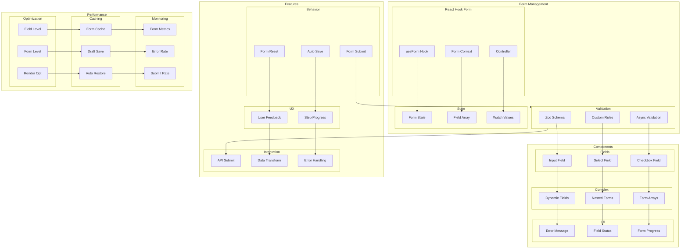

# Form Handling Architecture

This diagram illustrates our form management strategy using React Hook Form, Zod, and related patterns.

## Implementation

Our form handling system utilizes several particle components from our [Atomic Design Structure](./atomic-design.md#particles):

- Form Context Providers for form state management
- Error Boundary particles for form error handling
- Event Handler particles for form submissions
- Performance Optimizers for form field updates

## Form Architecture Diagram

## Component Description

### Form Management

1. **React Hook Form**

   - Form initialization
   - Field registration
   - Form control

2. **Validation**

   - Schema definition
   - Custom rules
   - Async validation

3. **State Management**
   - Form state
   - Field arrays
   - Value watching

### Components

1. **Form Fields**

   - Input components
   - Select fields
   - Checkbox groups

2. **Complex Forms**

   - Dynamic fields
   - Nested forms
   - Form arrays

3. **UI Elements**
   - Error display
   - Status indicators
   - Progress tracking

## Implementation Guidelines

1. **Form Design**

   - Field structure
   - Validation rules
   - State management
   - Error handling

2. **Performance**

   - Field-level updates
   - Form-level updates
   - Render optimization
   - State persistence

3. **User Experience**

   - Live validation
   - Error feedback
   - Progress tracking
   - Auto-save

4. **Best Practices**

   - Form organization
   - Error handling
   - Validation logic
   - State updates

5. **Integration**

   - API submission
   - Data transformation
   - Error handling
   - Success feedback

6. **Documentation**
   - Form patterns
   - Field types
   - Validation rules
   - Error states
