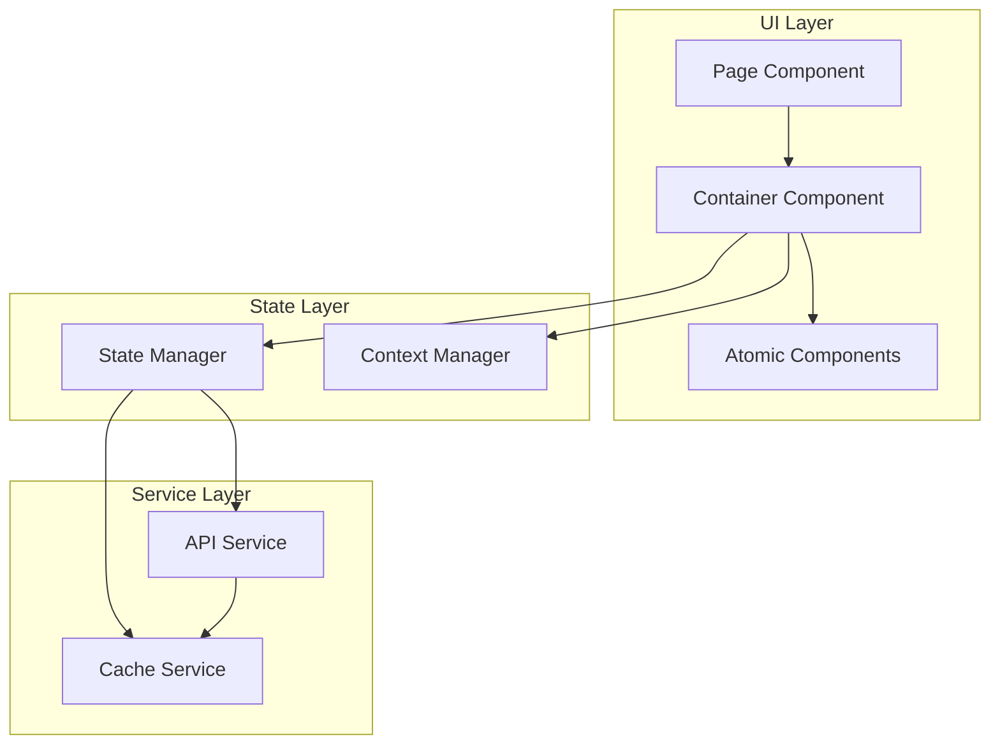

# Component Interactions

## Overview

This document outlines the architecture of component interactions within our application. It describes how different layers of components communicate, manage state, and integrate with services, ensuring efficient and maintainable component relationships while following best practices for React applications.

## Components

Our component interaction system consists of three main layers:

1. **UI Layer**
   - Page Components: Top-level route components
   - Container Components: Smart components with business logic
   - Atomic Components: Presentational components

2. **State Layer**
   - State Manager: Global state management (Redux/MobX)
   - Context Manager: React Context for specific features

3. **Service Layer**
   - API Service: Backend communication
   - Cache Service: Data caching and optimization



## Interactions

Our component interactions follow these patterns:

### 1. Parent-Child Communication
- Props passing for data flow
- Event bubbling for child-to-parent communication
- Render props for component composition
- Component composition for complex UIs

### 2. State Management Flow
- Global state updates through actions/reducers
- Local state handling with hooks
- Context propagation for feature-specific state
- State synchronization between components

### 3. Service Integration Flow
- API calls through service layer
- Cache management for performance
- Error handling and recovery
- Data transformation and normalization

## Implementation Details

### 1. Component Communication Patterns

```typescript
// Props and Events Pattern
interface ComponentProps {
  data: DataType;
  onAction: (data: ActionData) => void;
}

const ChildComponent: React.FC<ComponentProps> = ({ data, onAction }) => {
  const handleClick = () => {
    onAction({ id: data.id, value: data.value });
  };
  
  return <button onClick={handleClick}>Action</button>;
};

// Context Pattern
interface ContextData {
  theme: ThemeType;
  updateTheme: (theme: ThemeType) => void;
}

const ThemeContext = React.createContext<ContextData>({
  theme: 'light',
  updateTheme: () => {},
});

// State Management Pattern
interface State {
  data: DataType[];
  loading: boolean;
  error: Error | null;
}

const reducer = (state: State, action: Action): State => {
  switch (action.type) {
    case 'FETCH_START':
      return { ...state, loading: true };
    case 'FETCH_SUCCESS':
      return { ...state, loading: false, data: action.payload };
    case 'FETCH_ERROR':
      return { ...state, loading: false, error: action.payload };
    default:
      return state;
  }
};
```

### 2. Service Integration

```typescript
// API Service Pattern
class APIService {
  private baseURL: string;
  private cache: Cache;

  constructor(baseURL: string) {
    this.baseURL = baseURL;
    this.cache = new Cache();
  }

  async fetchData<T>(endpoint: string): Promise<T> {
    const cached = this.cache.get(endpoint);
    if (cached) return cached;

    const response = await fetch(`${this.baseURL}${endpoint}`);
    const data = await response.json();
    
    this.cache.set(endpoint, data);
    return data;
  }
}

// Cache Service Pattern
class Cache {
  private store: Map<string, any>;
  private ttl: number;

  constructor(ttl = 5000) {
    this.store = new Map();
    this.ttl = ttl;
  }

  set(key: string, value: any): void {
    this.store.set(key, {
      value,
      timestamp: Date.now(),
    });
  }

  get(key: string): any | null {
    const item = this.store.get(key);
    if (!item) return null;

    if (Date.now() - item.timestamp > this.ttl) {
      this.store.delete(key);
      return null;
    }

    return item.value;
  }
}
```

### Best Practices

1. **Component Coupling**
   - Maintain loose coupling between components
   - Use dependency injection where appropriate
   - Implement clear interfaces
   - Follow single responsibility principle

2. **State Management**
   - Centralize shared state in appropriate stores
   - Keep local state close to where it's used
   - Use appropriate state solutions for different needs
   - Implement proper state isolation

3. **Performance**
   - Minimize unnecessary re-renders
   - Optimize event handlers
   - Implement proper memoization
   - Use efficient data structures
   - Cache API responses appropriately

4. **Error Handling**
   - Implement proper error boundaries
   - Handle API errors gracefully
   - Provide meaningful error messages
   - Implement retry mechanisms where appropriate

## Related Diagrams

- [Atomic Design](atomic-design.md)
- [State Patterns](state-patterns.md)
- [API Architecture](../system/api-architecture.md)
