# Component Interactions

This diagram illustrates how components communicate and interact within our application.

## Component Communication Flow

```mermaid
graph TD
    subgraph UI Layer
        P[Page Component]
        C[Container Component]
        A[Atomic Components]
    end

    subgraph State Layer
        S[State Manager]
        CM[Context Manager]
    end

    subgraph Service Layer
        API[API Service]
        Cache[Cache Service]
    end

    P --> C
    C --> A
    C --> S
    C --> CM
    S --> API
    S --> Cache
    API --> Cache
```



## Key Interactions

### Parent-Child Communication

- Props passing
- Event bubbling
- Render props
- Component composition

### State Management

- Global state updates
- Local state handling
- Context propagation
- State synchronization

### Service Integration

- API calls
- Cache management
- Error handling
- Data transformation

## Best Practices

1. **Component Coupling**

   - Maintain loose coupling
   - Use dependency injection
   - Implement clear interfaces
   - Follow single responsibility principle

2. **State Management**

   - Centralize shared state
   - Keep local state close
   - Use appropriate state solutions
   - Implement proper state isolation

3. **Performance**
   - Minimize re-renders
   - Optimize event handlers
   - Implement proper memoization
   - Use efficient data structures

## Implementation Guidelines

### Component Communication

```typescript
// Event handling
interface ComponentProps {
  onAction: (data: ActionData) => void;
}

// Context usage
const MyContext = React.createContext<ContextData>(defaultValue);

// State management
const [state, dispatch] = useReducer(reducer, initialState);
```

### Service Integration

```typescript
// API service integration
const apiService = new APIService();
const data = await apiService.fetchData();

// Cache service usage
const cacheService = new CacheService();
await cacheService.set('key', value);
```

## Related Diagrams

- [Atomic Design](atomic-design.md)
- [State Patterns](state-patterns.md)
- [API Architecture](../system/api-architecture.md)
