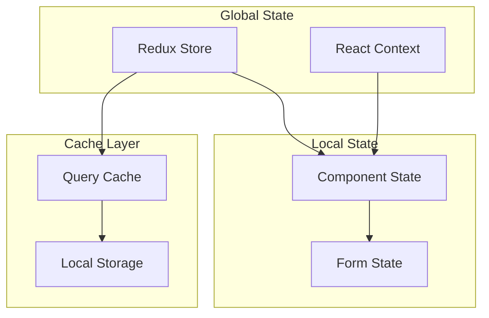

# Component State Patterns

## Overview

This document outlines our component state management patterns and best practices. It describes how we handle different types of state across our application, from global application state to local component state, ensuring consistent and maintainable state management.

## Components

Our state management architecture consists of several key components:

1. Global State Layer
   - Redux Store: For application-wide state
   - React Context: For feature-specific shared state

2. Local State Layer
   - Component State: For component-specific UI state
   - Form State: For form handling and validation

3. Cache Layer
   - Query Cache: For server state management
   - Local Storage: For persistent client-side storage



## State Categories

### 1. Application State

- Global configuration
- User preferences
- Authentication state
- Theme settings

### 2. Navigation State

- Current route
- Navigation history
- Active tabs/panels
- Modal states

### 3. Domain State

- Entity data
- Relationships
- Cached responses
- Derived state

### 4. UI State

- Loading states
- Error states
- Form values
- UI element states

## Interactions

Our state management follows these interaction patterns:

1. Global State Flow:
   - Components subscribe to global state changes
   - Actions dispatch state updates
   - Reducers process state mutations
   - Components re-render with new state

2. Local State Flow:
   - Component initializes local state
   - User interactions trigger state updates
   - State changes cause re-renders
   - Effects run based on state changes

3. Cache Interaction Flow:
   - Data queries trigger cache checks
   - Cache hits return immediate results
   - Cache misses fetch from server
   - Background revalidation maintains freshness

## Implementation Details

### Global State Pattern

```typescript
// Redux slice example
const slice = createSlice({
  name: 'feature',
  initialState,
  reducers: {
    action: (state, action) => {
      // state updates
    },
  },
});

// Context example
const FeatureContext = createContext<FeatureState>(initialState);
```

### Local State Pattern

```typescript
// Component state
const [state, setState] = useState<ComponentState>(initialState);

// Form state
const form = useForm<FormData>({
  defaultValues,
  resolver: zodResolver(schema),
});
```

### Cache Pattern

```typescript
// Query cache
const { data, isLoading } = useQuery({
  queryKey: ['key'],
  queryFn: fetchData,
});

// Storage cache
const storage = new StorageService();
await storage.set('key', value);
```

## State Update Patterns

### 1. Immutable Updates

```typescript
// Correct
setState((prev) => ({
  ...prev,
  value: newValue,
}));

// Incorrect
state.value = newValue;
```

### 2. Batch Updates

```typescript
// Batch related changes
batch(() => {
  dispatch(action1());
  dispatch(action2());
});
```

### 3. Optimistic Updates

```typescript
// Update UI immediately, revert on error
const optimisticUpdate = async () => {
  const previousData = queryClient.getQueryData(['key']);
  queryClient.setQueryData(['key'], newData);

  try {
    await mutation.mutateAsync(newData);
  } catch (error) {
    queryClient.setQueryData(['key'], previousData);
  }
};
```

## Best Practices

1. **State Location**

   - Keep state as close as possible to where it's used
   - Lift state up only when necessary
   - Use appropriate state management solution for the use case

2. **Performance**

   - Minimize state updates
   - Use selective re-rendering
   - Implement proper memoization
   - Batch related updates

3. **Type Safety**
   - Define clear state interfaces
   - Use strict type checking
   - Implement proper error boundaries
   - Validate state updates

## Related Diagrams

- [Component Interactions](interactions.md)
- [Data Flow](../data-flow/state-management.md)
- [Error Handling](../system/error-flow.md)
