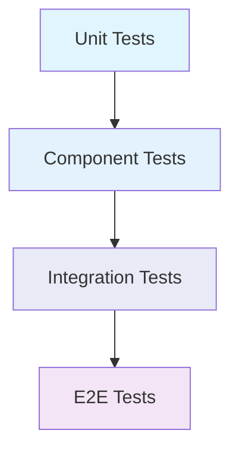

# Component Testing Patterns

## Overview

This document outlines our component testing strategies and best practices using Vitest and Testing Library. It provides a comprehensive guide for implementing effective testing patterns across different levels of our component architecture.

## Components

### Testing Tools
- Vitest: Fast unit test runner
- React Testing Library: Component testing utilities
- Mock Service Worker: API mocking
- Jest DOM: DOM testing utilities

### Testing Types
1. Unit Tests: Fast, isolated tests for pure functions and utilities
   - Focus: Individual functions, hooks, and utilities
   - When to use: Testing business logic, data transformations, and utility functions
   - Benefits: Fast execution, easy debugging, high coverage
   - Trade-offs: May miss integration issues

2. Component Tests: Testing individual components in isolation
   - Focus: Component rendering, props, events, and state
   - When to use: Testing UI components, custom hooks, and form validation
   - Benefits: Good balance of speed and coverage
   - Trade-offs: Limited testing of component interactions

3. Integration Tests: Testing component interactions and data flow
   - Focus: Multiple components working together, data flow, and state management
   - When to use: Testing feature workflows, complex interactions, and data fetching
   - Benefits: Higher confidence in feature functionality
   - Trade-offs: Slower execution, more complex setup

4. E2E Tests: Full user journey testing with real browser environment
   - Focus: Complete user flows and system integration
   - When to use: Critical business paths and user journeys
   - Benefits: Highest confidence in real-world behavior
   - Trade-offs: Slowest execution, most complex maintenance

### Testing Trade-offs Matrix

| Test Type | Speed | Coverage | Maintenance | Confidence | When to Use |
|-----------|-------|----------|-------------|------------|-------------|
| Unit | ⚡️⚡️⚡️⚡️⚡️ | 🎯🎯 | 🔧 | ⭐️ | Pure functions, utilities |
| Component | ⚡️⚡️⚡️⚡️ | 🎯🎯🎯 | 🔧🔧 | ⭐️⭐️ | UI components, hooks |
| Integration | ⚡️⚡️ | 🎯🎯🎯🎯 | 🔧🔧🔧 | ⭐️⭐️⭐️⭐️ | Features, workflows |
| E2E | ⚡️ | 🎯🎯🎯🎯🎯 | 🔧🔧🔧🔧🔧 | ⭐️⭐️⭐️⭐️⭐️ | Critical user journeys |

### Testing Best Practices
- Start with unit tests for core business logic
- Use component tests for UI behavior validation
- Add integration tests for critical feature workflows
- Reserve E2E tests for key user journeys
- Aim for the right balance based on:
  - Feature criticality
  - Development velocity needs
  - Maintenance capacity
  - CI/CD pipeline performance

## Interactions

### Testing Hierarchy



### Component Interactions
1. Parent-Child Communication
2. Context Providers
3. State Management
4. Event Handling
5. API Integration

## Implementation Details

### Testing Patterns

#### 1. Component Unit Tests
- Individual component rendering
- Props validation
- Event handlers
- State changes
- Error boundaries

#### 2. Component Integration Tests
- Parent-child interactions
- Context providers
- Redux/state management
- Custom hooks
- Event bubbling

#### 3. Best Practices
- Use React Testing Library
- Follow AAA pattern (Arrange, Act, Assert)
- Test user interactions
- Mock external dependencies
- Test accessibility
- Test error states

### Testing Structure

#### The AAA Pattern

The AAA (Arrange, Act, Assert) pattern is a fundamental testing pattern that helps organize tests in a clear and maintainable way:

1. **Arrange**: Set up the test data and conditions
   - Initialize test data
   - Create mocks and stubs
   - Set up component props
   - Configure test environment

2. **Act**: Execute the functionality being tested
   - Render components
   - Trigger user events
   - Call functions
   - Simulate async operations

3. **Assert**: Verify the results meet expectations
   - Check rendered output
   - Verify state changes
   - Validate function calls
   - Ensure error handling

Example implementations:

```typescript
// Basic Component Test
test('button changes text when clicked', () => {
  // Arrange
  const initialText = 'Click me';
  const changedText = 'Clicked!';
  const props = {
    initialText,
    changedText,
  };
  
  // Act
  render(<Button {...props} />);
  const button = screen.getByText(initialText);
  fireEvent.click(button);
  
  // Assert
  expect(screen.getByText(changedText)).toBeInTheDocument();
  expect(screen.queryByText(initialText)).not.toBeInTheDocument();
});

// Async Integration Test
test('loads and displays user data', async () => {
  // Arrange
  const mockUser = { id: 1, name: 'John Doe' };
  const mockFetchUser = vi.fn().mockResolvedValue(mockUser);
  
  // Act
  render(<UserProfile fetchUser={mockFetchUser} />);
  await waitFor(() => screen.getByRole('heading'));
  
  // Assert
  expect(mockFetchUser).toHaveBeenCalledTimes(1);
  expect(screen.getByText(mockUser.name)).toBeInTheDocument();
});

// Error Handling Test
test('displays error message on API failure', async () => {
  // Arrange
  const errorMessage = 'Failed to load user';
  const mockFetchUser = vi.fn().mockRejectedValue(new Error(errorMessage));
  
  // Act
  render(<UserProfile fetchUser={mockFetchUser} />);
  await waitFor(() => screen.getByRole('alert'));
  
  // Assert
  expect(screen.getByText(errorMessage)).toBeInTheDocument();
  expect(screen.getByRole('alert')).toHaveAttribute('aria-live', 'polite');
});
```

#### Benefits of AAA Pattern
- **Readability**: Clear separation of test phases
- **Maintainability**: Easy to identify where issues occur
- **Consistency**: Standard structure across test suite
- **Documentation**: Tests serve as component usage examples

#### Common Pitfalls to Avoid
- Mixing arrange and act steps
- Multiple act steps in one test
- Assertions before actions complete
- Testing implementation details
- Complex arrange steps (extract to helpers)

### Code Examples

#### Basic Component Test
```typescript
import { render, screen, fireEvent } from '@testing-library/react';
import { Button } from './Button';

describe('Button', () => {
  test('should handle click events', async () => {
    const handleClick = vi.fn();
    render(<Button onClick={handleClick}>Click me</Button>);
    
    const button = screen.getByText('Click me');
    await fireEvent.click(button);
    
    expect(handleClick).toHaveBeenCalledTimes(1);
  });
});
```

#### Integration Test Example
```typescript
import { render, screen, waitFor } from '@testing-library/react';
import { UserProfile } from './UserProfile';
import { UserContext } from './UserContext';

describe('UserProfile Integration', () => {
  test('should display user data from context', async () => {
    const user = { name: 'John Doe', email: 'john@example.com' };
    
    render(
      <UserContext.Provider value={user}>
        <UserProfile />
      </UserContext.Provider>
    );
    
    await waitFor(() => {
      expect(screen.getByText(user.name)).toBeInTheDocument();
      expect(screen.getByText(user.email)).toBeInTheDocument();
    });
  });
});
```

### Testing Guidelines

1. **Test Behavior, Not Implementation**
   - Focus on what the component does, not how it does it
   - Use user-centric queries (getByRole, getByText)
   - Avoid testing implementation details

2. **Isolation and Cleanup**
   - Each test should be independent
   - Clean up after each test
   - Use beforeEach/afterEach hooks

3. **Error Handling**
   - Test error states
   - Verify error messages
   - Test boundary conditions

4. **Accessibility Testing**
   - Use role-based queries
   - Test keyboard navigation
   - Verify ARIA attributes

## Related Documentation
- [Component Architecture](../components/atomic-design.md)
- For more information about setting up the testing environment, see [Testing Setup](../../../development/environment_setup.md)
- For details about our CI/CD pipeline, see [CI/CD Pipeline](../infrastructure/ci-cd-pipeline.md)
