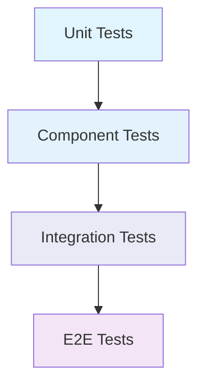

# Component Testing Patterns

## Overview

This document outlines our component testing strategies and best practices using Vitest and Testing Library. It provides a comprehensive guide for implementing effective testing patterns across different levels of our component architecture.

## Components

### Testing Tools
- Vitest: Fast unit test runner
- React Testing Library: Component testing utilities
- Mock Service Worker: API mocking
- Jest DOM: DOM testing utilities

### Testing Types
1. Unit Tests
2. Component Tests
3. Integration Tests
4. E2E Tests

## Interactions

### Testing Hierarchy



### Component Interactions
1. Parent-Child Communication
2. Context Providers
3. State Management
4. Event Handling
5. API Integration

## Implementation Details

### Testing Patterns

#### 1. Component Unit Tests
- Individual component rendering
- Props validation
- Event handlers
- State changes
- Error boundaries

#### 2. Component Integration Tests
- Parent-child interactions
- Context providers
- Redux/state management
- Custom hooks
- Event bubbling

#### 3. Best Practices
- Use React Testing Library
- Follow AAA pattern (Arrange, Act, Assert)
- Test user interactions
- Mock external dependencies
- Test accessibility
- Test error states

### Code Examples

#### Basic Component Test
```typescript
import { render, screen, fireEvent } from '@testing-library/react';
import { Button } from './Button';

describe('Button', () => {
  test('should handle click events', async () => {
    const handleClick = vi.fn();
    render(<Button onClick={handleClick}>Click me</Button>);
    
    const button = screen.getByText('Click me');
    await fireEvent.click(button);
    
    expect(handleClick).toHaveBeenCalledTimes(1);
  });
});
```

#### Integration Test Example
```typescript
import { render, screen, waitFor } from '@testing-library/react';
import { UserProfile } from './UserProfile';
import { UserContext } from './UserContext';

describe('UserProfile Integration', () => {
  test('should display user data from context', async () => {
    const user = { name: 'John Doe', email: 'john@example.com' };
    
    render(
      <UserContext.Provider value={user}>
        <UserProfile />
      </UserContext.Provider>
    );
    
    await waitFor(() => {
      expect(screen.getByText(user.name)).toBeInTheDocument();
      expect(screen.getByText(user.email)).toBeInTheDocument();
    });
  });
});
```

### Testing Guidelines

1. **Test Behavior, Not Implementation**
   - Focus on what the component does, not how it does it
   - Use user-centric queries (getByRole, getByText)
   - Avoid testing implementation details

2. **Isolation and Cleanup**
   - Each test should be independent
   - Clean up after each test
   - Use beforeEach/afterEach hooks

3. **Error Handling**
   - Test error states
   - Verify error messages
   - Test boundary conditions

4. **Accessibility Testing**
   - Use role-based queries
   - Test keyboard navigation
   - Verify ARIA attributes

## Related Documentation
- [Component Architecture](../components/atomic-design.md)
- For more information about setting up the testing environment, see [Testing Setup](../../../development/environment_setup.md)
- For details about our CI/CD pipeline, see [CI/CD Pipeline](../infrastructure/ci-cd-pipeline.md)
