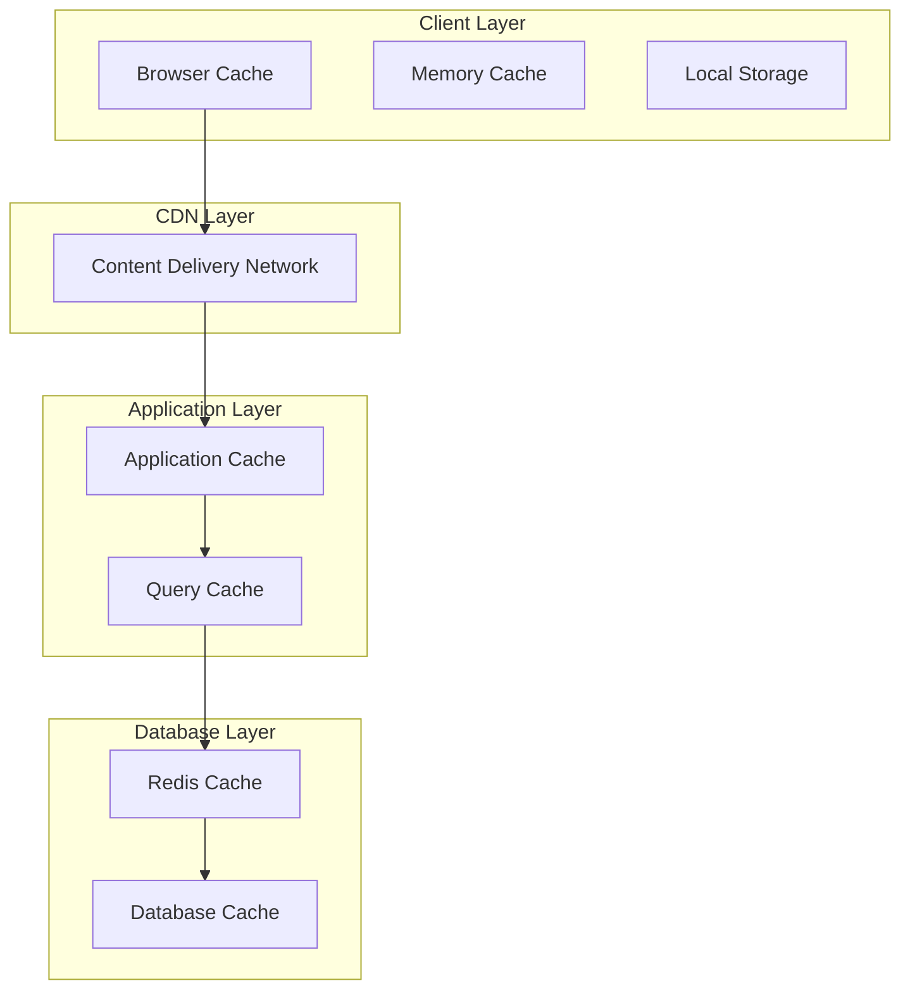
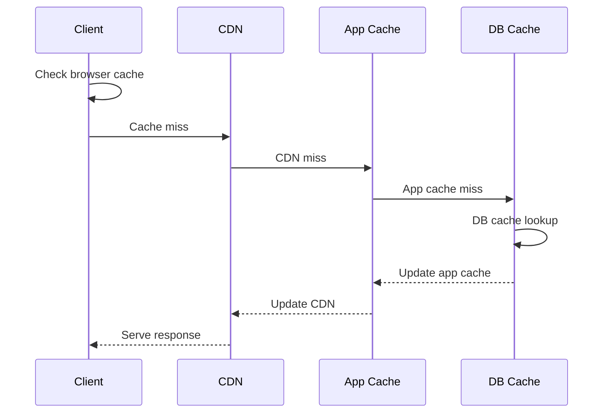

# Caching Strategy

## Overview

This document outlines our multi-level caching architecture and implementation patterns. The system employs a comprehensive caching strategy across multiple layers to optimize performance, reduce latency, and minimize database load while ensuring data consistency and freshness.

## Components

Our caching architecture consists of four main layers:

### Client Layer
- Browser Cache
- Memory Cache
- Local Storage

### CDN Layer
- Content Delivery Network

### Application Layer
- Application Cache
- Query Cache

### Database Layer
- Redis Cache
- Database Cache



## Interactions

The caching system operates through the following interaction patterns:

1. **Cache Lookup Flow**
   - Check browser cache first
   - Fall back to CDN if not found
   - Query application cache next
   - Finally check database cache
   - Fetch from source if all caches miss

2. **Cache Update Flow**
   - Update database cache first
   - Propagate to application cache
   - Invalidate CDN cache if needed
   - Signal client to refresh

3. **Cache Invalidation Flow**
   - Receive invalidation event
   - Clear affected cache layers
   - Trigger recomputation if needed



## Implementation Details

### Technical Stack
- Browser: Service Workers, LocalStorage
- CDN: CloudFront/Cloudflare
- Application: React Query
- Database: Redis, PostgreSQL

### Cache Levels

#### 1. Browser Cache

- Static assets
- API responses
- PWA cache storage
- Service worker cache

#### 2. CDN Cache

- Static files
- Images and media
- API responses
- Generated content

#### 3. Application Cache

- Query results
- Computed values
- Session data
- Frequently accessed data

#### 4. Database Cache

- Query results
- Materialized views
- Computed aggregations
- Frequently accessed records

### Implementation Patterns

#### Browser Caching

```typescript
// Service Worker Cache
const CACHE_NAME = 'v1';
const urlsToCache = ['/', '/styles/main.css', '/scripts/main.js'];

self.addEventListener('install', (event) => {
  event.waitUntil(caches.open(CACHE_NAME).then((cache) => cache.addAll(urlsToCache)));
});
```

#### Application Caching

```typescript
// Query Cache
const useQueryWithCache = <T>(key: string, queryFn: () => Promise<T>, options: QueryOptions) => {
  return useQuery({
    queryKey: [key],
    queryFn,
    staleTime: options.staleTime,
    cacheTime: options.cacheTime,
  });
};

// Memory Cache
const memoryCache = new Map<string, CacheEntry>();
const cacheService = {
  get: (key: string) => memoryCache.get(key),
  set: (key: string, value: any, ttl: number) => {
    memoryCache.set(key, {
      value,
      expiry: Date.now() + ttl,
    });
  },
};
```

### Redis Caching

```typescript
// Redis Cache Service
class RedisCacheService {
  async get<T>(key: string): Promise<T | null> {
    const cached = await redis.get(key);
    return cached ? JSON.parse(cached) : null;
  }

  async set(key: string, value: any, ttl?: number): Promise<void> {
    await redis.set(key, JSON.stringify(value), ttl ? ['EX', ttl] : undefined);
  }

  async invalidate(pattern: string): Promise<void> {
    const keys = await redis.keys(pattern);
    if (keys.length) await redis.del(keys);
  }
}
```

## Caching Strategies

### 1. Cache-Aside

```typescript
const getCacheAside = async (key: string) => {
  const cached = await cache.get(key);
  if (cached) return cached;

  const data = await fetchData(key);
  await cache.set(key, data);
  return data;
};
```

### 2. Write-Through

```typescript
const writeThrough = async (key: string, data: any) => {
  await cache.set(key, data);
  await database.save(key, data);
};
```

### 3. Write-Behind

```typescript
const writeBehind = async (key: string, data: any) => {
  await cache.set(key, data);
  await queue.push({
    type: 'write',
    key,
    data,
  });
};
```

## Cache Invalidation

### 1. Time-Based

```typescript
const withTTL = async (key: string, data: any) => {
  await cache.set(key, data, {
    ttl: 3600, // 1 hour
  });
};
```

### 2. Event-Based

```typescript
const invalidateOnEvent = async (event: Event) => {
  const patterns = getInvalidationPatterns(event);
  await Promise.all(patterns.map((pattern) => cache.invalidate(pattern)));
};
```

## Best Practices

1. **Cache Policy**

   - Set appropriate TTLs
   - Use cache versioning
   - Implement cache warming
   - Monitor cache hit rates

2. **Performance**

   - Cache at appropriate levels
   - Optimize cache key design
   - Use batch operations
   - Implement cache preloading

3. **Consistency**
   - Handle cache invalidation
   - Maintain data freshness
   - Implement cache coherence
   - Handle race conditions

## Related Diagrams

- [Data Processing](processing.md)
- [State Management](state-management.md)
- [Performance Architecture](../system/performance.md)
