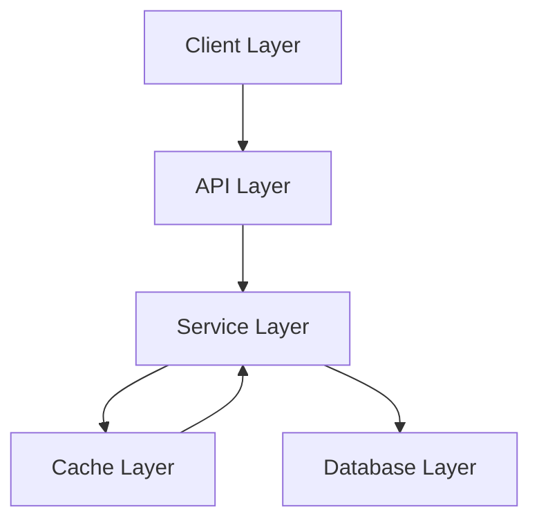

# Data Flow Architecture

This document outlines our data flow patterns and implementation.

## Overview



## Implementation Layers

### 1. Client Layer

- Request validation
- Data transformation
- Error handling
- Response formatting

### 2. API Layer

- Route handling
- Authentication
- Authorization
- Rate limiting

### 3. Service Layer

- Business logic
- Data processing
- Cache management
- Error handling

### 4. Cache Layer

- Data caching
- Cache invalidation
- Cache warming
- Performance optimization

### 5. Database Layer

- Data persistence
- Query optimization
- Transaction management
- Data integrity

## Data Flow Patterns

### Request Flow

```typescript
// Example request flow
const handleRequest = async (req: Request) => {
  // 1. Validate request
  const validatedData = await validateRequest(req);

  // 2. Authenticate
  const user = await authenticate(req);

  // 3. Check cache
  const cachedData = await cache.get(getCacheKey(req));
  if (cachedData) return cachedData;

  // 4. Process request
  const result = await processRequest(validatedData);

  // 5. Cache result
  await cache.set(getCacheKey(req), result);

  return result;
};
```

### Response Flow

```typescript
// Example response flow
const handleResponse = async (data: any) => {
  // 1. Transform data
  const transformed = transformResponse(data);

  // 2. Format response
  const formatted = formatResponse(transformed);

  // 3. Add metadata
  const response = addMetadata(formatted);

  return response;
};
```

## Performance Optimization

### 1. Caching Strategy

- Response caching
- Query caching
- Fragment caching
- Cache invalidation

### 2. Query Optimization

- Eager loading
- Query batching
- Index optimization
- Connection pooling

### 3. Data Transformation

- Lazy loading
- Partial responses
- Data compression
- Stream processing

## Error Handling

### 1. Client Errors

- Validation errors
- Authentication errors
- Authorization errors
- Rate limit errors

### 2. Server Errors

- Database errors
- Cache errors
- Service errors
- System errors

## Best Practices

### 1. Data Validation

- Input validation
- Type checking
- Schema validation
- Error messages

### 2. Performance

- Minimize requests
- Optimize queries
- Use caching
- Monitor performance

### 3. Security

- Data encryption
- Access control
- Input sanitization
- Error handling

### 4. Monitoring

- Performance metrics
- Error tracking
- Usage analytics
- Health checks

## Related Documentation

- [Data Protection](./data-protection.md)
- [State Architecture](./state-architecture.md)
- [Security Architecture](../system/security.md)
- [Performance Guidelines](../system/performance.md)
