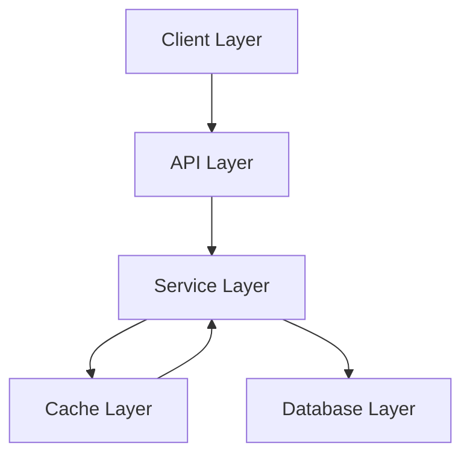
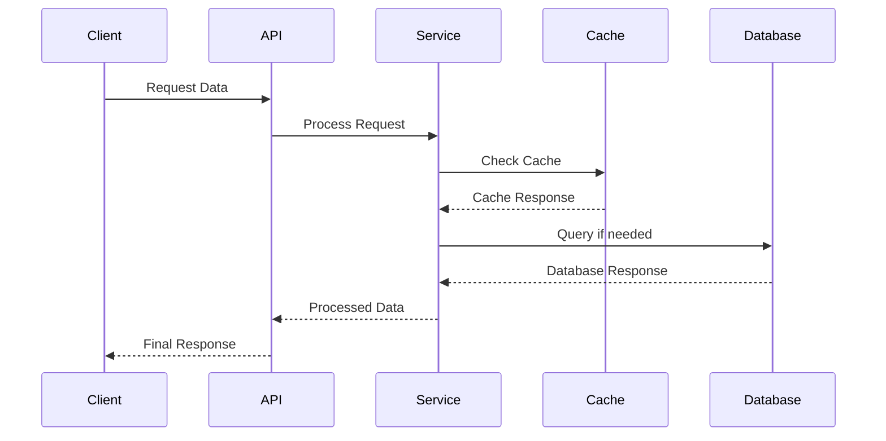

# Data Flow Architecture

## Overview

Our data flow architecture is designed to handle data processing and management efficiently. It implements a layered approach with clear separation of concerns, optimized caching strategies, and robust error handling. The system is built to be scalable, maintainable, and performant while ensuring data security and integrity.

## Components

Our data flow architecture consists of several key components that work together to handle data processing and management:

### 1. Client Layer
- Frontend data operations
- State management
- Data validation
- Error handling
- Cache management

### 2. API Layer
- HTTP endpoints
- Request validation
- Authentication
- Rate limiting
- Response formatting

### 3. Service Layer
- Business logic
- Data processing
- Transaction management
- Event handling
- Error handling

### 4. Cache Layer
- Response caching
- Query caching
- Cache invalidation
- Cache optimization
- Fallback strategies

### 5. Database Layer
- Data persistence
- Query optimization
- Connection pooling
- Transaction management
- Data integrity



## Interactions

Our data flow system follows these interaction patterns:

### 1. Request Flow
1. Client initiates request
2. API validates and authenticates
3. Service processes request
4. Cache/DB operations performed
5. Response returned to client

### 2. Cache Flow
1. Check cache for data
2. Return if cache hit
3. Query database if miss
4. Update cache with result
5. Return response

### 3. Error Flow
1. Error detected
2. Error logged
3. Circuit breaker checked
4. Fallback initiated
5. Client notified



## Implementation Details

### Technical Stack

- Frontend: React with TypeScript
- API: Express/Node.js
- Cache: Redis
- Database: PostgreSQL
- Message Queue: RabbitMQ

### Data Flow Patterns

#### Request Flow

```typescript
// Example request flow
const handleRequest = async (req: Request) => {
  // 1. Validate request
  const validatedData = await validateRequest(req);

  // 2. Authenticate
  const user = await authenticate(req);

  // 3. Check cache
  const cachedData = await cache.get(getCacheKey(req));
  if (cachedData) return cachedData;

  // 4. Process request
  const result = await processRequest(validatedData);

  // 5. Cache result
  await cache.set(getCacheKey(req), result);

  return result;
};
```

#### Response Flow

```typescript
// Example response flow
const handleResponse = async (data: any) => {
  // 1. Transform data
  const transformed = transformResponse(data);

  // 2. Format response
  const formatted = formatResponse(transformed);

  // 3. Add metadata
  const response = addMetadata(formatted);

  return response;
};
```

### Error Handling

- Circuit breaking for service failures
- Retry mechanisms for transient errors
- Fallback strategies for cache misses
- Comprehensive error logging

### Performance Considerations

- Cache optimization
- Query performance
- Connection pooling
- Load balancing

## Performance Optimization

### 1. Caching Strategy

- Response caching
- Query caching
- Fragment caching
- Cache invalidation

### 2. Query Optimization

- Eager loading
- Query batching
- Index optimization
- Connection pooling

### 3. Data Transformation

- Lazy loading
- Partial responses
- Data compression
- Stream processing

## Error Handling

### 1. Client Errors

- Validation errors
- Authentication errors
- Authorization errors
- Rate limit errors

### 2. Server Errors

- Database errors
- Cache errors
- Service errors
- System errors

## Best Practices

### 1. Data Validation

- Input validation
- Type checking
- Schema validation
- Error messages

### 2. Performance

- Minimize requests
- Optimize queries
- Use caching
- Monitor performance

### 3. Security

- Data encryption
- Access control
- Input sanitization
- Error handling

### 4. Monitoring

- Performance metrics
- Error tracking
- Usage analytics
- Health checks

## Related Documentation

- [Data Protection](./data-protection.md)
- [State Architecture](./state-architecture.md)
- [Security Architecture](../system/security.md)
- [Performance Guidelines](../system/performance.md)
- [State Management](./state-management.md)
- [API Architecture](../system/api-architecture.md)
- [Caching Strategy](../system/caching-strategy.md)
