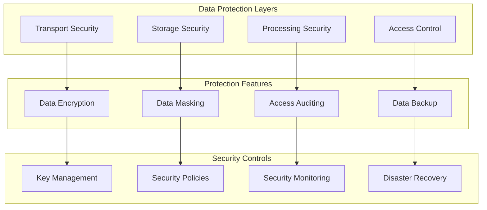

# Data Protection Architecture

This document outlines our data protection implementation and security measures.

## Implementation

Our data protection system utilizes several particle components from our [Atomic Design Structure](../../components/atomic-design.md#particles):

- Data Protection Context Providers
- Error Boundary particles for data security
- Event Handler particles for security events
- Performance Optimizers for encryption operations

## Data Protection Diagram



## Protection Measures

### 1. Transport Security

- TLS encryption
- Certificate management
- Secure protocols
- Traffic monitoring

### 2. Storage Security

- Encryption at rest
- Secure key storage
- Access controls
- Data isolation

### 3. Processing Security

- Memory protection
- Secure computation
- Data sanitization
- Access logging

### 4. Access Control

- Role-based access
- Principle of least privilege
- Access monitoring
- Audit trails

## Implementation Patterns

### Data Protection Context

```typescript
// Data protection context provider particle
const DataProtectionProvider = ({ children }: PropsWithChildren) => {
  const [protectionState, setProtectionState] = useState({
    encryptionEnabled: true,
    maskingRules: {},
    auditingEnabled: true,
  });

  return <DataProtectionContext.Provider value={protectionState}>{children}</DataProtectionContext.Provider>;
};
```

### Data Masking

```typescript
// Data masking particle
const DataMasking = ({ data, rules, children }: DataMaskingProps) => {
  const maskedData = useMemo(() => {
    return maskData(data, rules);
  }, [data, rules]);

  return children(maskedData);
};
```

### Audit Logging

```typescript
// Audit logging particle
const AuditLogger = ({ operation, children }: AuditLoggerProps) => {
  useEffect(() => {
    const logAccess = () => {
      logDataAccess({
        operation,
        timestamp: new Date(),
        user: getCurrentUser(),
      });
    };

    logAccess();
  }, [operation]);

  return children;
};
```

## Best Practices

1. **Data Classification**

   - Classify data sensitivity
   - Apply protection levels
   - Regular review
   - Update classifications

2. **Access Management**

   - Role-based access
   - Regular audits
   - Access reviews
   - Privilege management

3. **Encryption**
   - Strong algorithms
   - Key rotation
   - Secure storage
   - Certificate management

## Related Documentation

- [Security Architecture](../system/security.md)
- [Authorization Model](../security/authorization.md)
- [Data Flow](./data-flow.md)
