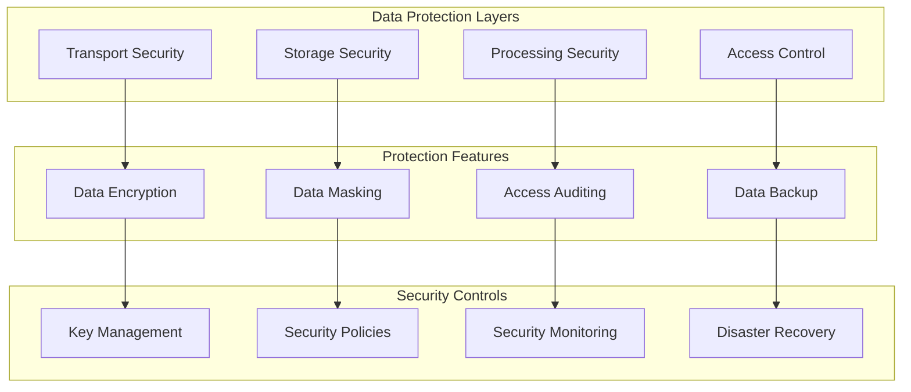
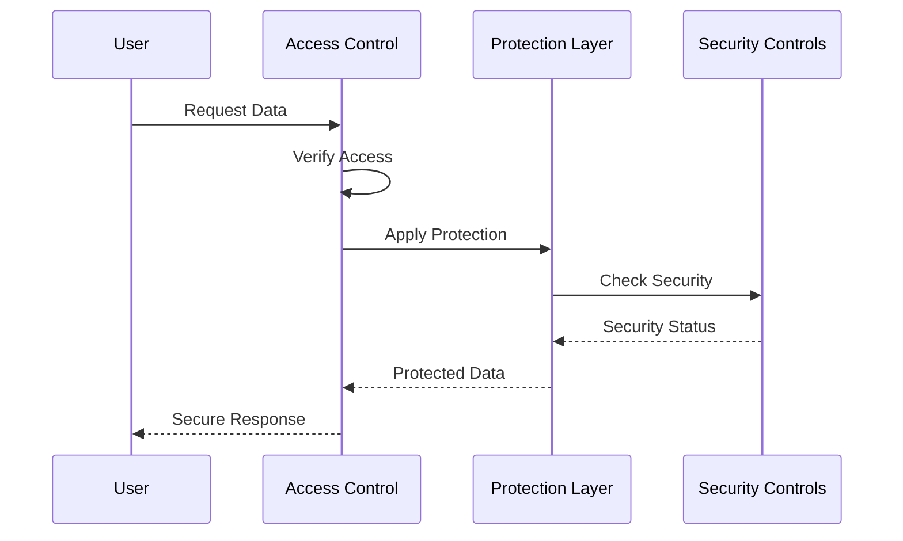

# Data Protection Architecture

## Overview

This document outlines our data protection implementation and security measures. The architecture ensures comprehensive data security through multiple protection layers, implementing industry-standard security practices and compliance requirements while maintaining system performance and usability.

## Components

Our data protection architecture consists of three main component groups:

### Protection Layers
- Transport Security Layer
- Storage Security Layer
- Processing Security Layer
- Access Control Layer

### Protection Features
- Data Encryption Systems
- Data Masking Services
- Access Auditing Tools
- Data Backup Solutions

### Security Controls
- Key Management System
- Security Policy Engine
- Security Monitoring Tools
- Disaster Recovery System



## Interactions

The data protection system operates through the following interaction patterns:

1. **Data Access Flow**
   - Authentication verification
   - Authorization check
   - Access logging
   - Data retrieval with appropriate protections

2. **Data Protection Flow**
   - Encryption/decryption operations
   - Data masking application
   - Security policy enforcement
   - Audit trail generation

3. **Security Control Flow**
   - Key rotation and management
   - Policy updates and enforcement
   - Security monitoring and alerts
   - Recovery procedure execution



## Implementation Details

### Technical Stack
- Encryption: AES-256, RSA
- Authentication: OAuth 2.0, JWT
- Monitoring: ELK Stack
- Key Management: AWS KMS

### Protection Measures

#### 1. Transport Security

- TLS encryption
- Certificate management
- Secure protocols
- Traffic monitoring

#### 2. Storage Security

- Encryption at rest
- Secure key storage
- Access controls
- Data isolation

#### 3. Processing Security

- Memory protection
- Secure computation
- Data sanitization
- Access logging

#### 4. Access Control

- Role-based access
- Principle of least privilege
- Access monitoring
- Audit trails

### Implementation Patterns

#### Data Protection Context

```typescript
// Data protection context provider particle
const DataProtectionProvider = ({ children }: PropsWithChildren) => {
  const [protectionState, setProtectionState] = useState({
    encryptionEnabled: true,
    maskingRules: {},
    auditingEnabled: true,
  });

  return <DataProtectionContext.Provider value={protectionState}>{children}</DataProtectionContext.Provider>;
};
```

#### Data Masking

```typescript
// Data masking particle
const DataMasking = ({ data, rules, children }: DataMaskingProps) => {
  const maskedData = useMemo(() => {
    return maskData(data, rules);
  }, [data, rules]);

  return children(maskedData);
};
```

#### Audit Logging

```typescript
// Audit logging particle
const AuditLogger = ({ operation, children }: AuditLoggerProps) => {
  useEffect(() => {
    const logAccess = () => {
      logDataAccess({
        operation,
        timestamp: new Date(),
        user: getCurrentUser(),
      });
    };

    logAccess();
  }, [operation]);

  return children;
};
```

## Best Practices

1. **Data Classification**

   - Classify data sensitivity
   - Apply protection levels
   - Regular review
   - Update classifications

2. **Access Management**

   - Role-based access
   - Regular audits
   - Access reviews
   - Privilege management

3. **Encryption**
   - Strong algorithms
   - Key rotation
   - Secure storage
   - Certificate management

## Related Documentation

- [Security Architecture](../system/security.md)
- [Authorization Model](../security/authorization.md)
- [Data Flow](./data-flow.md)
