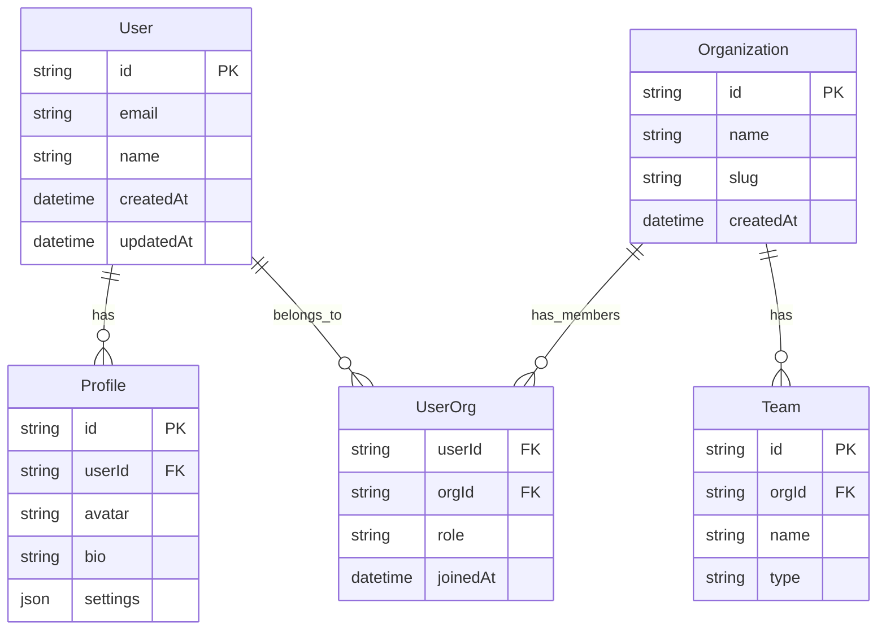

# Database Schema Architecture

This diagram illustrates our database schema and relationships.

## Schema Diagram

## Description

Our database schema is designed with these key entities:

1. **User Management**

   - Users and their profiles
   - Authentication data
   - User preferences

2. **Organization Structure**

   - Organizations and teams
   - Member relationships
   - Role assignments

3. **Relationships**
   - One-to-one: User-Profile
   - One-to-many: Org-Teams
   - Many-to-many: Users-Organizations

## Implementation Details

- Uses PostgreSQL as primary database
- Implements row-level security
- Includes audit logging
- Supports soft deletes
- Maintains referential integrity
