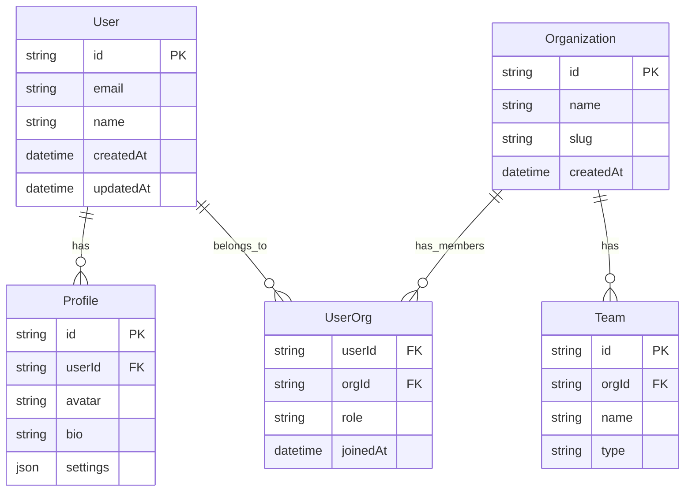

# Database Schema Architecture

This document outlines our database schema design, relationships, and implementation details.

## Overview

Our database architecture is designed to support a multi-tenant system with user management, organization structures, and flexible team hierarchies. The schema implements proper relationships, constraints, and security measures to ensure data integrity and efficient access patterns.

## Components

The database schema consists of these primary components:

### Core Entities
- Users and Profiles
- Organizations
- Teams
- User-Organization Relationships

### Schema Diagram

## Interactions

The database components interact through the following relationships and operations:

1. User Management Flow:
   - User creation triggers profile creation
   - Profile updates maintain user references
   - User deletion cascades to related entities

2. Organization Management:
   - Organization creation with initial admin user
   - Team creation within organization context
   - Member addition with role assignment

## Implementation Details

- Uses PostgreSQL as primary database
- Implements row-level security
- Includes audit logging
- Supports soft deletes
- Maintains referential integrity

## Related Documentation

- [Data Flow](./data-flow.md)
- [Data Protection](./data-protection.md)
- [Caching Strategy](./caching.md)
