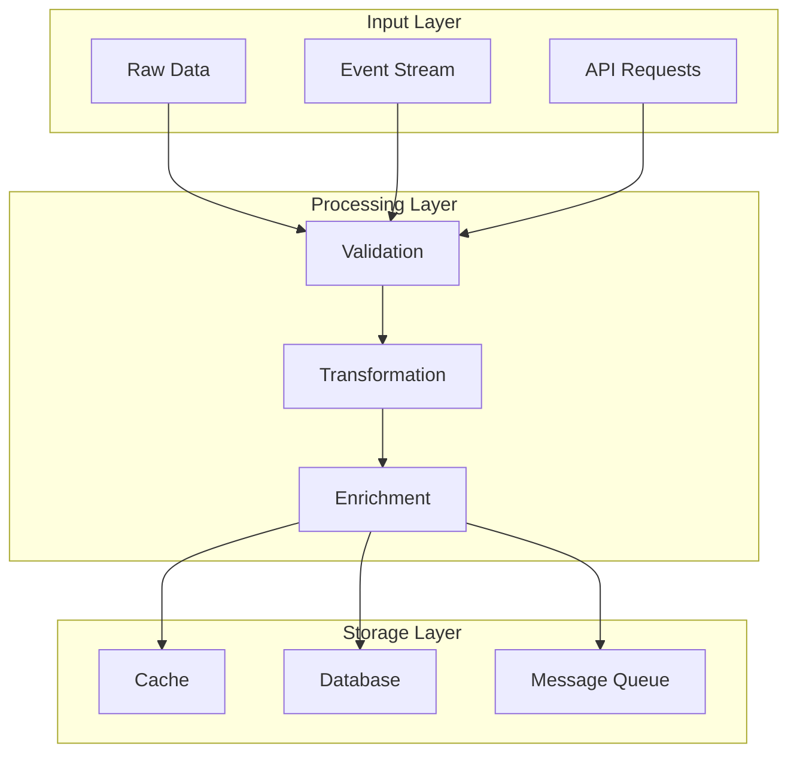
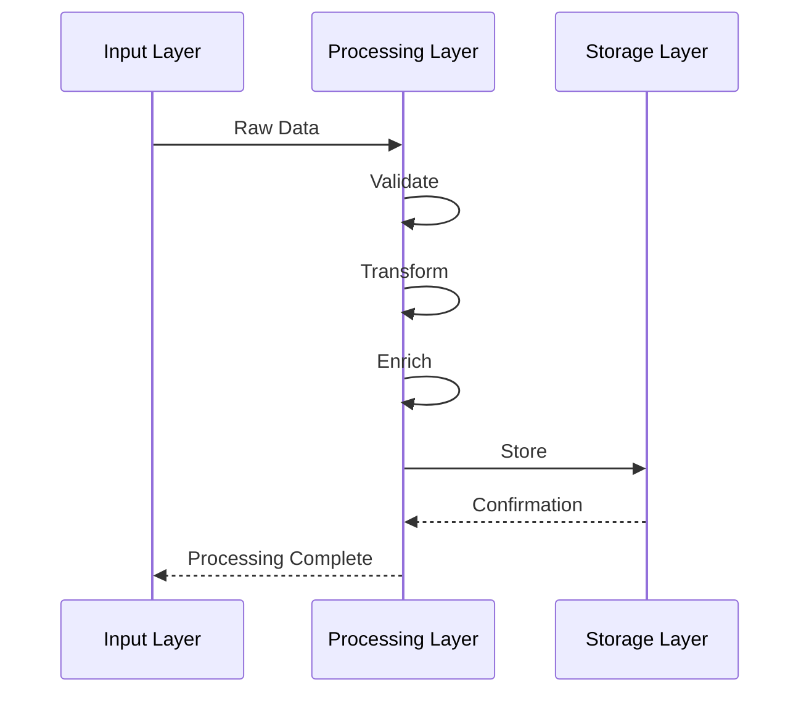

# Data Processing Architecture

## Overview

This document outlines our data processing pipelines and transformation patterns. The architecture is designed to handle data processing in a scalable, maintainable, and efficient manner, ensuring data quality and consistency throughout the system.

## Components

Our data processing architecture consists of three main layers:

### Input Layer
- Raw Data Intake
- Event Stream Processing
- API Request Handling

### Processing Layer
- Validation Engine
- Transformation Pipeline
- Enrichment Service

### Storage Layer
- Cache Storage
- Database Systems
- Message Queue



## Interactions

The data flows through our system in the following sequence:

1. **Data Ingestion**
   - Raw data enters through various input channels
   - Events are captured and streamed
   - API requests are received and normalized

2. **Processing Pipeline**
   - Data undergoes validation checks
   - Validated data is transformed to standard format
   - Enrichment adds necessary context and metadata

3. **Storage and Distribution**
   - Processed data is cached for quick access
   - Permanent storage in database
   - Events published to message queue for subscribers



## Implementation Details

### Technical Stack
- Validation: Zod
- Processing: Node.js Stream API
- Queue: RabbitMQ
- Cache: Redis
- Storage: PostgreSQL

### Processing Stages

#### 1. Data Validation

- Schema validation
- Type checking
- Business rule validation
- Data sanitization

#### 2. Data Transformation

- Format conversion
- Data normalization
- Field mapping
- Data aggregation

#### 3. Data Enrichment

- Adding metadata
- Resolving references
- Computing derived fields
- Adding timestamps

### Implementation Patterns

#### Validation Pattern

```typescript
// Schema validation
const schema = z.object({
  id: z.string().uuid(),
  name: z.string().min(1),
  email: z.string().email(),
  metadata: z.record(z.string()),
});

// Business rule validation
const validateBusinessRules = (data: InputData): ValidationResult => {
  const errors: ValidationError[] = [];
  // Validation logic
  return { isValid: errors.length === 0, errors };
};
```

#### Transformation Pattern

```typescript
// Data transformer
const transform = (input: InputData): OutputData => ({
  id: input.id,
  displayName: formatName(input.name),
  contact: {
    email: input.email.toLowerCase(),
    phone: formatPhone(input.phone),
  },
  metadata: enrichMetadata(input.metadata),
});
```

#### Enrichment Pattern

```typescript
// Data enricher
const enrich = async (data: TransformedData): Promise<EnrichedData> => {
  const metadata = await fetchMetadata(data.id);
  const timestamps = addTimestamps(data);
  const references = await resolveReferences(data);

  return {
    ...data,
    metadata,
    timestamps,
    references,
  };
};
```

## Processing Strategies

### 1. Batch Processing

```typescript
// Batch processor
const processBatch = async (items: InputData[]): Promise<ProcessedData[]> => {
  const validated = await validateBatch(items);
  const transformed = await transformBatch(validated);
  return enrichBatch(transformed);
};
```

### 2. Stream Processing

```typescript
// Stream processor
const processStream = (source: Observable<InputData>): Observable<ProcessedData> => {
  return source.pipe(map(validate), filter(isValid), map(transform), mergeMap(enrich));
};
```

### 3. Real-time Processing

```typescript
// Real-time processor
const processRealTime = async (data: InputData): Promise<ProcessedData> => {
  const validated = await validate(data);
  if (!validated.isValid) throw new ValidationError(validated.errors);

  const transformed = await transform(validated.data);
  return enrich(transformed);
};
```

## Best Practices

1. **Data Quality**

   - Validate early and often
   - Maintain data integrity
   - Handle edge cases
   - Preserve data lineage

2. **Performance**

   - Use appropriate batch sizes
   - Implement caching strategies
   - Optimize heavy transformations
   - Monitor processing times

3. **Error Handling**
   - Implement retry mechanisms
   - Log processing errors
   - Maintain error states
   - Provide error recovery

## Related Diagrams

- [State Management](state-management.md)
- [Caching Strategy](caching.md)
- [Error Flow](../system/error-flow.md)
