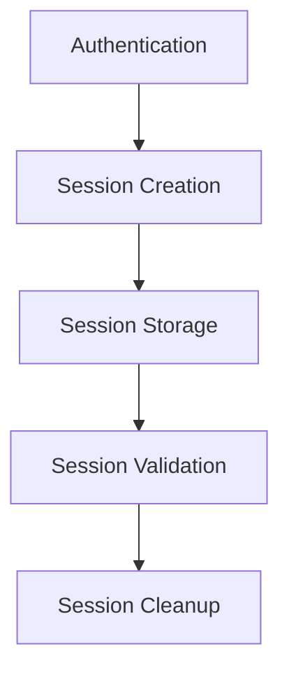
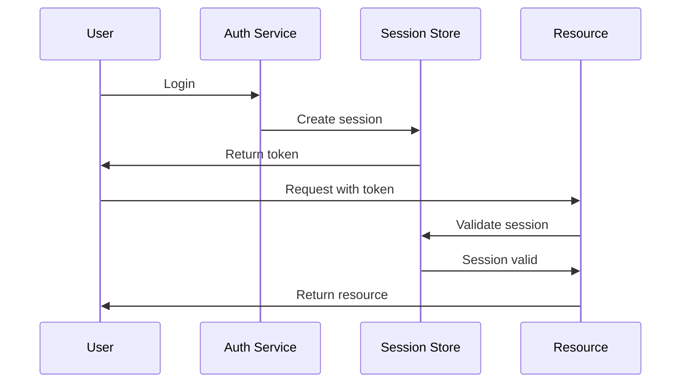

# Session Management Architecture

## Overview

This document outlines our session management architecture, designed to handle user sessions securely and efficiently across our distributed system.

## Components

### Session Stack


### Key Components
1. Session Creation
   - Token generation
   - Session initialization
   - Context setup
   - Metadata tracking

2. Session Storage
   - Distributed cache
   - Persistence layer
   - Replication
   - Recovery

3. Session Validation
   - Token verification
   - Permission checks
   - Expiry handling
   - Security validation

4. Session Cleanup
   - Expiry management
   - Resource cleanup
   - Audit logging
   - Garbage collection

## Interactions

### Session Flow


## Implementation Details

### Session Configuration
```typescript
interface SessionConfig {
  timeout: number;
  storage: StorageConfig;
  security: SecurityConfig;
  cleanup: CleanupConfig;
}

interface StorageConfig {
  type: 'redis' | 'memcached' | 'database';
  replication: boolean;
  ttl: number;
  maxSize: number;
}
```

### Security Settings
```typescript
interface SecuritySettings {
  encryption: boolean;
  tokenType: 'jwt' | 'opaque';
  refreshToken: boolean;
  rotationPolicy: RotationPolicy;
}
```

### Session Standards
- Token format
- Storage requirements
- Security policies
- Cleanup procedures
- Monitoring rules

## Related Documentation
- [Authentication](../security/authentication.md)
- [OAuth2 Flow](../security/oauth2-flow.md)
- [Security Architecture](../security/security-architecture.md)
- [Data Protection](./data-protection.md)
