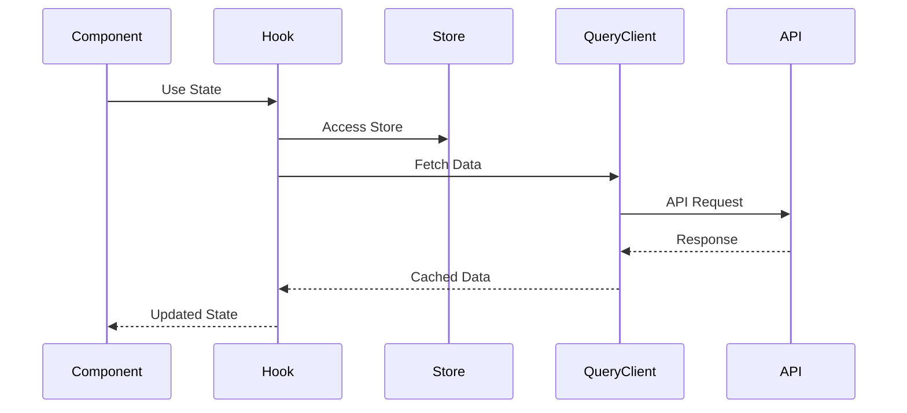

# State Management Architecture

## Overview

This document outlines our state management approach using Zustand and React Query, showing how different types of state are handled across the application. The architecture is designed to efficiently manage both client-side and server-side state while maintaining clear separation of concerns and optimal performance.

## Related Documentation

- [State Management Implementation](../system/state-management.md)
- [Database Architecture](../system/database-architecture.md)
- [API Architecture](../system/api-architecture.md)
- [Event-Driven Architecture](../system/event-driven.md)

## Components

Our state management architecture consists of several key layers and components:

### UI Layer

- **React Components**: Presentational and container components
- **Custom Hooks**: Reusable state management logic

### Client State (Zustand)

- **Global Store**: Central state container
- **Store Slices**:
  - UI State: Theme, layout, modals
  - User State: Preferences, settings
  - App State: Feature flags, configs
- **Middleware**: Persistence, logging, devtools

### Server State (React Query)

- **Query Client**: Central manager for server state
- **Cache Management**:
  - Query Cache: GET request results
  - Mutation Cache: POST/PUT/DELETE results
  - Infinite Query Cache: Pagination data
- **Prefetching**: Optimistic data loading

## Interactions

The state management system interactions follow these primary patterns:

1. **Component-State Interaction**
   - Components access state through custom hooks
   - State updates trigger re-renders only in subscribed components
   - Batch updates are used for multiple state changes

2. **Client-Server State Synchronization**
   - React Query manages all server state interactions
   - Automatic background refetching keeps data fresh
   - Optimistic updates provide instant feedback
   - Cache invalidation ensures consistency

3. **Persistence Flow**
   - Middleware intercepts state changes
   - Critical data is persisted to LocalStorage/SessionStorage
   - State rehydration occurs on app initialization

## Implementation Details

### Technical Stack
- State Management: Zustand
- Server State: React Query
- Storage: LocalStorage/SessionStorage
- Development Tools: Redux DevTools (via middleware)

### Implementation Guidelines

1. **State Classification**

   - Client State: UI preferences, form data, local settings
   - Server State: API data, remote configurations
   - URL State: Route parameters, query strings

2. **State Access Patterns**

   - Use hooks for component-level state
   - Zustand for global client state
   - React Query for server state

3. **Performance Optimization**

   - Implement selective re-rendering
   - Use proper cache strategies
   - Enable background updates
   - Optimize bundle size

4. **Development Practices**

   - Implement proper TypeScript types
   - Use devtools for debugging
   - Follow immutability patterns
   - Document state changes

5. **Error Handling**
   - Implement error boundaries
   - Handle loading states
   - Manage stale data
   - Handle offline scenarios

## State Architecture Overview

### Client Layer

- UI components and state
- Business logic and validation
- Client-side caching
- State persistence

### Communication Layer

- REST API interactions
- WebSocket connections
- Event-driven communication
- State synchronization

### Server Layer

- API endpoints
- Service logic
- Database operations
- Event processing

## State Management Principles

1. **State Organization**

   - Clear separation of concerns
   - Predictable state flow
   - Minimal state duplication
   - Single source of truth

2. **State Updates**

   - Immutable updates
   - Atomic operations
   - Optimistic updates
   - Rollback handling

3. **State Synchronization**
   - Real-time sync
   - Conflict resolution
   - Offline support
   - Error recovery

## Implementation Notes

1. **Client-Side**

   - Use Zustand for global state
   - React Query for server state
   - Local storage for persistence
   - Event bus for communication

2. **Server-Side**

   - RESTful API design
   - WebSocket for real-time
   - Event sourcing
   - CQRS patterns

3. **Data Flow**
   - Unidirectional flow
   - Event-driven updates
   - Cache invalidation
   - State rehydration

## Best Practices

1. **State Design**

   - Keep state minimal
   - Normalize data
   - Use selectors
   - Cache strategically

2. **Performance**

   - Optimize renders
   - Batch updates
   - Use memoization
   - Lazy loading

3. **Maintenance**
   - Clear documentation
   - Type safety
   - Testing strategy
   - Monitoring

For detailed implementation guidelines, see [State Management Implementation](../system/state-management.md).
