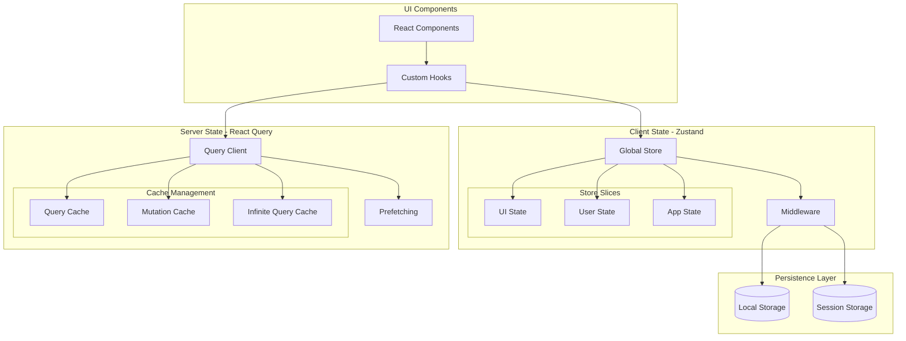

# State Management Architecture

This diagram illustrates our state management approach using Zustand and React Query, showing how different types of state are handled across the application.

## Related Documentation

- [State Management Implementation](../system/state-management.md)
- [Database Architecture](../system/database-architecture.md)
- [API Architecture](../system/api-architecture.md)
- [Event-Driven Architecture](../system/event-driven.md)

## State Management Diagram

## Component Description

### UI Layer

- **React Components**: Presentational and container components
- **Custom Hooks**: Reusable state management logic

### Client State (Zustand)

- **Global Store**: Central state container
- **Store Slices**:
  - UI State: Theme, layout, modals
  - User State: Preferences, settings
  - App State: Feature flags, configs
- **Middleware**: Persistence, logging, devtools

### Server State (React Query)

- **Query Client**: Central manager for server state
- **Cache Management**:
  - Query Cache: GET request results
  - Mutation Cache: POST/PUT/DELETE results
  - Infinite Query Cache: Pagination data
- **Prefetching**: Optimistic data loading

## Implementation Guidelines

1. **State Classification**

   - Client State: UI preferences, form data, local settings
   - Server State: API data, remote configurations
   - URL State: Route parameters, query strings

2. **State Access Patterns**

   - Use hooks for component-level state
   - Zustand for global client state
   - React Query for server state

3. **Performance Optimization**

   - Implement selective re-rendering
   - Use proper cache strategies
   - Enable background updates
   - Optimize bundle size

4. **Development Practices**

   - Implement proper TypeScript types
   - Use devtools for debugging
   - Follow immutability patterns
   - Document state changes

5. **Error Handling**
   - Implement error boundaries
   - Handle loading states
   - Manage stale data
   - Handle offline scenarios

## State Architecture Overview

### Client Layer

- UI components and state
- Business logic and validation
- Client-side caching
- State persistence

### Communication Layer

- REST API interactions
- WebSocket connections
- Event-driven communication
- State synchronization

### Server Layer

- API endpoints
- Service logic
- Database operations
- Event processing

## State Management Principles

1. **State Organization**

   - Clear separation of concerns
   - Predictable state flow
   - Minimal state duplication
   - Single source of truth

2. **State Updates**

   - Immutable updates
   - Atomic operations
   - Optimistic updates
   - Rollback handling

3. **State Synchronization**
   - Real-time sync
   - Conflict resolution
   - Offline support
   - Error recovery

## Implementation Notes

1. **Client-Side**

   - Use Zustand for global state
   - React Query for server state
   - Local storage for persistence
   - Event bus for communication

2. **Server-Side**

   - RESTful API design
   - WebSocket for real-time
   - Event sourcing
   - CQRS patterns

3. **Data Flow**
   - Unidirectional flow
   - Event-driven updates
   - Cache invalidation
   - State rehydration

## Best Practices

1. **State Design**

   - Keep state minimal
   - Normalize data
   - Use selectors
   - Cache strategically

2. **Performance**

   - Optimize renders
   - Batch updates
   - Use memoization
   - Lazy loading

3. **Maintenance**
   - Clear documentation
   - Type safety
   - Testing strategy
   - Monitoring

For detailed implementation guidelines, see [State Management Implementation](../system/state-management.md).
