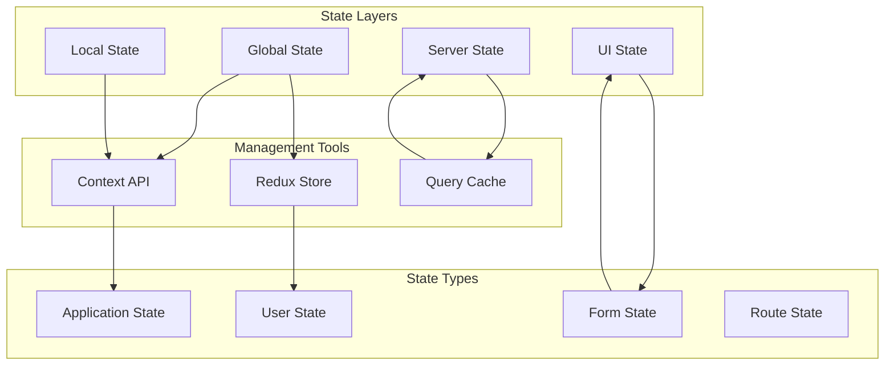
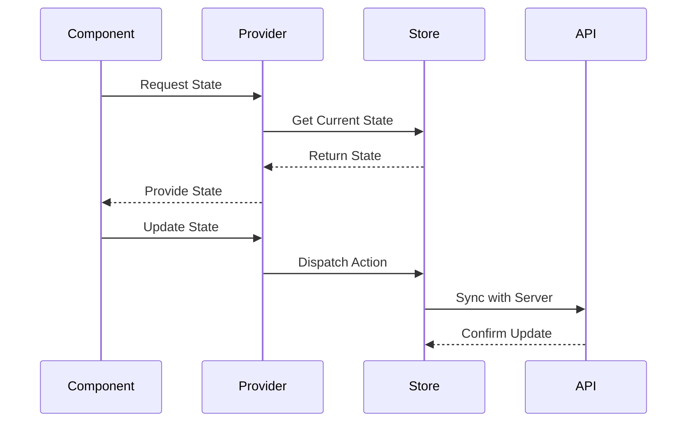

# State Management Architecture

This document illustrates our state management patterns and data flow architecture.

## Overview

Our state management system is designed to handle various types of state across the application, from global application state to local component state. It utilizes various components from our Atomic Design Structure, including Context Providers, State Synchronizers, and Performance Optimizers.

## Components

The state management architecture consists of several key components and layers:

- Global State Management
- Local State Handlers
- Server State Synchronization
- UI State Controllers



## Interactions

The state management system follows these interaction patterns:

1. State Updates Flow
2. Component Communication
3. Server Synchronization
4. Cache Management



## Implementation Details

### Technical Stack

- React Context API
- Redux for global state
- React Query for server state
- Form libraries for form state

### State Categories

#### 1. Global State
- Application configuration
- User preferences
- Authentication state
- Theme settings

#### 2. Local State
- Component state
- Form values
- UI interactions
- Temporary data

#### 3. Server State
- API responses
- Cache data
- Real-time updates
- Synchronization state

#### 4. UI State
- Loading states
- Error states
- Modal states
- Animation states

### Implementation Patterns

#### Context Providers
```typescript
const StateProvider = ({ children }: PropsWithChildren) => {
  const state = useStateManager();
  return <StateContext.Provider value={state}>{children}</StateContext.Provider>;
};
```

#### State Synchronizers
```typescript
const StateSynchronizer = () => {
  const localState = useLocalState();
  const serverState = useServerState();

  useEffect(() => {
    synchronizeState(localState, serverState);
  }, [localState, serverState]);

  return null;
};
```

#### Performance Optimizers
```typescript
const MemoizedState = memo(({ state }: StateProps) => {
  const optimizedState = useOptimizedState(state);

  return <StateConsumer state={optimizedState} />;
});
```

### Performance Considerations

1. **State Location**
   - Keep state close to usage
   - Minimize global state
   - Use appropriate tools
   - Implement proper isolation

2. **Optimization**
   - Optimize re-renders
   - Use efficient updates
   - Implement caching
   - Batch operations

3. **Consistency**
   - Maintain single source of truth
   - Handle race conditions
   - Implement proper validation
   - Use immutable updates

## Related Documentation

- [Component Interactions](../components/interactions.md)
- [Data Processing](processing.md)
- [Caching Strategy](caching.md)
- [Atomic Design Structure](../components/atomic-design.md)
