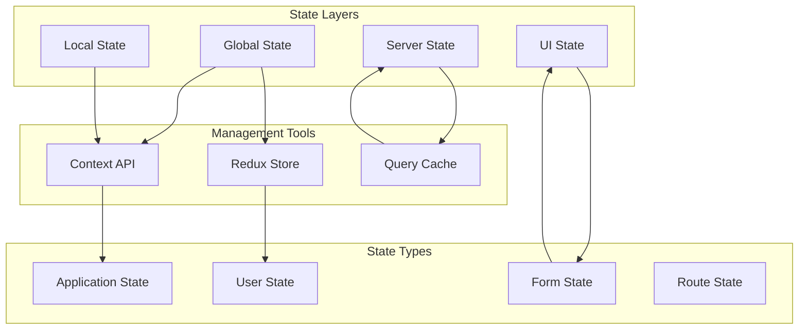

# State Management Architecture

This diagram illustrates our state management patterns and data flow architecture.

## Implementation

Our state management system utilizes various particle components from our [Atomic Design Structure](../components/atomic-design.md#particles), including Context Providers for state propagation, State Synchronizers for consistency, and Performance Optimizers for efficient updates.

## State Management Diagram



## State Categories

### 1. Global State

- Application configuration
- User preferences
- Authentication state
- Theme settings

### 2. Local State

- Component state
- Form values
- UI interactions
- Temporary data

### 3. Server State

- API responses
- Cache data
- Real-time updates
- Synchronization state

### 4. UI State

- Loading states
- Error states
- Modal states
- Animation states

## Implementation Patterns

### Context Providers

```typescript
const StateProvider = ({ children }: PropsWithChildren) => {
  const state = useStateManager();

  return <StateContext.Provider value={state}>{children}</StateContext.Provider>;
};
```

### State Synchronizers

```typescript
const StateSynchronizer = () => {
  const localState = useLocalState();
  const serverState = useServerState();

  useEffect(() => {
    synchronizeState(localState, serverState);
  }, [localState, serverState]);

  return null;
};
```

### Performance Optimizers

```typescript
const MemoizedState = memo(({ state }: StateProps) => {
  const optimizedState = useOptimizedState(state);

  return <StateConsumer state={optimizedState} />;
});
```

## Best Practices

1. **State Location**

   - Keep state close to usage
   - Minimize global state
   - Use appropriate tools
   - Implement proper isolation

2. **Performance**

   - Optimize re-renders
   - Use efficient updates
   - Implement caching
   - Batch operations

3. **Consistency**
   - Maintain single source of truth
   - Handle race conditions
   - Implement proper validation
   - Use immutable updates

## Related Diagrams

- [Component Interactions](../components/interactions.md)
- [Data Processing](processing.md)
- [Caching Strategy](caching.md)
