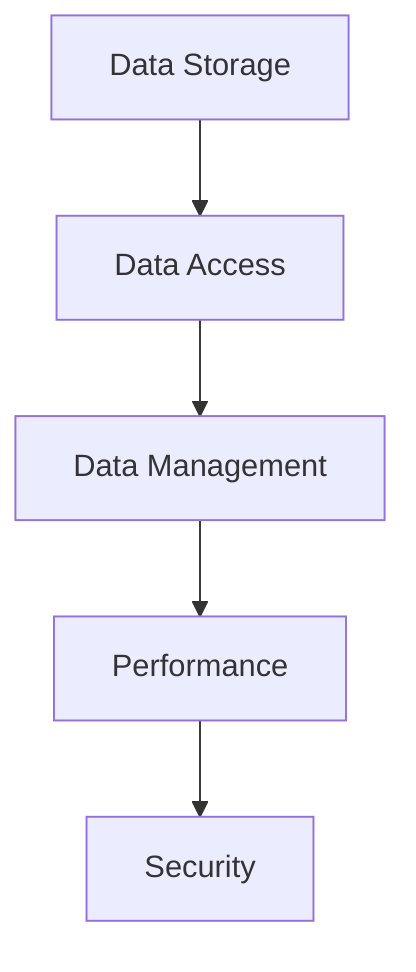
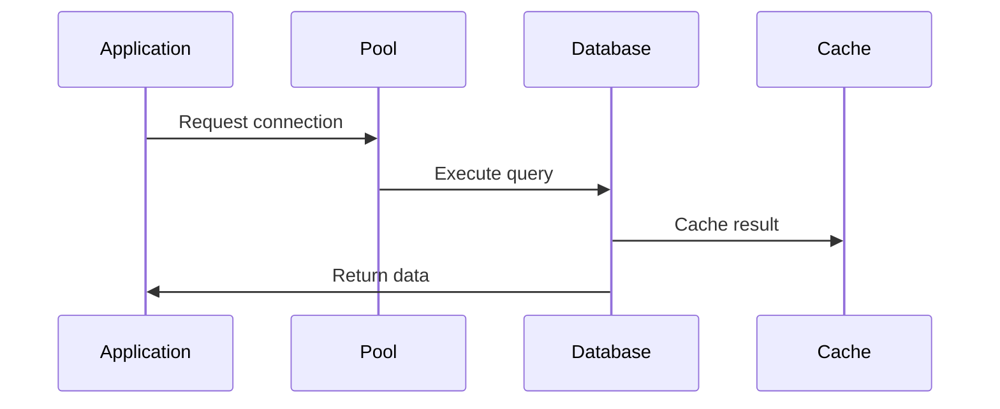

# Database Architecture

## Overview

This document outlines our database architecture, establishing patterns and practices for data storage, access, and management across our system.

## Components

### Database Stack


### Key Components
1. Data Storage
   - Storage engines
   - Data models
   - Schemas
   - Partitioning

2. Data Access
   - Query patterns
   - Access layers
   - Connection pools
   - Transactions

3. Data Management
   - Data lifecycle
   - Backup/Recovery
   - Migration
   - Versioning

4. Performance
   - Query optimization
   - Indexing
   - Caching
   - Monitoring

## Interactions

### Database Flow


## Implementation Details

### Database Configuration
```typescript
interface DatabaseConfig {
  storage: StorageConfig;
  access: AccessConfig;
  management: ManagementConfig;
  performance: PerformanceConfig;
}

interface StorageConfig {
  engine: string;
  models: Model[];
  schemas: Schema[];
  partitions: Partition[];
}
```

### Performance Rules
```typescript
interface PerformanceRule {
  type: QueryType;
  threshold: number;
  optimization: OptimizationMethod;
  priority: number;
}
```

### Database Standards
- Storage patterns
- Access methods
- Management policies
- Performance targets
- Security measures

## Related Documentation
- [Performance](../infrastructure/performance.md)
- [Data Protection](../data-flow/data-protection.md)
- [Backup Recovery](../infrastructure/backup-recovery.md)
- [Security Architecture](../security/security-architecture.md)
