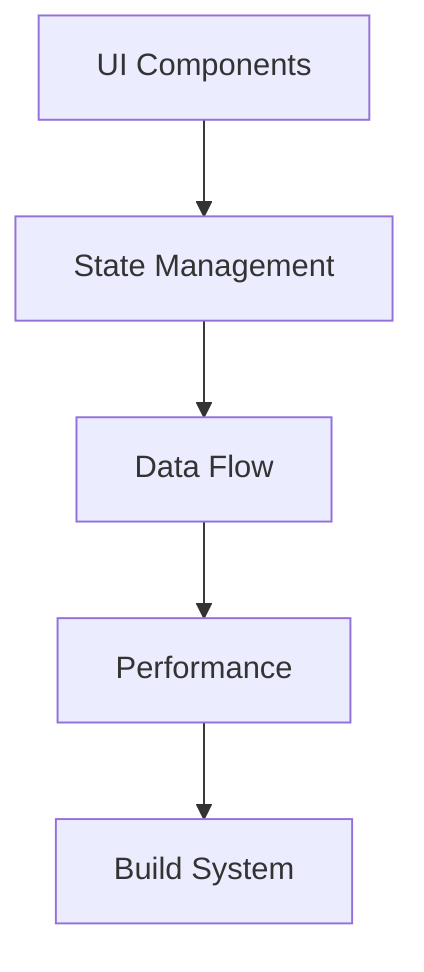
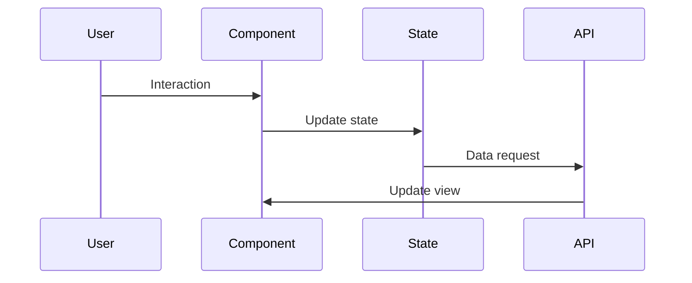

# Frontend Architecture

## Overview

This document outlines our frontend architecture, establishing patterns and practices for building scalable and maintainable user interfaces.

## Components

### Frontend Stack


### Key Components
1. UI Components
   - Component hierarchy
   - Design system
   - Reusable components
   - Accessibility

2. State Management
   - State stores
   - State updates
   - Side effects
   - Data persistence

3. Data Flow
   - API integration
   - Data fetching
   - Caching
   - Real-time updates

4. Performance
   - Code splitting
   - Lazy loading
   - Bundle optimization
   - Resource management

## Interactions

### Frontend Flow


## Implementation Details

### Frontend Configuration
```typescript
interface FrontendConfig {
  components: ComponentConfig;
  state: StateConfig;
  data: DataConfig;
  performance: PerformanceConfig;
}

interface ComponentConfig {
  library: string;
  patterns: Pattern[];
  themes: Theme[];
  layouts: Layout[];
}
```

### Performance Rules
```typescript
interface PerformanceRule {
  metric: MetricType;
  threshold: number;
  optimization: OptimizationMethod;
  priority: number;
}
```

### Frontend Standards
- Component patterns
- State management
- Data handling
- Performance targets
- Build processes

## Related Documentation
- [Performance](../infrastructure/performance.md)
- [Build Optimization](../infrastructure/build-optimization.md)
- [Asset Pipeline](../infrastructure/asset-pipeline.md)
- [Content Delivery](../infrastructure/content-delivery.md)
