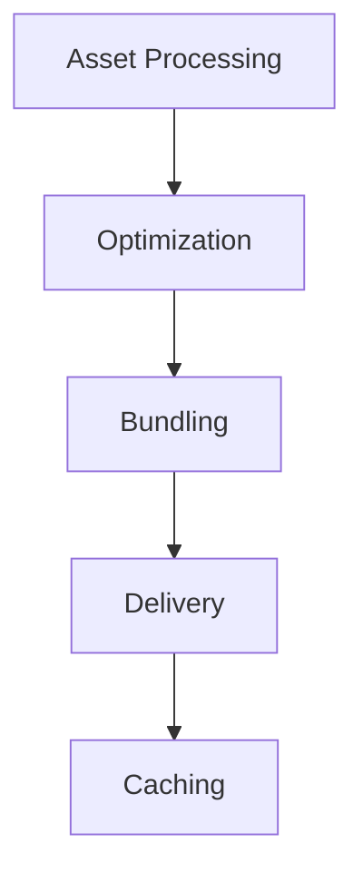
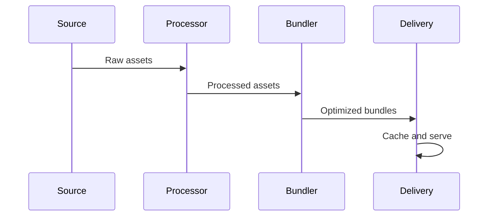

# Asset Pipeline Architecture

## Overview

This document outlines our asset pipeline architecture, designed to efficiently process, optimize, and deliver static assets throughout our build and deployment process.

## Components

### Asset Pipeline Stack


### Key Components
1. Asset Processing
   - File processing
   - Asset compilation
   - Transformation
   - Validation

2. Asset Optimization
   - Minification
   - Compression
   - Image optimization
   - Code splitting

3. Asset Bundling
   - Bundle creation
   - Dependency resolution
   - Code packaging
   - Version management

4. Asset Delivery
   - CDN integration
   - Load balancing
   - Geographic distribution
   - Cache management

## Interactions

### Asset Flow


## Implementation Details

### Pipeline Configuration
```typescript
interface PipelineConfig {
  processing: ProcessingConfig;
  optimization: OptimizationConfig;
  bundling: BundlingConfig;
  delivery: DeliveryConfig;
}

interface ProcessingConfig {
  transforms: Transform[];
  validators: Validator[];
  compilers: Compiler[];
  options: ProcessingOptions;
}
```

### Optimization Rules
```typescript
interface OptimizationRule {
  type: AssetType;
  strategy: OptimizationStrategy;
  settings: OptimizationSettings;
  priority: number;
}
```

### Pipeline Standards
- Processing requirements
- Optimization targets
- Bundling strategies
- Delivery methods
- Caching policies

## Related Documentation
- [Build Optimization](./build-optimization.md)
- [Dependency Management](./dependency-management.md)
- [Performance Optimization](./performance-monitoring.md)
- [Content Delivery](./content-delivery.md)
