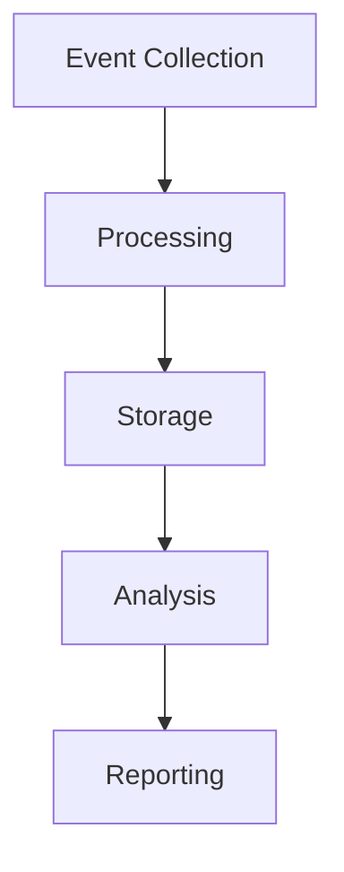
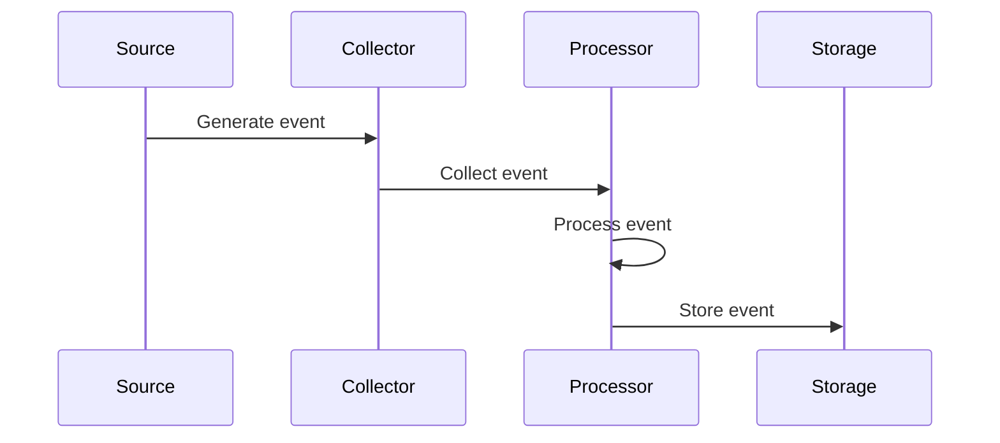

# Audit Logging Architecture

## Overview

This document outlines our audit logging architecture, designed to track and monitor system activities for security, compliance, and operational purposes.

## Components

### Audit Stack


### Key Components
1. Event Collection
   - System events
   - User activities
   - Security events
   - Application logs

2. Processing Engine
   - Event filtering
   - Enrichment
   - Normalization
   - Correlation

3. Storage System
   - Log storage
   - Retention management
   - Archival
   - Recovery

4. Analysis Tools
   - Log analysis
   - Pattern detection
   - Anomaly detection
   - Compliance checking

## Interactions

### Audit Flow


## Implementation Details

### Audit Configuration
```typescript
interface AuditConfig {
  sources: AuditSource[];
  processing: ProcessingConfig;
  storage: StorageConfig;
  retention: RetentionPolicy;
}

interface AuditSource {
  type: SourceType;
  events: EventType[];
  filters: Filter[];
  format: LogFormat;
}
```

### Processing Rules
```typescript
interface ProcessingRule {
  type: RuleType;
  condition: Condition;
  action: Action;
  priority: number;
}
```

### Audit Standards
- Event categories
- Log formats
- Retention periods
- Access controls
- Analysis requirements

## Related Documentation
- [Compliance](./compliance.md)
- [Security Monitoring](../security/security-monitoring.md)
- [Data Protection](../data-flow/data-protection.md)
- [Risk Management](./risk-management.md)
