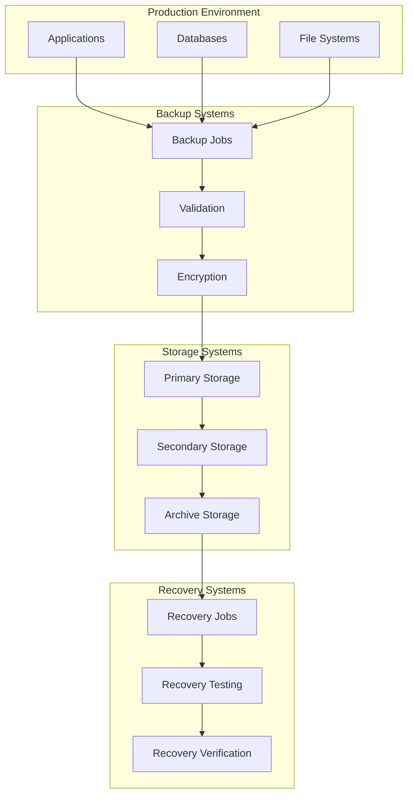

# Backup and Recovery Architecture

## Overview

Our backup and recovery architecture implements a comprehensive data protection strategy ensuring business continuity and disaster recovery capabilities. It utilizes automated backup procedures, multi-region replication, and point-in-time recovery options to protect against data loss, system failures, and catastrophic events. The system is designed to maintain data integrity while minimizing recovery time objectives (RTO) and recovery point objectives (RPO).

## Components

### 1. Backup Systems
- **Database Backups**
  - Full backups
  - Incremental backups
  - Transaction logs
  - Point-in-time recovery
- **File System Backups**
  - System state
  - Configuration files
  - User data
  - Media assets
- **Application Backups**
  - Application state
  - Cache data
  - Session information
  - Temporary files

### 2. Storage Systems
- **Primary Storage**
  - Production databases
  - File systems
  - Object storage
- **Backup Storage**
  - Backup repositories
  - Archive storage
  - Cold storage
- **Replication Systems**
  - Cross-region replication
  - Real-time mirroring
  - Async replication

### 3. Recovery Components
- **Recovery Tools**
  - Database recovery
  - File recovery
  - System recovery
- **Verification Systems**
  - Backup validation
  - Recovery testing
  - Integrity checks
- **Monitoring Systems**
  - Backup status
  - Storage capacity
  - Recovery metrics

### 4. Security Components
- **Encryption**
  - At-rest encryption
  - In-transit encryption
  - Key management
- **Access Control**
  - Role-based access
  - Audit logging
  - Compliance tracking
- **Data Protection**
  - Immutable backups
  - Version control
  - Retention policies

## Interactions

### 1. Backup and Recovery Flow


### 2. Backup Flow
1. Initiate backup job
2. Capture consistent state
3. Perform backup operation
4. Validate backup integrity
5. Encrypt backup data
6. Transfer to storage
7. Update backup catalog

### 3. Recovery Flow
1. Identify recovery point
2. Validate backup integrity
3. Prepare recovery environment
4. Restore data
5. Verify recovery
6. Switch to recovered system
7. Validate functionality

## Implementation Details

### 1. Backup Configuration

```typescript
// Backup configuration
interface BackupConfig {
  schedule: ScheduleConfig;
  retention: RetentionConfig;
  storage: StorageConfig;
  encryption: EncryptionConfig;
}

interface ScheduleConfig {
  full: CronExpression;
  incremental: CronExpression;
  logs: CronExpression;
}

// Backup implementation
class BackupManager {
  private config: BackupConfig;
  private storage: StorageManager;
  private encryption: EncryptionManager;

  constructor(config: BackupConfig) {
    this.config = config;
    this.storage = new StorageManager(config.storage);
    this.encryption = new EncryptionManager(config.encryption);
  }

  public async performBackup(
    target: BackupTarget
  ): Promise<BackupResult> {
    const snapshot = await this.createSnapshot(target);
    const encrypted = await this.encryption.encrypt(snapshot);
    return this.storage.store(encrypted);
  }

  private async createSnapshot(
    target: BackupTarget
  ): Promise<Snapshot> {
    const state = await this.captureState(target);
    return this.createConsistentSnapshot(state);
  }

  private async validateBackup(
    backup: Backup
  ): Promise<ValidationResult> {
    const integrity = await this.checkIntegrity(backup);
    const completeness = await this.verifyCompleteness(backup);
    return { integrity, completeness };
  }
}
```

### 2. Recovery Configuration

```typescript
// Recovery configuration
interface RecoveryConfig {
  targets: RecoveryTarget[];
  validation: ValidationConfig;
  notification: NotificationConfig;
}

interface RecoveryTarget {
  type: 'database' | 'filesystem' | 'application';
  location: string;
  priority: number;
}

// Recovery implementation
class RecoveryManager {
  private config: RecoveryConfig;
  private validation: ValidationManager;
  private notification: NotificationManager;

  constructor(config: RecoveryConfig) {
    this.config = config;
    this.validation = new ValidationManager(config.validation);
    this.notification = new NotificationManager(config.notification);
  }

  public async performRecovery(
    point: RecoveryPoint
  ): Promise<RecoveryResult> {
    const backup = await this.locateBackup(point);
    const validated = await this.validateBackup(backup);
    const recovered = await this.restoreData(validated);
    return this.verifyRecovery(recovered);
  }

  private async restoreData(
    backup: ValidatedBackup
  ): Promise<RecoveredData> {
    const restored = await this.performRestore(backup);
    await this.validateRestored(restored);
    return restored;
  }

  private async verifyRecovery(
    recovered: RecoveredData
  ): Promise<VerificationResult> {
    const integrity = await this.checkDataIntegrity(recovered);
    const functionality = await this.verifyFunctionality(recovered);
    return { integrity, functionality };
  }
}
```

### 3. Monitoring Implementation

```typescript
// Monitoring configuration
interface MonitoringConfig {
  metrics: MetricsConfig;
  alerts: AlertConfig;
  reporting: ReportingConfig;
}

interface MetricsConfig {
  backupStatus: MetricDefinition[];
  storageMetrics: MetricDefinition[];
  recoveryMetrics: MetricDefinition[];
}

// Monitoring implementation
class BackupMonitor {
  private config: MonitoringConfig;
  private metrics: MetricsManager;
  private alerts: AlertManager;

  constructor(config: MonitoringConfig) {
    this.config = config;
    this.metrics = new MetricsManager(config.metrics);
    this.alerts = new AlertManager(config.alerts);
  }

  public async monitorBackups(): Promise<void> {
    const status = await this.collectBackupMetrics();
    await this.updateMetrics(status);
    await this.checkAlertConditions(status);
  }

  private async collectBackupMetrics(): Promise<BackupMetrics> {
    const backupStatus = await this.getBackupStatus();
    const storageMetrics = await this.getStorageMetrics();
    return { backupStatus, storageMetrics };
  }

  private async checkAlertConditions(
    metrics: BackupMetrics
  ): Promise<void> {
    const violations = this.evaluateAlertRules(metrics);
    for (const violation of violations) {
      await this.alerts.sendAlert(violation);
    }
  }
}
```

## Best Practices

1. **Backup Strategy**
   - Regular backup schedule
   - Multiple backup copies
   - Offsite storage
   - Encryption at rest
   - Backup validation
   - Retention management

2. **Recovery Process**
   - Documented procedures
   - Regular testing
   - Automated recovery
   - Verification steps
   - Communication plan
   - Post-recovery validation

3. **Monitoring and Maintenance**
   - Continuous monitoring
   - Capacity planning
   - Performance optimization
   - Security updates
   - Compliance checks
   - Regular audits

## Related Documentation

- [Disaster Recovery Plan](./disaster-recovery.md)
- [Data Protection Strategy](./data-protection.md)
- [Security Architecture](./security.md)
- [Monitoring Architecture](./monitoring.md)
- [Compliance Guidelines](./compliance.md)

## Component Description

### Backup Strategy

1. **Data Types**

   - Database backups
   - File system backups
   - Configuration backups

2. **Backup Types**

   - Full backups
   - Incremental backups
   - Differential backups

3. **Schedule**
   - Daily schedule
   - Weekly schedule
   - Monthly schedule

### Storage Solutions

1. **Primary Storage**

   - Local storage
   - Network storage
   - SAN storage

2. **Cloud Storage**
   - S3 storage
   - Glacier archive
   - Azure backup

## Implementation Guidelines

1. **Backup Strategy**

   - Data selection
   - Backup types
   - Schedule planning
   - Retention policy

2. **Storage Management**

   - Storage tiers
   - Lifecycle rules
   - Access patterns
   - Cost optimization

3. **Recovery Process**

   - Recovery types
   - Test procedures
   - Automation
   - Verification

4. **Best Practices**

   - Encryption
   - Access control
   - Monitoring
   - Documentation

5. **Compliance**

   - Retention rules
   - Compliance requirements
   - Audit trails
   - Documentation

6. **Documentation**
   - Backup procedures
   - Recovery plans
   - Test results
   - Compliance docs

## Backup and Recovery Architecture Diagram

```mermaid
graph TB
    subgraph "Backup Strategy"
        subgraph "Data Types"
            Database[Database]
            FileSystem[File System]
            Config[Configuration]
        end

        subgraph "Backup Types"
            Full[Full Backup]
            Incremental[Incremental]
            Differential[Differential]
        end

        subgraph "Schedule"
            Daily[Daily Backup]
            Weekly[Weekly Backup]
            Monthly[Monthly Backup]
        end
    end

    subgraph "Storage"
        subgraph "Primary"
            Local[Local Storage]
            NAS[Network Storage]
            SAN[Storage Area Network]
        end

        subgraph "Cloud"
            S3[AWS S3]
            Glacier[AWS Glacier]
            Azure[Azure Backup]
        end

        subgraph "Archive"
            ColdStorage[Cold Storage]
            LongTerm[Long Term]
            Offsite[Offsite Backup]
        end
    end

    subgraph "Recovery"
        subgraph "Procedures"
            PointInTime[Point in Time]
            BareMetal[Bare Metal]
            Granular[Granular Recovery]
        end

        subgraph "Testing"
            RecoveryTest[Recovery Test]
            ValidationTest[Validation]
            DrillTest[DR Drill]
        end

        subgraph "Automation"
            AutoRecover[Auto Recovery]
            Orchestration[Orchestration]
            Verification[Verification]
        end
    end

    subgraph "Infrastructure"
        subgraph "Monitoring"
            BackupStatus[Backup Status]
            StorageMetrics[Storage Metrics]
            RecoveryMetrics[Recovery Metrics]
        end

        subgraph "Security"
            Encryption[Encryption]
            AccessControl[Access Control]
            Audit[Audit Logs]
        end

        subgraph "Compliance"
            Retention[Retention Policy]
            Compliance[Compliance Rules]
            Documentation[Documentation]
        end
    end

    %% Backup Flow
    Database --> Full
    FileSystem --> Incremental
    Config --> Differential

    Full --> Daily
    Incremental --> Weekly
    Differential --> Monthly

    %% Storage Flow
    Local --> S3
    NAS --> Glacier
    SAN --> Azure

    S3 --> ColdStorage
    Glacier --> LongTerm
    Azure --> Offsite

    %% Recovery Flow
    PointInTime --> RecoveryTest
    BareMetal --> ValidationTest
    Granular --> DrillTest

    RecoveryTest --> AutoRecover
    ValidationTest --> Orchestration
    DrillTest --> Verification

    %% Infrastructure Flow
    BackupStatus --> Encryption
    StorageMetrics --> AccessControl
    RecoveryMetrics --> Audit

    Encryption --> Retention
    AccessControl --> Compliance
    Audit --> Documentation
```
