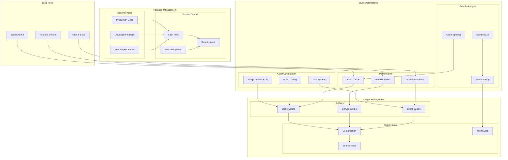

# Build and Dependency Management Architecture

## Overview

Our build and dependency management architecture implements a comprehensive strategy for optimizing build performance, managing dependencies, and ensuring efficient asset delivery in our monorepo environment. It leverages Bun, Nx, and Next.js to provide fast, reliable, and scalable builds while maintaining strict dependency control and optimization standards.

## Components

### 1. Package Management
- **Production Dependencies**: Core runtime dependencies
- **Development Dependencies**: Build and test tools
- **Peer Dependencies**: Framework compatibility requirements
- **Version Control**: Lock files and security audits

### 2. Build System
- **Bun Runtime**: Fast JavaScript/TypeScript runtime
- **Nx Build System**: Monorepo build orchestration
- **Next.js Build**: Application bundling and optimization

### 3. Optimization Layer
- **Bundle Analysis**: Size monitoring and optimization
- **Code Splitting**: Dynamic import boundaries
- **Tree Shaking**: Dead code elimination
- **Asset Optimization**: Image, font, and icon processing

### 4. Cache Management
- **Build Cache**: Incremental build storage
- **Parallel Processing**: Multi-core utilization
- **Incremental Builds**: Changed-based compilation

### 5. Output Management
- **Static Assets**: Optimized media and fonts
- **Server Bundle**: API and SSR code
- **Client Bundle**: Browser-optimized code
- **Source Maps**: Debug support files

## Interactions

### 1. Build Flow


### 2. Build Process Flow
1. Dependencies resolved from lock files
2. Security audit performed
3. Source files compiled
4. Assets optimized
5. Bundles created
6. Output compressed
7. Source maps generated

### 3. Cache Flow
1. Build cache checked
2. Changed files identified
3. Incremental build triggered
4. Parallel tasks distributed
5. Results cached
6. Artifacts generated

## Implementation Details

### 1. Build Configuration

```typescript
// nx.json configuration
interface BuildConfig {
  namedInputs: {
    production: string[];
    development: string[];
  };
  targetDefaults: {
    build: {
      dependsOn: string[];
      inputs: string[];
      cache: boolean;
    };
  };
  tasksRunnerOptions: {
    default: {
      runner: string;
      options: {
        cacheableOperations: string[];
        parallel: number;
        useDaemonProcess: boolean;
      };
    };
  };
}

const nxConfig: BuildConfig = {
  namedInputs: {
    production: [
      "default",
      "!{projectRoot}/**/?(*.)+(spec|test).[jt]s?(x)",
      "!{projectRoot}/tsconfig.spec.json",
    ],
    development: [
      "default",
      "!{projectRoot}/**/?(*.)+(spec|test).[jt]s?(x)",
    ],
  },
  targetDefaults: {
    build: {
      dependsOn: ["^build"],
      inputs: ["production", "^production"],
      cache: true,
    },
  },
  tasksRunnerOptions: {
    default: {
      runner: "nx/tasks-runners/default",
      options: {
        cacheableOperations: ["build", "test", "lint", "e2e"],
        parallel: 3,
        useDaemonProcess: true,
      },
    },
  },
};
```

### 2. Asset Optimization

```typescript
// next.config.js configuration
interface AssetConfig {
  images: {
    domains: string[];
    deviceSizes: number[];
    imageSizes: number[];
    formats: string[];
    minimumCacheTTL: number;
  };
  experimental: {
    optimizeCss: boolean;
    optimizePackageImports: string[];
  };
  compiler: {
    removeConsole: boolean;
  };
}

const nextConfig: AssetConfig = {
  images: {
    domains: ['assets.example.com'],
    deviceSizes: [640, 750, 828, 1080, 1200, 1920, 2048, 3840],
    imageSizes: [16, 32, 48, 64, 96, 128, 256, 384],
    formats: ['image/webp'],
    minimumCacheTTL: 60,
  },
  experimental: {
    optimizeCss: true,
    optimizePackageImports: [
      '@mui/icons-material',
      '@mui/material',
      'date-fns',
    ],
  },
  compiler: {
    removeConsole: process.env.NODE_ENV === 'production',
  },
};
```

### 3. Cache Strategy

```typescript
// Cache configuration
interface CacheConfig {
  directory: string;
  compression: boolean;
  maxAge: number;
  hashAlgorithm: string;
}

const cacheConfig: CacheConfig = {
  directory: '.nx/cache',
  compression: true,
  maxAge: 172800, // 48 hours
  hashAlgorithm: 'sha256',
};

// Cache implementation
class BuildCache {
  private config: CacheConfig;

  constructor(config: CacheConfig) {
    this.config = config;
  }

  async get(key: string): Promise<any> {
    const hash = await this.hashKey(key);
    return this.readFromCache(hash);
  }

  async set(key: string, value: any): Promise<void> {
    const hash = await this.hashKey(key);
    await this.writeToCache(hash, value);
  }

  private async hashKey(key: string): Promise<string> {
    // Implementation of hash generation
  }

  private async readFromCache(hash: string): Promise<any> {
    // Implementation of cache reading
  }

  private async writeToCache(hash: string, value: any): Promise<void> {
    // Implementation of cache writing
  }
}
```

## Best Practices

1. **Dependency Management**
   - Pin dependency versions
   - Regular security audits
   - Minimize duplicate dependencies
   - Use peer dependencies appropriately
   - Maintain up-to-date lock files
   - Regular dependency updates

2. **Build Optimization**
   - Enable build caching
   - Optimize parallel execution
   - Configure proper chunk splitting
   - Enable tree shaking
   - Optimize asset loading
   - Monitor bundle sizes

3. **Cache Management**
   - Regular cache cleanup
   - Proper cache invalidation
   - Optimize cache storage
   - Monitor cache hit rates
   - Configure cache compression
   - Set appropriate TTLs

## Related Documentation

- [Performance Architecture](../system/performance.md)
- [Dependency Management](./dependency-management.md)
- [Asset Pipeline](./asset-pipeline.md)
- [CI/CD Pipeline](./ci-cd.md)
- [Development Workflow](../development/workflow.md)
