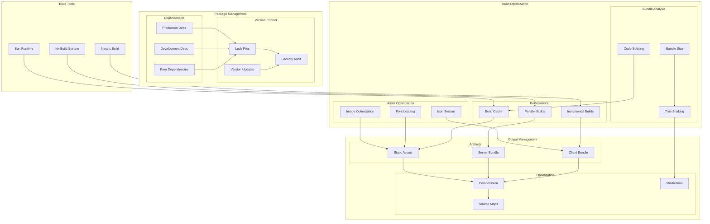

# Build and Dependency Management Architecture

This diagram illustrates our build optimization strategy and dependency management approach across the monorepo.

## Build Architecture Diagram

## Component Description

### Package Management

1. **Dependency Types**

   - Production dependencies
   - Development tools
   - Peer dependencies

2. **Version Control**
   - Lock file management
   - Update strategy
   - Security monitoring

### Build Optimization

1. **Bundle Analysis**

   - Size monitoring
   - Code splitting
   - Tree shaking

2. **Asset Handling**

   - Image optimization
   - Font strategy
   - Icon system

3. **Build Performance**
   - Cache utilization
   - Parallel processing
   - Incremental builds

## Implementation Guidelines

1. **Dependency Strategy**

   - Version pinning
   - Update frequency
   - Compatibility checks
   - Security policies

2. **Build Configuration**

   - Cache settings
   - Parallel tasks
   - Memory usage
   - CPU utilization

3. **Optimization Rules**

   - Bundle size limits
   - Split points
   - Load priorities
   - Cache policies

4. **Best Practices**

   - Regular audits
   - Performance monitoring
   - Cache management
   - Version control

5. **Monitoring**

   - Build times
   - Bundle sizes
   - Cache hits
   - Error rates

6. **Documentation**
   - Build processes
   - Optimization guides
   - Troubleshooting
   - Performance tips
