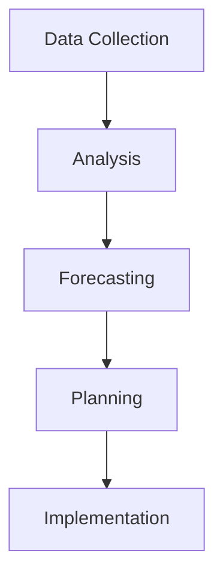
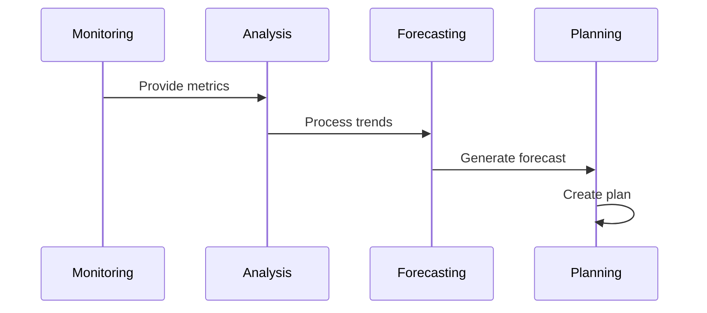

# Capacity Planning Architecture

## Overview

This document outlines our capacity planning architecture, designed to predict and manage resource requirements across our infrastructure.

## Components

### Planning Stack


### Key Components
1. Data Collection
   - Resource metrics
   - Usage patterns
   - Growth trends
   - Cost data

2. Analysis Engine
   - Pattern recognition
   - Trend analysis
   - Anomaly detection
   - Cost analysis

3. Forecasting System
   - Growth prediction
   - Resource modeling
   - Cost projection
   - Risk assessment

4. Planning Tools
   - Resource allocation
   - Scaling strategies
   - Budget planning
   - Implementation timing

## Interactions

### Planning Flow


## Implementation Details

### Capacity Configuration
```typescript
interface CapacityConfig {
  resources: ResourceType[];
  thresholds: Threshold[];
  forecasting: ForecastConfig;
  planning: PlanningConfig;
}

interface ResourceType {
  name: string;
  metrics: Metric[];
  limits: ResourceLimit[];
  scaling: ScalingPolicy;
}
```

### Planning Rules
```typescript
interface PlanningRule {
  trigger: TriggerCondition;
  action: PlanningAction;
  priority: number;
  constraints: Constraint[];
}
```

### Planning Standards
- Resource metrics
- Growth patterns
- Cost models
- Risk thresholds
- Implementation guidelines

## Related Documentation
- [Performance Monitoring](./performance-monitoring.md)
- [Infrastructure Monitoring](./infrastructure-monitoring.md)
- [Scaling Architecture](./scaling.md)
- [Cost Management](./cost-management.md)
