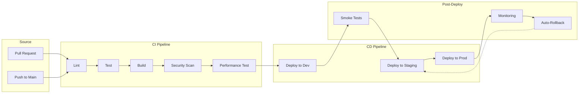

# CI/CD Pipeline Architecture

This diagram illustrates our continuous integration and continuous deployment pipeline, including testing, security scanning, and deployment stages.

## Pipeline Stages

### Source Control

- Pull request validation
- Branch protection
- Code review enforcement
- Automated checks

### CI Pipeline

- Code linting
- Unit and integration tests
- Build process
- Security scanning
- Performance testing

### CD Pipeline

- Development deployment
- Staging deployment
- Production deployment
- Environment configuration

### Post-Deployment

- Smoke testing
- Monitoring
- Auto-rollback
- Health checks

## Implementation Details

### Automation

- Automated testing
- Automated deployments
- Automated rollbacks
- Automated monitoring

### Security

- Security scanning
- Dependency checking
- Vulnerability assessment
- Compliance checks

### Monitoring

- Performance monitoring
- Error tracking
- Log aggregation
- Metrics collection

### Rollback Strategy

- Automated rollbacks
- Version control
- State management
- Data migration
