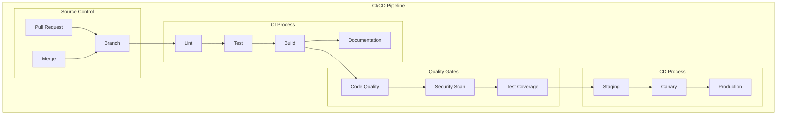
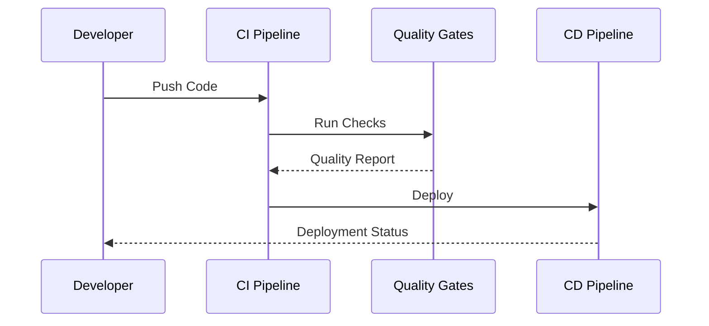

# CI/CD Pipeline Architecture

This document outlines our Continuous Integration and Continuous Deployment (CI/CD) pipeline architecture, detailing how code changes flow from development to production.

## Overview

Our CI/CD pipeline is built on GitHub Actions, providing automated testing, building, and deployment processes across our monorepo. The pipeline ensures code quality, maintains security standards, and enables rapid, reliable deployments.

## Components

- **Source Control**: GitHub repository and branch management
- **CI Pipeline**: Automated testing and validation
- **CD Pipeline**: Automated build and deployment
- **Quality Gates**: Code quality and security checks



## Interactions

The pipeline components interact in a defined sequence:

1. Code commit triggers CI pipeline
2. Quality gates validate changes
3. Successful validation triggers deployment
4. Deployment proceeds through environments



## Implementation Details

### Technical Stack

- GitHub Actions: CI/CD platform
- Jest/Vitest: Testing framework
- ESLint: Code quality
- SonarQube: Code analysis
- Docker: Containerization

### Key Configurations

```yaml
# ci.yml
name: CI Pipeline
on:
  push:
    branches: [main]
  pull_request:
    branches: [main]

jobs:
  test:
    runs-on: ubuntu-latest
    steps:
      - uses: actions/checkout@v3
      - uses: oven-sh/setup-bun@v1
      - run: bun install
      - run: bun test
```

### Error Handling

- **Build Failures**: Immediate notification and blocking of deployment
- **Test Failures**: Detailed test reports and failure analysis
- **Deployment Issues**: Automatic rollback capabilities

### Performance Considerations

- **Parallel Execution**: Run independent jobs concurrently
- **Caching**: Cache dependencies and build artifacts
- **Selective Testing**: Only test affected packages
- **Incremental Builds**: Optimize build time

## Related Documentation

- [Workspace Architecture](../system/workspace-architecture.md)
- [Dependencies Management](./dependencies.md)
- [Build Optimization](./build-optimization.md)
