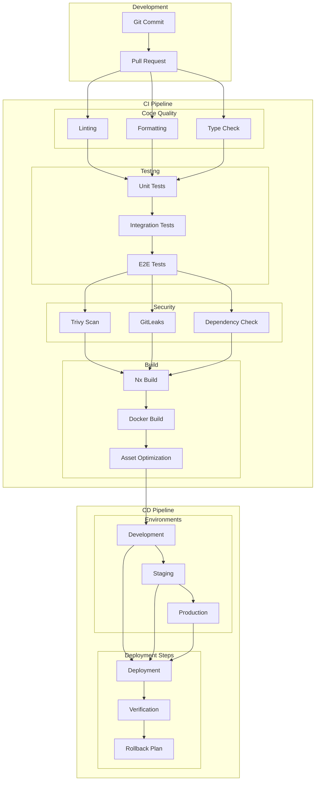
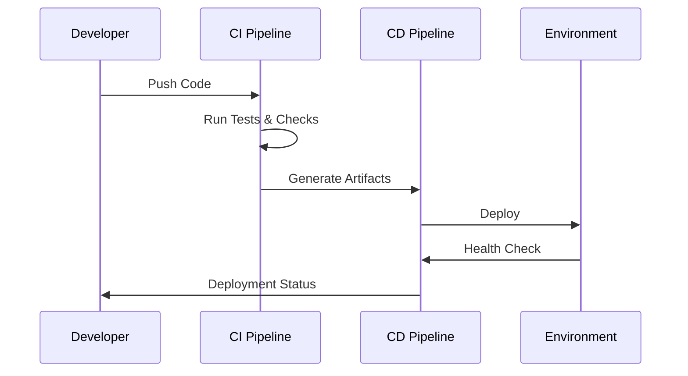

# CI/CD Pipeline Architecture

## Overview

This document outlines our continuous integration and deployment pipeline using GitHub Actions, showing the workflow from code commit to production deployment. The architecture ensures reliable, automated, and secure software delivery while maintaining high code quality and enabling rapid iteration.

## Components

Our CI/CD pipeline consists of three main component groups:

### Development Components
- Version Control Integration
- Pull Request Management
- Code Review System

### CI Pipeline Components
- Code Quality Tools
- Testing Framework
- Security Scanners
- Build System

### CD Pipeline Components
- Environment Management
- Deployment Tools
- Verification Systems
- Rollback Mechanisms

## CI/CD Architecture Diagram



## Interactions

The CI/CD pipeline operates through the following interaction patterns:

1. **Code Integration Flow**
   - Developer commits code
   - PR triggers automated checks
   - Code review process
   - Merge to main branch

2. **Build and Test Flow**
   - Code quality verification
   - Test suite execution
   - Security scanning
   - Artifact generation

3. **Deployment Flow**
   - Environment promotion
   - Deployment execution
   - Health verification
   - Rollback if needed



## Implementation Details

### Technical Stack
- CI Platform: GitHub Actions
- Testing: Jest, Cypress
- Security: Trivy, GitLeaks
- Build: Nx, Docker
- Deployment: Kubernetes

### Development Phase

- **Git Commit**: Code changes
- **Pull Request**: Code review process

### CI Pipeline

#### Code Quality
- ESLint configuration
- Prettier setup
- TypeScript checks

```yaml
# ESLint Configuration
extends:
  - eslint:recommended
  - plugin:@typescript-eslint/recommended
rules:
  no-console: error
  no-unused-vars: error
```

#### Testing Strategy
```yaml
# Jest Configuration
jest:
  coverage:
    threshold:
      global:
        statements: 80
        branches: 80
        functions: 80
        lines: 80
```

#### Security Checks
```yaml
# Trivy Configuration
trivy:
  severity: HIGH,CRITICAL
  ignore-unfixed: true
  timeout: 10m
```

1. **Code Quality**

   - Linting with ESLint
   - Formatting with Prettier
   - TypeScript checking

2. **Testing**

   - Unit tests with Vitest
   - Integration tests
   - E2E tests with Playwright

3. **Security**

   - Trivy vulnerability scanning
   - GitLeaks secrets detection
   - Dependency vulnerability check

4. **Build**
   - Nx workspace build
   - Docker image creation
   - Asset optimization

### CD Pipeline

#### Deployment Configuration
```yaml
# Deployment Strategy
strategy:
  rolling_update:
    max_surge: 25%
    max_unavailable: 25%
  type: RollingUpdate
```

#### Health Checks
```yaml
# Health Check Configuration
livenessProbe:
  httpGet:
    path: /health
    port: 8080
  initialDelaySeconds: 30
  periodSeconds: 10
```

1. **Environments**

   - Development deployment
   - Staging verification
   - Production release

2. **Deployment Steps**
   - Automated deployment
   - Health verification
   - Rollback procedures

## Implementation Guidelines

1. **Pipeline Configuration**

   - GitHub Actions workflow
   - Environment secrets
   - Build caching
   - Parallel execution

2. **Quality Gates**

   - Code coverage thresholds
   - Performance benchmarks
   - Security requirements
   - Build size limits

3. **Deployment Strategy**

   - Blue-green deployment
   - Canary releases
   - Feature flags
   - Rollback procedures

4. **Monitoring**

   - Pipeline metrics
   - Build times
   - Success rates
   - Resource usage

5. **Best Practices**
   - Fast feedback loops
   - Reliable builds
   - Secure pipelines
   - Efficient caching
