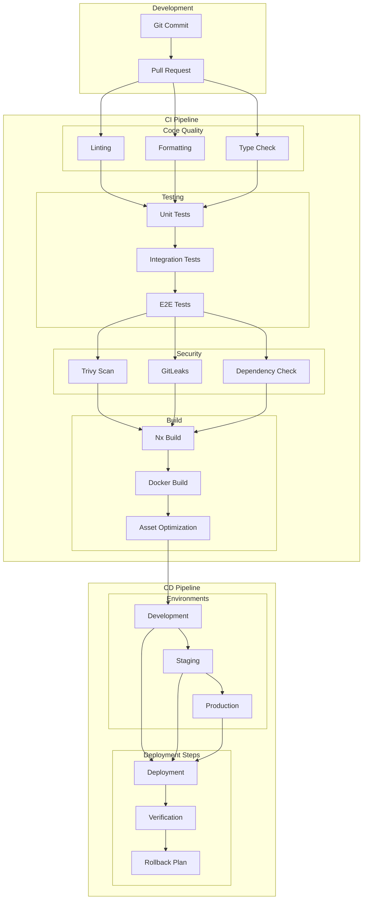

# CI/CD Pipeline Architecture

This diagram illustrates our continuous integration and deployment pipeline using GitHub Actions, showing the workflow from code commit to production deployment.

## CI/CD Architecture Diagram

## Component Description

### Development Phase

- **Git Commit**: Code changes
- **Pull Request**: Code review process

### CI Pipeline

1. **Code Quality**

   - Linting with ESLint
   - Formatting with Prettier
   - TypeScript checking

2. **Testing**

   - Unit tests with Vitest
   - Integration tests
   - E2E tests with Playwright

3. **Security**

   - Trivy vulnerability scanning
   - GitLeaks secrets detection
   - Dependency vulnerability check

4. **Build**
   - Nx workspace build
   - Docker image creation
   - Asset optimization

### CD Pipeline

1. **Environments**

   - Development deployment
   - Staging verification
   - Production release

2. **Deployment Steps**
   - Automated deployment
   - Health verification
   - Rollback procedures

## Implementation Guidelines

1. **Pipeline Configuration**

   - GitHub Actions workflow
   - Environment secrets
   - Build caching
   - Parallel execution

2. **Quality Gates**

   - Code coverage thresholds
   - Performance benchmarks
   - Security requirements
   - Build size limits

3. **Deployment Strategy**

   - Blue-green deployment
   - Canary releases
   - Feature flags
   - Rollback procedures

4. **Monitoring**

   - Pipeline metrics
   - Build times
   - Success rates
   - Resource usage

5. **Best Practices**
   - Fast feedback loops
   - Reliable builds
   - Secure pipelines
   - Efficient caching
