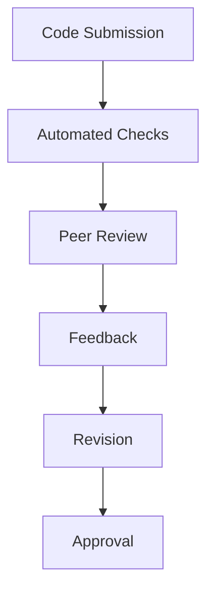
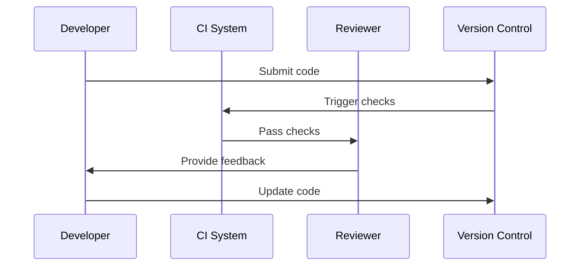

# Code Review Architecture

## Overview

This document outlines our code review architecture and processes, designed to maintain code quality, share knowledge, and catch potential issues early in development.

## Components

### Review Process


### Key Components
1. Automated Checks
   - Linting
   - Unit tests
   - Integration tests
   - Security scans
   - Style checks

2. Review Guidelines
   - Code standards
   - Performance impact
   - Security considerations
   - Documentation requirements

3. Review Tools
   - Version control
   - Code review platform
   - CI/CD integration
   - Documentation tools

## Interactions

### Review Flow


## Implementation Details

### Review Configuration
```typescript
interface ReviewConfig {
  requiredApprovals: number;
  automatedChecks: Check[];
  reviewers: ReviewerGroup[];
  guidelines: ReviewGuideline[];
}

interface Check {
  name: string;
  type: 'lint' | 'test' | 'security' | 'performance';
  severity: 'error' | 'warning' | 'info';
  config: Record<string, unknown>;
}
```

### Review Checklist
```typescript
interface ReviewChecklist {
  codeQuality: QualityCheck[];
  security: SecurityCheck[];
  performance: PerformanceCheck[];
  documentation: DocumentationCheck[];
}
```

### Review Standards
- Code quality requirements
- Testing requirements
- Documentation standards
- Performance criteria
- Security guidelines

## Related Documentation
- [Git Workflow](./git-workflow.md)
- [Testing Strategy](../system/testing-strategy.md)
- [Release Process](./release-process.md)
- [Development Standards](../system/standards.md)
