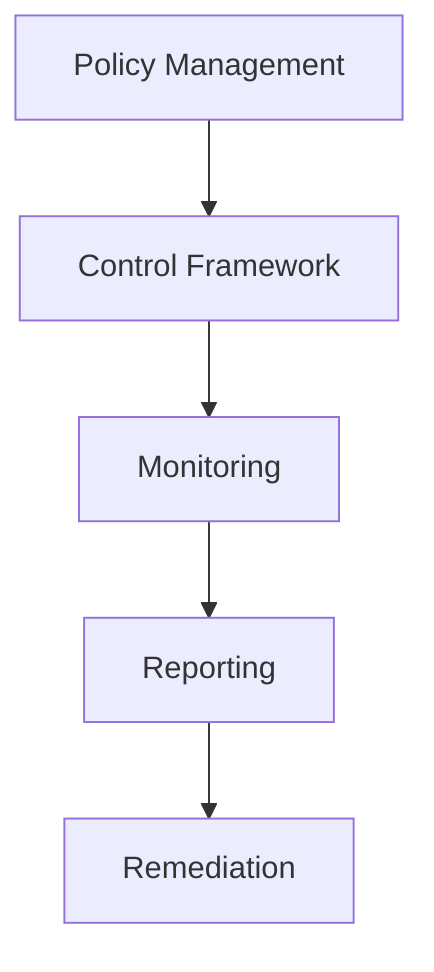
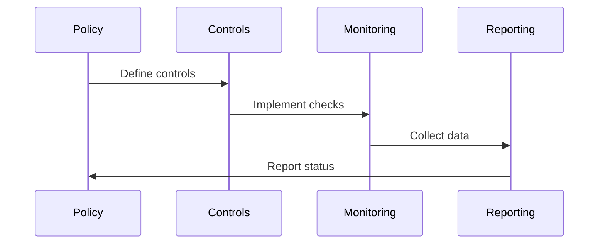

# Compliance Architecture

## Overview

This document outlines our compliance architecture, designed to ensure adherence to regulatory requirements, industry standards, and internal policies.

## Components

### Compliance Stack


### Key Components
1. Policy Management
   - Policy definition
   - Standard mapping
   - Requirement tracking
   - Version control

2. Control Framework
   - Control mapping
   - Risk assessment
   - Gap analysis
   - Implementation guide

3. Monitoring System
   - Continuous monitoring
   - Audit logging
   - Alert management
   - Evidence collection

4. Reporting Engine
   - Compliance reports
   - Audit trails
   - Metrics tracking
   - Status dashboards

## Interactions

### Compliance Flow


## Implementation Details

### Compliance Configuration
```typescript
interface ComplianceConfig {
  frameworks: Framework[];
  controls: Control[];
  monitoring: MonitoringConfig;
  reporting: ReportingConfig;
}

interface Framework {
  name: string;
  version: string;
  requirements: Requirement[];
  controls: Control[];
}
```

### Control Implementation
```typescript
interface Control {
  id: string;
  type: ControlType;
  requirements: string[];
  implementation: Implementation[];
  evidence: EvidenceType[];
}
```

### Compliance Standards
- Regulatory requirements
- Industry standards
- Security policies
- Privacy guidelines
- Audit procedures

## Related Documentation
- [Security Architecture](../security/security-architecture.md)
- [Data Protection](../data-flow/data-protection.md)
- [Audit Logging](./audit-logging.md)
- [Risk Management](./risk-management.md)
