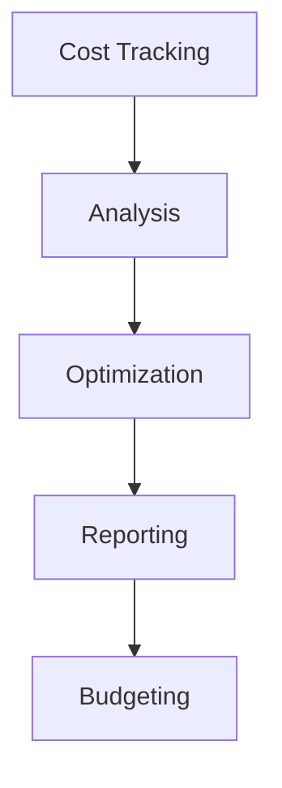
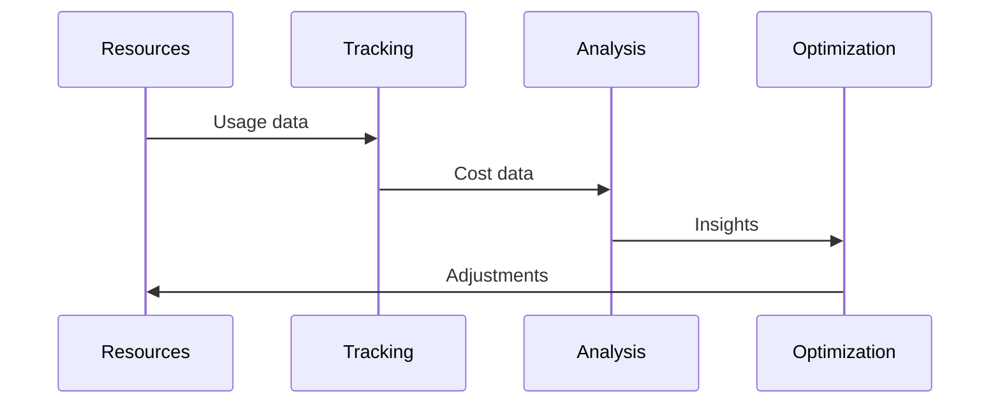

# Cost Management Architecture

## Overview

This document outlines our cost management architecture, designed to track, analyze, and optimize infrastructure and operational costs across our system.

## Components

### Cost Management Stack


### Key Components
1. Cost Tracking
   - Resource usage
   - Service costs
   - License tracking
   - Usage patterns

2. Analysis Engine
   - Cost allocation
   - Trend analysis
   - Usage patterns
   - Optimization opportunities

3. Optimization System
   - Resource rightsizing
   - Usage optimization
   - Cost reduction
   - Efficiency improvements

4. Reporting System
   - Cost reports
   - Budget tracking
   - Forecasting
   - Recommendations

## Interactions

### Cost Flow


## Implementation Details

### Cost Configuration
```typescript
interface CostConfig {
  tracking: TrackingConfig;
  analysis: AnalysisConfig;
  optimization: OptimizationConfig;
  reporting: ReportingConfig;
}

interface TrackingConfig {
  resources: ResourceType[];
  metrics: CostMetric[];
  frequency: string;
  retention: number;
}
```

### Optimization Rules
```typescript
interface OptimizationRule {
  type: 'resource' | 'usage' | 'license';
  trigger: TriggerCondition;
  action: OptimizationAction;
  savings: SavingsEstimate;
}
```

### Management Standards
- Cost tracking methods
- Allocation rules
- Budget controls
- Optimization criteria
- Reporting requirements

## Related Documentation
- [Capacity Planning](./capacity-planning.md)
- [Resource Management](./resource-management.md)
- [Performance Monitoring](./performance-monitoring.md)
- [Scaling Architecture](./scaling.md)
