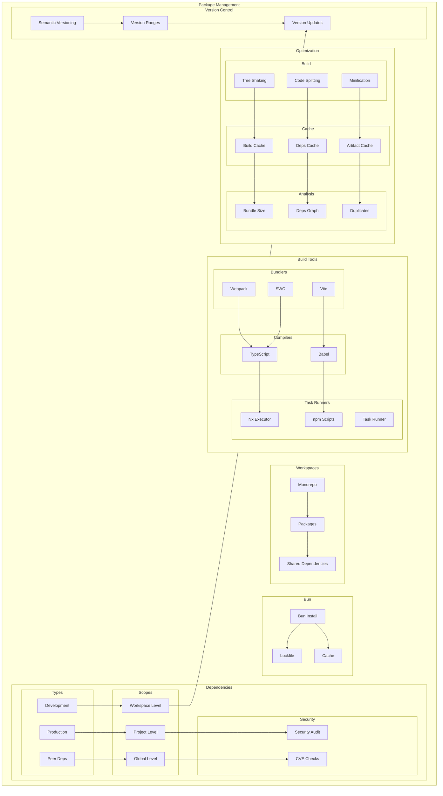
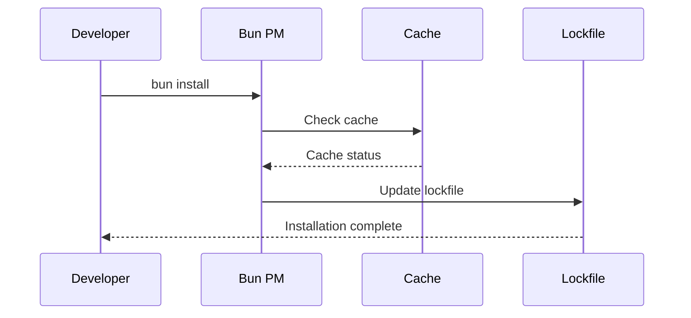

# Dependencies Management Architecture

This document describes how dependencies are managed across the monorepo, including package management, versioning, and workspace organization.

## Overview

Our dependency management system is built around Bun package manager and Nx workspace management, providing a robust and efficient way to handle dependencies across multiple packages in the monorepo.

## Components

- **Package Manager (Bun)**: Handles package installation, updates, and lockfile management
- **Workspace Management (Nx)**: Manages monorepo structure and shared dependencies
- **Version Control**: Handles semantic versioning and dependency updates



## Interactions

1. Package Installation Flow:
   - Developer runs `bun install`
   - Bun reads package.json and workspace configuration
   - Dependencies are installed and cached
   - Lockfile is updated



## Implementation Details

### Technical Stack

- Bun 1.0.0+: Primary package manager
- Nx: Workspace management
- Semantic Versioning: Version control

### Configuration

```json
{
    "packageManager": "bun@1.0.0",
    "workspaces": [
        "packages/*",
        "apps/*"
    ]
}
```

### Error Handling

- Version Conflicts: Resolved through lockfile and explicit resolutions
- Missing Dependencies: Caught during installation and build processes
- Circular Dependencies: Detected and prevented by Nx

### Performance Considerations

- Caching: Bun's built-in caching improves installation speed
- Parallel Installation: Dependencies are installed in parallel
- Shared Dependencies: Deduplication reduces installation size

## Related Documentation

- [Workspace Architecture](../system/workspace-architecture.md)
- [Build Optimization](../infrastructure/build-optimization.md)
- [CI/CD Pipeline](../infrastructure/ci-cd-pipeline.md)
