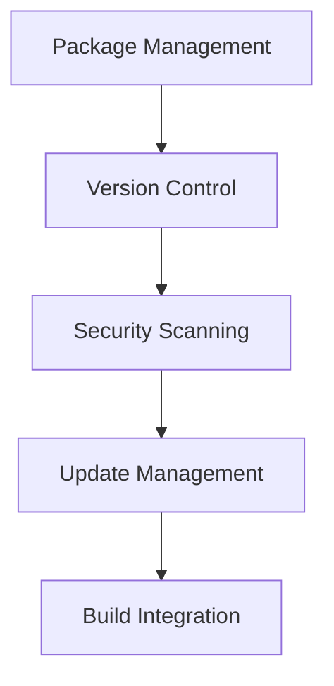
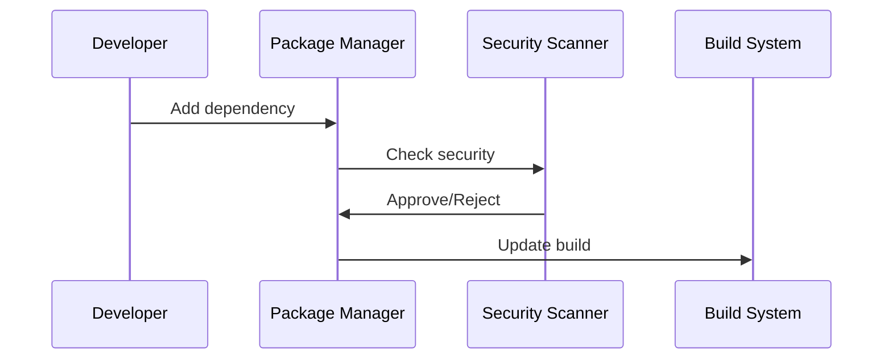

# Dependency Management Architecture

## Overview

This document outlines our dependency management architecture, designed to handle package dependencies, versioning, and updates across our codebase efficiently and securely.

## Components

### Dependency Stack


### Key Components
1. Package Management
   - Registry configuration
   - Package resolution
   - Lock file management
   - Cache management

2. Version Control
   - Version constraints
   - Semantic versioning
   - Update policies
   - Compatibility checks

3. Security Scanning
   - Vulnerability scanning
   - License checking
   - Dependency auditing
   - Update recommendations

4. Update Management
   - Update scheduling
   - Breaking changes
   - Migration planning
   - Rollback procedures

## Interactions

### Dependency Flow


## Implementation Details

### Dependency Configuration
```typescript
interface DependencyConfig {
  registry: RegistryConfig;
  security: SecurityConfig;
  updates: UpdateConfig;
  caching: CacheConfig;
}

interface RegistryConfig {
  url: string;
  scope: string;
  auth: AuthConfig;
  mirrors: string[];
}
```

### Security Rules
```typescript
interface SecurityRule {
  type: 'vulnerability' | 'license' | 'audit';
  severity: 'critical' | 'high' | 'medium' | 'low';
  action: 'block' | 'warn' | 'ignore';
}
```

### Management Standards
- Package naming conventions
- Version constraints
- Security requirements
- Update procedures
- Build integration

## Related Documentation
- [Build Optimization](./build-optimization.md)
- [Security Guidelines](../security/security-architecture.md)
- [CI/CD Pipeline](./ci-cd-pipeline.md)
- [Asset Pipeline](./asset-pipeline.md)
