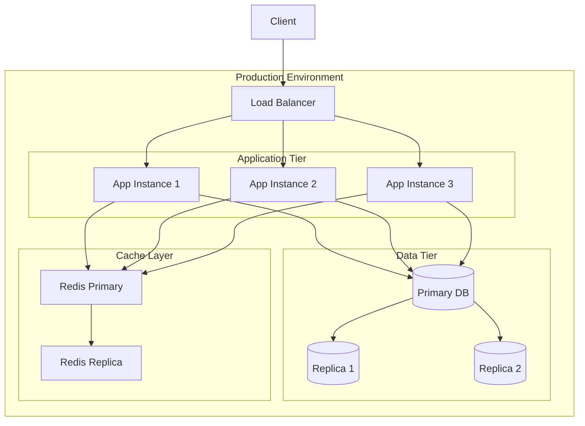

# Deployment Architecture

This diagram shows our production deployment architecture and scaling strategy.

## Infrastructure Diagram

## Description

Our production infrastructure includes:

1. **Load Balancing**

   - Distributes traffic across multiple app instances
   - Handles SSL termination
   - Provides health checking

2. **Application Tier**

   - Multiple stateless app instances
   - Auto-scaling based on load
   - Blue-green deployment support

3. **Data Tier**

   - Primary-replica database setup
   - Automated backups
   - Point-in-time recovery

4. **Cache Layer**
   - Redis for session storage and caching
   - Primary-replica setup for high availability
   - Automatic failover

## Scaling Strategy

- Horizontal scaling of app instances
- Read replicas for database scaling
- Distributed caching
- CDN for static assets
